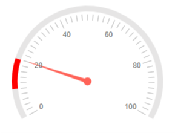
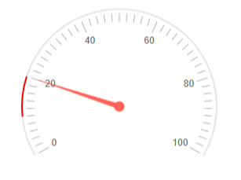
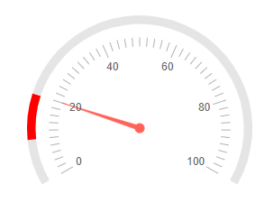
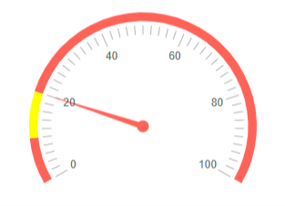
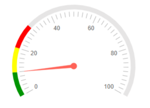
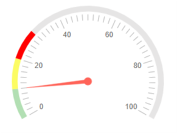

# Radial Gauge Ranges

You can highlight specific value ranges by providing one or more instances of the `<RadialGaugeScaleRange>` to the `<RadialGaugeScaleRanges>` collection, child tag of the `<RadialGaugeScale>`. You can customize them by using the parameters exposed on the `<RadialGaugeScaleRange>`:

* [From and To](#from-and-to)

* [Range Size](#range-size)

* [Range Distance](#range-distance)

* [Range Placeholder Color](#range-placeholder-color)

* [Color](#color)

* [Opacity](#opacity)

## From and To

* The `From` (`double`) parameter controls the start position of the range in scale units.

* The `To` (`double`) parameter controls the end position of the range in scale units.

>caption Use the From and To parameters to provide a range. The result from the code snippet below.



````CSHTML
@* Use the From and To parameters to provide a range on the scale. *@

<TelerikRadialGauge>
    <RadialGaugeScales>
        <RadialGaugeScale>
            <RadialGaugeScaleRanges>
                <RadialGaugeScaleRange From="10" To="20" Color="red"></RadialGaugeScaleRange>
            </RadialGaugeScaleRanges>
        </RadialGaugeScale>
    </RadialGaugeScales>

    <RadialGaugePointers>            

        <RadialGaugePointer Value="20">
        </RadialGaugePointer>

    </RadialGaugePointers>
</TelerikRadialGauge>
````

## Range Size

The `RangeSize` (`double`) parameter controls the width of the range indicators.

>caption Use the RangeSize parameter to provide size for the range indicators. The result from the code snippet below.



````CSHTML
@* Provide the desired size of the range. *@

<TelerikRadialGauge>

    <RadialGaugeScales>

        <RadialGaugeScale RangeSize="2">            
            <RadialGaugeScaleRanges>
                <RadialGaugeScaleRange From="10" To="20" Color="red"></RadialGaugeScaleRange>
            </RadialGaugeScaleRanges>
        </RadialGaugeScale>

    </RadialGaugeScales>

    <RadialGaugePointers>

        <RadialGaugePointer Value="20">
        </RadialGaugePointer>

    </RadialGaugePointers>
</TelerikRadialGauge>
````

## Range Distance 

The `RangeDistance` (`double`) parameter controls the distance from the range indicators to the ticks.

>caption Use the RangeDistance parameter to provide the desired distance from the range indicators to the ticks. The result from the code snippet below.



````CSHTML
@* Provide the desired distance from the range indicators to the ticks. *@

<TelerikRadialGauge>

    <RadialGaugeScales>

        <RadialGaugeScale RangeDistance="15">            
            <RadialGaugeScaleRanges>
                <RadialGaugeScaleRange From="10" To="20" Color="red"></RadialGaugeScaleRange>
            </RadialGaugeScaleRanges>
        </RadialGaugeScale>

    </RadialGaugeScales>

    <RadialGaugePointers>

        <RadialGaugePointer Value="20">
        </RadialGaugePointer>

    </RadialGaugePointers>
</TelerikRadialGauge>
````

## Range Placeholder Color

The `RangePlaceholderColor` (`string`) parameter controls the default color for the ranges. It accepts **CSS**, **HEX** and **RGB** colors.

>caption Set the default color for the ranges in the radial gauge. The result from the code snippet below.



````CSHTML
@* Change the default color of the ranges *@

<TelerikRadialGauge>

    <RadialGaugeScales>

        <RadialGaugeScale RangePlaceholderColor="#FF6358">            
            <RadialGaugeScaleRanges>
                <RadialGaugeScaleRange From="10" To="20" Color="yellow"></RadialGaugeScaleRange>
            </RadialGaugeScaleRanges>
        </RadialGaugeScale>

    </RadialGaugeScales>

    <RadialGaugePointers>

        <RadialGaugePointer Value="20">
        </RadialGaugePointer>

    </RadialGaugePointers>
</TelerikRadialGauge>
````

## Color

The `Color` (`string`) parameter controls the color of the range. It accepts **CSS**, **HEX** and **RGB** colors. If you do not define the `Color` parameter the range will not be visually rendered.

>caption Set the desired colors for the ranges in the radial gauge. The result from the code snippet below.



````CSHTML
@* Change the color of the ranges *@

<TelerikRadialGauge>
    <RadialGaugeScales>
        <RadialGaugeScale>
            <RadialGaugeScaleRanges>
                <RadialGaugeScaleRange From="0" To="10" Color="#009402"></RadialGaugeScaleRange>
                <RadialGaugeScaleRange From="10" To="20" Color="rgb(255,255,0)"></RadialGaugeScaleRange>
                <RadialGaugeScaleRange From="20" To="30" Color="red"></RadialGaugeScaleRange>
                @* Range with no defined color that is not visually rendered *@
                <RadialGaugeScaleRange From="30" To="40"></RadialGaugeScaleRange>

            </RadialGaugeScaleRanges>
        </RadialGaugeScale>
    </RadialGaugeScales>

    <RadialGaugePointers>

        <RadialGaugePointer Value="10">
        </RadialGaugePointer>
        
    </RadialGaugePointers>
</TelerikRadialGauge>
````

## Opacity

The `Opacity` (`double`) parameter controls the opacity of the range. The value passed to it should be between **0** and **1**. Defaults to 1.

>caption Change the opacity of a range. The result from the code snippet below



````CSHTML
@* Make a range more opaque *@

<TelerikRadialGauge>
    <RadialGaugeScales>
        <RadialGaugeScale>
            <RadialGaugeScaleRanges>
                <RadialGaugeScaleRange From="0" To="10" Opacity="0.3" Color="#009402"></RadialGaugeScaleRange>
                <RadialGaugeScaleRange From="10" To="20" Opacity="0.6" Color="rgb(255,255,0)"></RadialGaugeScaleRange>
                <RadialGaugeScaleRange From="20" To="30" Color="red"></RadialGaugeScaleRange>
                
            </RadialGaugeScaleRanges>
        </RadialGaugeScale>
    </RadialGaugeScales>

    <RadialGaugePointers>

        <RadialGaugePointer Value="10">
        </RadialGaugePointer>

    </RadialGaugePointers>
</TelerikRadialGauge>
````

## See Also

* [Radial Gauge: Live Demo](https://demos.telerik.com/blazor-ui/radial-gauge)
* [Radial Gauge: Overview]()
* [Radial Gauge: Scale]()
* [Radial Gauge: Labels]()
* [Radial Gauge: Pointers]()

