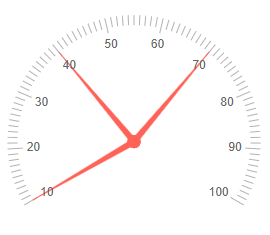
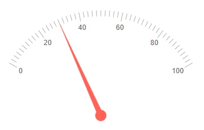

## Radial Gauge Scale

The Scale of the Radial Gauge renders the values, pointers and labels. You can customize it by adding an instance of the `<RadialGaugeScale>` to the `<RadialGaugeScales>` collection, child tag of the `<TelerikRadialGauge>`. The `<RadialGaugeScale>` exposes the following parameters:

* [Min and Max](#min-and-max)

* [MinorUnit and MajorUnit](#minorunit-and-majorunit)

* [MinorTicks and MajorTicks](#ninorticks-and-majorticks)

* [StartAngle and EndAngle](#startangle-and-endangle)

* [Reverse](#reverse)

* [Additional Customization](#additional-customization)

    * [Example: Remove the MinorUnit ticks](#example-remove-the-minorunit-ticks)


## Min and Max

* The `Max` (`double`) parameter controls the maximum value that the component can reach.

* The `Min` (`double`) parameter controls the minimum value of the component.

>caption Change the minimum and the maximum values for the scale. The result from the code snippet below.



````CSHTML
@* Use the Min and Max parameters to change the minimum and the maximum values for the scale *@

<TelerikRadialGauge>
    <RadialGaugeScales>
        <RadialGaugeScale Min="10" Max="100"></RadialGaugeScale>
    </RadialGaugeScales>

    <RadialGaugePointers>

        <RadialGaugePointer Value="10">
        </RadialGaugePointer>

        <RadialGaugePointer Value="40">
        </RadialGaugePointer>

        <RadialGaugePointer Value="70">
        </RadialGaugePointer>

    </RadialGaugePointers>
</TelerikRadialGauge>

````

## MinorUnit and MajorUnit

* The `MajorUnit` (`double`) parameter controls the interval between the major unit divisions of the component. The [labels]() will be rendered next to the `MajorUnit` ticks.

* The `MinorUnit` (`double`) parameter controls the interval between the minor unit divisions of the component.

>caption Change the rendering frequency of the minor and major unit divisions. The result from the code snippet below.


````CSHTML
@* Update the rendering of the major and minor units *@

<TelerikRadialGauge>

    <RadialGaugeScales>
        <RadialGaugeScale MajorUnit="10" MinorUnit="5"></RadialGaugeScale>
    </RadialGaugeScales>

    <RadialGaugePointers>

        <RadialGaugePointer Value="30">
        </RadialGaugePointer>

    </RadialGaugePointers>
</TelerikRadialGauge>
````

## StartAngle and EndAngle

The gauge is rendered clockwise (0 degrees are the 180 degrees in the polar coordinate system).

* `StartAngle` defines the start angle of the gauge, its default value is 0.

* `EndAngle` - defines the end angle of the gauge, its default value is 180. 

>caption Change the StartAngle and EndAngle of the radial gauge. The result from the code snippet below



````CSHTML
@* Change the StartAngle and EndAngle of the radial gauge *@

<TelerikRadialGauge>
    <RadialGaugeScales>

        <RadialGaugeScale StartAngle="30" EndAngle="150">
        </RadialGaugeScale>

    </RadialGaugeScales>

    <RadialGaugePointers>

        <RadialGaugePointer Value="30">
        </RadialGaugePointer>

    </RadialGaugePointers> 
</TelerikRadialGauge>
````

## Reverse

If you set the `Reverse` (`bool`) parameter to `true` the gauge will be rendered in a reversed view - the min value will be on the right side and the max value will be on the left.

>caption Reverse the component. The result from the code snippet below.


````CSHTML
@* Set the Reverse parameter to true *@

<TelerikRadialGauge>

    <RadialGaugeScales>
        <RadialGaugeScale Reverse="true"></RadialGaugeScale>
    </RadialGaugeScales>
    <RadialGaugePointers>

        <RadialGaugePointer Value="30">
        </RadialGaugePointer>

    </RadialGaugePointers>
</TelerikRadialGauge>
````


## Additional Customization

@[template](/_contentTemplates/gauges/additional-customization.md#radial-gauge-additional-customization)

### Example: Remove the MinorUnit ticks

You can remove the MinorUnit ticks from the rendering of the scale by using the `<RadialGaugeScaleMinorTicks>` nested tag and its `Visible` parameter.

>caption Remove the MinorUnit ticks. The result from the code snippet below.


````CSHMTL
@* Remove the MinorUnit ticks. *@

<TelerikRadialGauge>
    <RadialGaugeScales>
        <RadialGaugeScale>
            <RadialGaugeScaleMinorTicks Visible="false"></RadialGaugeScaleMinorTicks>
        </RadialGaugeScale>
    </RadialGaugeScales>

    <RadialGaugePointers>

        <RadialGaugePointer Value="30">
        </RadialGaugePointer>

    </RadialGaugePointers>
</TelerikRadialGauge>
````

## See Also

* [Radial Gauge: Live Demo](https://demos.telerik.com/blazor-ui/radial-gauge)
* [Radial Gauge: Overview]()
* [Radial Gauge: Pointers]()
* [Radial Gauge: Labels]()
* [Radial Gauge: Ranges]()

