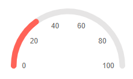
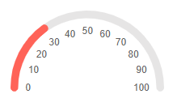

## Arc Gauge Scale

The scale of the arc gauge renders the values, pointers and labels. You can customize it by adding an instance of the `<ArcGaugeScale>` to the `<ArcGaugeScales>` collection, child tag of the `<TelerikArcGauge>`. The `<ArcGaugeScale>` exposes the following parameters:

* [Min and Max](#min-and-max)

* [MinorUnit and MajorUnit](#minorunit-and-majorunit)

* [StartAngle and EndAngle](#startangle-and-endangle)

* [Reverse](#reverse)

* [Additional Customization](#additional-customization)

    * [Example: Enable the MinorUnit ticks](#example-enable-the-minorunit-ticks)


## Min and Max

* The `Max` (`double`) parameter controls the maximum value that the component can reach.

* The `Min` (`double`) parameter controls the lowest value of the component.

>caption Change the lowest and the highest values for the scale. The result from the code snippet below.



````CSHTML
@* Use the Min and Max parameters to change the lowest and highest values for the scale *@

<TelerikArcGauge>
    <ArcGaugeScales>
        <ArcGaugeScale Min="10" Max="100">
            <ArcGaugeScaleLabels Visible="true" />
        </ArcGaugeScale>
    </ArcGaugeScales>

    <ArcGaugePointers>

        <ArcGaugePointer Value="30">
        </ArcGaugePointer>

    </ArcGaugePointers>
</TelerikArcGauge>
````

## MinorUnit and MajorUnit

* The `MajorUnit` (`double`) parameter controls the interval between the major unit divisions of the component. The values provided to the `ArcGaugePointer` will render as a `MajorUnit` tick. The [labels]() will be rendered next to the `MajorUnit` ticks.

* The `MinorUnit` (`double`) parameter controls the interval between the minor unit divisions of the component. In order to use the `MinorUnit` ticks you must [enable them](#example-enable-the-minorunit-ticks) explicitly.

>caption Change the rendering frequency of the major unit divisions. The result from the code snippet below.



````CSHTML
@* Update the rendering of the major ticks *@

<TelerikArcGauge>
    <ArcGaugeScales>
        <ArcGaugeScale Min="0" Max="100" MajorUnit="10">
            <ArcGaugeScaleLabels Visible="true" />
        </ArcGaugeScale>
    </ArcGaugeScales>

    <ArcGaugePointers>

        <ArcGaugePointer Value="30">
        </ArcGaugePointer>

    </ArcGaugePointers>
</TelerikArcGauge>
````

## StartAngle and EndAngle

* The `StartAngle` (`double`) parameter controls the starting angle of the scale.

* The `EndAngle` (`double`) parameter controls the ending angle of the component.

By default the `StartAngle` is set to `0` and the `EndAngle` to `180`. These values represent the angles on the coordinate system. 

>caption Change the StartAngle and the EndAngle of the scale. The result from the code snippet below.


````CSHTML
@* Use the StartAngle and EndAngle parameters to curve the scale differently. *@

<TelerikArcGauge>
    <ArcGaugeScales>
        <ArcGaugeScale Min="0" Max="100" StartAngle="-45" EndAngle="180">
            <ArcGaugeScaleLabels Visible="true" />
        </ArcGaugeScale>
    </ArcGaugeScales>

    <ArcGaugePointers>

        <ArcGaugePointer Value="30">
        </ArcGaugePointer>

    </ArcGaugePointers>
</TelerikArcGauge>
````

## Reverse

If you set the `Reverse` (`bool`) parameter to `true` the values of the scale will increase from the right side to the left side of the scale. By default they will raise from the left to right.

>caption Reverse the scale of the component. The result from the code snippet below.


````CSHTML
@* Set the Reverse parameter to true *@

<TelerikArcGauge>
    <ArcGaugeScales>
        <ArcGaugeScale Min="0" Max="100" Reverse="true">
            <ArcGaugeScaleLabels Visible="true" />
        </ArcGaugeScale>
    </ArcGaugeScales>

    <ArcGaugePointers>

        <ArcGaugePointer Value="30">
        </ArcGaugePointer>

    </ArcGaugePointers>
</TelerikArcGauge>
````

## Additional Customization

@[template](/_contentTemplates/gauges/additional-customization.md#arc-gauge-additional-customization)

### Example: Enable the MinorUnit ticks

You can enable the MinorUnit ticks on the scale by using the `<ArcGaugeScaleMinorTicks>` nested tag and its `Visible` parameter.

>caption Add the MinorUnit ticks to the scale. The result from the code snippet below.


````CSHMTL
@* Add the MinorUnit ticks. *@

<TelerikArcGauge>
    <ArcGaugeScales>
        <ArcGaugeScale Min="0" Max="100" MajorUnit="20" MinorUnit="5">
            <ArcGaugeScaleMinorTicks Visible="true" />
            <ArcGaugeScaleLabels Visible="true" />
        </ArcGaugeScale>
    </ArcGaugeScales>

    <ArcGaugePointers>

        <ArcGaugePointer Value="30">
        </ArcGaugePointer>

    </ArcGaugePointers>
</TelerikArcGauge>
````

## See Also

* [Live Demo: Arc Gauge](https://demos.telerik.com/blazor-ui/arcgauge/overview)
* [Live Demo: Arc Gauge - Scale Options](https://demos.telerik.com/blazor-ui/arcgauge/scale-options)
* [Arc Gauge: Overview]()
* [Arc Gauge: Pointers]()
