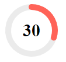

# Circular Gauge Overview

The <a href = "https://www.telerik.com/blazor-ui/circular-gauge" target="_blank">Telerik Circular Gauge for Blazor</a> represents [numerical values]() on a circular [scale]().

#### This article is separated in the following sections: 

* [Basics](#basics)

* [Features](#features)

* [Methods](#methods)

## Basics

>caption To add a Telerik Circular Gauge for Blazor to your application:

1. Add the `<TelerikCircularGauge>` tag.

1. Add one or more instance of the `<CircularGaugePointer>` to the `<CircularGaugePointers>` collection.

1. Provide a `Value` for each `<CircularGaugePointer>`.

1. (Optional) You can use the [Center Label Template](#center-template) to display the value of the pointer in the center of the component.

>caption Basic Telerik Circular Gauge for Blazor.



````CSHTML
@* Setup a basic circular gauge with center label template *@

<TelerikCircularGauge Width="100px" Height="100px">

    <CircularGaugePointers>
        <CircularGaugePointer Value="30" Size="10" />
    </CircularGaugePointers>

    <CircularGaugeCenterLabel>
        <Template>
            @{
                var pointer = context.Pointers.FirstOrDefault();

                <div style="font-weight: bold; font-size:30px">@pointer.Value</div>
            }
        </Template>
    </CircularGaugeCenterLabel>

</TelerikCircularGauge>
````

## Features

The Telerik Circular Gauge for Blazor exposes the following features:

#### Circular Gauge Size

* `Width` - `string` - controls the width of the component. You can read more on how they work in the [Dimensions]() article.

* `Height` - `string` - controls the height of the component. You can read more on how they work in the [Dimensions]() article.

You can also set the Gauge size in percentage values so it occupies its container when it renderes. If the parent container size changes, you must call the gauge's `Refresh()` C# [method](#methods) after the DOM has been redrawn and the new container dimensions are rendered.

#### Other Features

* `Class` - renders a custom CSS class on the topmost wrapping element of the component. You can use that class to reposition the component on the page.

* [Scale]() - The scale of the circular gauge renders the values of the [pointers]() and [labels]().

* [Labels]() - The labels are rendered on the scale of the component to give information to the users.

* [Pointers]() - The pointers indicate the values on the scale of the component.

## Methods

The Circular Gauge reference exposes the `Refresh` method which allows you to programatically re-render the component.

>caption Get a component reference and use the Refresh method

````CSHTML
@* Change the Height of the component *@

<TelerikButton OnClick="@ChangeTheHeight">Change the Height of the component</TelerikButton>

<TelerikCircularGauge @ref="@CircularGaugeRef" Height="@Height">
    <CircularGaugePointers>

        <CircularGaugePointer Value="30" />

    </CircularGaugePointers>
</TelerikCircularGauge>

@code {
    Telerik.Blazor.Components.TelerikCircularGauge CircularGaugeRef { get; set; }

    public string Height { get; set; } = "300px";

    async Task ChangeTheHeight()
    {
        Height = "450px";

        //give time to the framework and browser to resize the actual DOM so the gauge can use the expected size
        await Task.Delay(30);

        CircularGaugeRef.Refresh();
    }
}
````

## See Also

* [Circular Gauge: Live Demo](https://demos.telerik.com/blazor-ui/circular-gauge)
* [Circular Gauge: Scale]()
* [Circular Gauge: Pointers]()
* [Circular Gauge: Labels]()