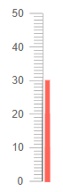

# Linear Gauge Overview

The <a href = "https://www.telerik.com/blazor-ui/linear-gauge" target="_blank">Telerik Linear Gauge for Blazor</a> represents [numerical values]() on a [scale]() of ranges in a linear format.

#### This article is separated in the following sections: 

* [Basics](#basics)

* [Features](#features)

* [Methods](#methods)

## Basics

>caption To add a Telerik Linear Gauge for Blazor to your application:

1. Add the `<TelerikLinearGauge>` tag.

1. Add one or more instance of the `<LinearGaugePointer>` to the `<LinearGaugePointers>` collection.

1. Provide a `Value` for each `<LinearGaugePointer>`.

>caption Basic Telerik Linear Gauge for Blazor.



````CSHTML
@* Setup a basic linear gauge *@

<TelerikLinearGauge>
    <LinearGaugePointers>
        <LinearGaugePointer Value="30" />
    </LinearGaugePointers>
</TelerikLinearGauge>
````

## Features

The Telerik Linear Gauge for Blazor exposes the following features:

#### Linear Gauge Size

* `Width` - `string` - controls the width of the component. You can read more on how they work in the [Dimensions]() article.

* `Height` - `string` - controls the height of the component. You can read more on how they work in the [Dimensions]() article.

You can also set the Gauge size in percentage values so it occupies its container when it renderes. If the parent container size changes, you must call the gauge's `Refresh()` C# [method](#methods) after the DOM has been redrawn and the new container dimensions are rendered.

#### Other Feautres

* `Class` - renders a custom CSS class on the topmost wrapping element of the component. You can use that class to reposition the component on the page.

* Scale - The scale of the linear gauge renders the values of the [pointers](), different [ranges]() and [labels](). See the [Scale]() article for more information on how to customize the scale of the component.

* Ranges - The ranges are used to visually distinguish particular values on the scale. See the [Ranges]() article for more information on how to provide ranges for the scale of the component.

* Labels - The labels are rendered on the scale of the component to give information to the users. See the [Labels]() article for more information on how to customize the labels on the scale of the component.

* Pointers - The pointers indicate the values on the scale of the component. See the [Pointers]() article for more information on how to customize the pointers of the component.

## Methods

The Linear Gauge reference exposes the `Refresh` method which allows you to programatically re-render the component. 

>caption Get a component reference and use the Refresh method

````CSHTML
@* Change the Height of the component *@

<TelerikButton OnClick="@ChangeTheHeight">Change the Height of the component</TelerikButton>

<TelerikLinearGauge @ref="@LinearGaugeRef" Height="@Height">
    <LinearGaugePointers>
    
        <LinearGaugePointer Value="30" />
        
    </LinearGaugePointers>
</TelerikLinearGauge>

@code {
    Telerik.Blazor.Components.TelerikLinearGauge LinearGaugeRef { get; set; }

    public string Height { get; set; } = "300px";

    private void ChangeTheHeight()
    {
        Height = "450px";

        LinearGaugeRef.Refresh();
    }
}
````

## See Also

* [Linear Gauge: Live Demo](https://demos.telerik.com/blazor-ui/linear-gauge)
* [Linear Gauge: Scale]()
* [Linear Gauge: Pointers]()