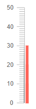

# Gauges Overview

The Telerik UI for Blazor suite offers several gauge components that let you visualize data values against a scale to easily identify them as suitable or sub-par values.

#### There are four different types of gauges available:

* [Circular gauge]() - the dial is a full circle to fit modern dashboard designs, and allows a center template where you can place the value and/or clarifications.

    

* [Linear gauge]() - the dial is a classic straight ruler scale that resembles a thermometer.

    

* [Radial gauge]() - the dial is a section of a circle with a needle pointing to the value which resembles a car speedometer or old-school physical gauge devices.

    

* [Arc gauge]() - the dial is a section of a circle in a fashion similar to the circular gauge.
    
    
