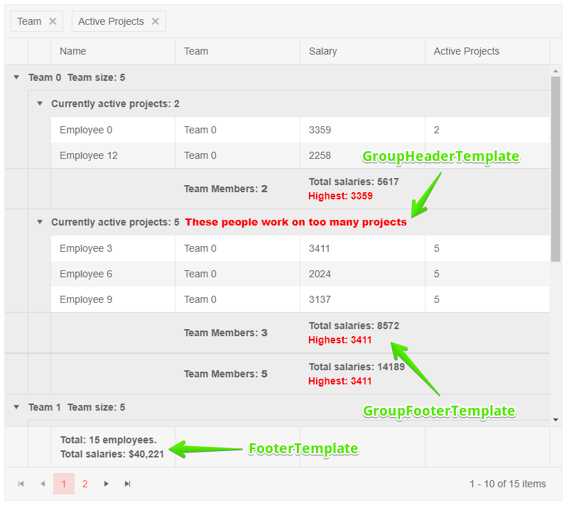

# Grid Aggregates

The Grid component provides built-in aggregates for column values based on [grouping]().

There are several available aggregate functions under the `Telerik.Blazor.GridAggregateType` enum:

* `Average`
* `Count`
* `Max`
* `Min`
* `Sum`

The `Count` aggregate can be applied to any type of field. The other aggregates can only be applied to numerical fields (e.g., `int`, `decimal`, `double`, etc.).

You can use aggregates in the following templates:

* `GroupFooterTemplate` of a `GridColumn` - a footer in the respective column that renders when the grid is grouped.
* `GroupHeaderTemplate` of a `GridColumn` - a header in the respective column that renders when the grid is grouped by that column. The `Value` field in the context carries the current group value.

To enable aggregates:

1. Set the grid's `Groupable` property to `true`.
1. Under the `GridAggregates` tag, define the `GridAggregate` entries to enable the aggregations per field you want to use.
1. Use the aggregate result in the templates that support it - their `context` is strongly typed and carries the aggregate values in the respective fields.
1. Group the grid to see the effect

You should define only aggregates that you will use to avoid unnecessary calculations that may be noticeable on large data sets.

If you try to use an aggregate that is not defined, or an aggregate over an unsupported field type, a runtime error will be thrown.


>caption Use Aggregates in the Telerik Blazor Grid

````CSHTML
@* Enable and use aggregates. To see the effect, group by a column - "Team" and then "Active Projects" *@

<TelerikGrid Data=@GridData Groupable="true" Pageable="true" Height="650px">
    <GridAggregates>
        <GridAggregate Field=@nameof(Employee.Team) Aggregate="@GridAggregateType.Count" />
        <GridAggregate Field=@nameof(Employee.Salary) Aggregate="@GridAggregateType.Max" />
        <GridAggregate Field=@nameof(Employee.Salary) Aggregate="@GridAggregateType.Sum" />
    </GridAggregates>
    <GridColumns>
        <GridColumn Field=@nameof(Employee.Name) Groupable="false" />
        <GridColumn Field=@nameof(Employee.Team) Title="Team">
            <GroupFooterTemplate>
                Team Members: <strong>@context.Count</strong>
            </GroupFooterTemplate>
            <GroupHeaderTemplate>
                @context.Value @* the default text you would get without the template *@
                &nbsp;<span>Team size: @context.Count</span>
            </GroupHeaderTemplate>
        </GridColumn>
        <GridColumn Field=@nameof(Employee.Salary) Title="Salary" Groupable="false">
            <GroupFooterTemplate>
                @* you can use a group footer for non-groupable columns as well *@
                Total montly salary: @context.Sum
                <br />
                <span style="color: red;">Top paid employee: @context.Max</span>
            </GroupFooterTemplate>
        </GridColumn>
        <GridColumn Field=@nameof(Employee.ActiveProjects) Title="Active Projects">
            <GroupHeaderTemplate>
                @{
                    <span>Currently active projects: @context.Value &nbsp;</span>

                    //sample of conditional logic in the group header
                    if ( (int)context.Value > 3) // in a real case, you may want to ensure type safety and add defensive checks
                    {
                        <strong style="color: red;">These people work on too many projects</strong>
                    }
                }
            </GroupHeaderTemplate>
        </GridColumn>
    </GridColumns>
</TelerikGrid>

@code {
    public List<Employee> GridData { get; set; }

    protected override void OnInitialized()
    {
        GridData = new List<Employee>();
        var rand = new Random();
        for (int i = 0; i < 15; i++)
        {
            Random rnd = new Random();
            GridData.Add(new Employee()
            {
                EmployeeId = i,
                Name = "Employee " + i.ToString(),
                Team = "Team " + i % 3,
                Salary = rnd.Next(1000, 5000),
                ActiveProjects = i % 4 == 0 ? 2 : 5
            });
        }
    }

    public class Employee
    {
        public int EmployeeId { get; set; }
        public string Name { get; set; }
        public string Team { get; set; }
        public decimal Salary { get; set; }
        public int ActiveProjects { get; set; }
    }
}
````

>caption The result of the code snippet above after the grid has been grouped by the `Team` and `Active Projects` columns




## See Also

  * [Live Demo: Grid Grouping](https://demos.telerik.com/blazor-ui/grid/grouping)
   
  
