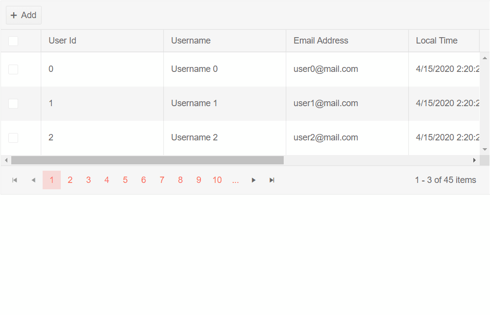

# Automatically Generated Columns

The Grid allows you to automatically generate a column for each public property of its model rather than defining each column manually.

To enable Automatic Column Generation, set the `AutoGenerateColumns` parameter of the Grid to `true`.

The content of this article will be separated into groups for clarity:

* [Basics](#basics)
	* [Declare Explicit Columns](#declare-explicit-columns)
* [Customization](#customization)
	* [Example](#example)


## Basics

To display all model fields in the grid, just set its `AutoGenerateColumns` parameter to `true`.

If you don't need explicitly declared columns (such as a command column or frozen columns) the `GridColumns` tag is not required.

>caption Use the AutoGenerateColumns parameter to generate columns out of a model

````CSHTML
@* Data display requires only a single parameter. See the next examples for customizations and CRUD operations *@

<TelerikGrid Data="@GridData" AutoGenerateColumns="true"
             Pageable="true" PageSize="4">
</TelerikGrid>

@code {
    public class GridDataModel
    {
        public int Id { get; set; }
        public string Username { get; set; }
        public string EmailAddress { get; set; }
        public DateTime? RegistrationDate { get; set; }
        public DateTime? LocalTime { get; set; }
        public string BoughtBooks { get; set; } = String.Join(", ", Books);
    }

    List<GridDataModel> GridData { get; set; } = Enumerable.Range(1, 15).Select(i => new GridDataModel()
    {
        Id = i,
        Username = $"Username {i}",
        EmailAddress = $"user{i}@mail.com",
        RegistrationDate = DateTime.Now.AddDays(-2),
        LocalTime = DateTime.Now
    }).ToList();

    static List<string> Books = new List<string>() { "Wolf", "Lord of the Rings", "The Hobbit" };
}
````
>caption The result from the code snippet above.


### Declare Explicit Columns

The Grid can consist of both Automatically Generated and explicitly declared columns.

The following examples show how you can control their order and positions:

* [Default Column Order](#default-column-order)
* [Define Explicit Column Order](#define-explicit-column-order)

### Default Column Order

By default the Automatically Generated Columns are rendered after the manually declared ones.

>caption Observe the default positioning of the Automatically Generated Columns


````CSHTML
@* The autogenerated columns are after those you define manually. *@

<TelerikGrid Data="@GridData" AutoGenerateColumns="true"
                Pageable="true" PageSize="4">
    <GridColumns>
        <GridCheckboxColumn />
    </GridColumns>
</TelerikGrid>

@code {
    public class GridDataModel
    {
        public int Id { get; set; }
        public string Username { get; set; }
        public string EmailAddress { get; set; }
        public DateTime? RegistrationDate { get; set; }
        public DateTime? LocalTime { get; set; }
        public string BoughtBooks { get; set; } = String.Join(", ", Books);
    }

    List<GridDataModel> GridData { get; set; } = Enumerable.Range(1, 15).Select(i => new GridDataModel()
    {
        Id = i,
        Username = $"Username {i}",
        EmailAddress = $"user{i}@mail.com",
        RegistrationDate = DateTime.Now.AddDays(-2),
        LocalTime = DateTime.Now
    }).ToList();

    static List<string> Books = new List<string>() { "Wolf", "Lord of the Rings", "The Hobbit" };
}
````

>caption The result from the code snippet above


### Define Explicit Column Order

To set explicit position of the Automatically Generated Columns you can use the `GridAutoGeneratedColumns` tag inside the `GridColumns` tag and place it in the order you want it to have in relation to the columns you declare.

>note When the `GridAutoGeneratedColumns` tag is used the `AutoGenerateColumns` parameter of the Grid must also set to `true`.

>caption Observe explicitly set position of the Automatically Generated Columns between a Checkbox and Command columns

````CSHTML
@* For brevity, editing is not implemented in this example *@

<TelerikGrid Data="@GridData" AutoGenerateColumns="true"
                Pageable="true" PageSize="4">
    <GridColumns>
        <GridCheckboxColumn />
        <GridAutoGeneratedColumns />
        <GridCommandColumn>
            <GridCommandButton Command="Edit" Icon="edit">Edit</GridCommandButton>
        </GridCommandColumn>
    </GridColumns>
</TelerikGrid>

@code {
    public class GridDataModel
    {
        public int Id { get; set; }
        public string Username { get; set; }
        public string EmailAddress { get; set; }
        public DateTime? RegistrationDate { get; set; }
        public DateTime? LocalTime { get; set; }
        public string BoughtBooks { get; set; } = String.Join(", ", Books);
    }

    List<GridDataModel> GridData { get; set; } = Enumerable.Range(1, 15).Select(i => new GridDataModel()
    {
        Id = i,
        Username = $"Username {i}",
        EmailAddress = $"user{i}@mail.com",
        RegistrationDate = DateTime.Now.AddDays(-2),
        LocalTime = DateTime.Now
    }).ToList();

    static List<string> Books = new List<string>() { "Wolf", "Lord of the Rings", "The Hobbit" };
}
````
>caption The result from the code snippet above


## Customization

* You can set the `Title` of the column through the `[Display(Name="The Desired Title")]` attribute on the fields of your model.
* You can set the `[Display(AutoGenerateField=false)]` attribute over a property of your model if you want to prevent auto-generation of a column from that field.
* You can prevent data mutation by setting the `[Editable]` attribute to `false` on fields of your model.
 * The properties that do not have a `setter` or the `setter` is not accessible (private) will not be editable either.
* You can set custom width to all auto-generated columns through the `ColumnWidth` parameter of `GridAutoGeneratedColumns`. By default they will be equally distributed to fill the width of the Grid.
    * To enable horizontal scrolling the `ColumnWidth` parameter has to be set so that the sum of all columns is greater than the Grid width. You can find more information in the [Column Width]() article.

>tip To use the attributes listed above the `System.ComponentModel.DataAnnotations` using statement has to be present in the file with your model. With [Popup editing](https://demos.telerik.com/blazor-ui/grid/editing-popup), you can use validation attributes in addition to the customization attributes.

### Example

This example shows how to:
* Use data annotation attributes to
    * set the column titles (e.g., `BoughtBooks`)
    * make a field non-editable (e.g., `Id`)
    * hide a field from the grid (e.g., `RegistrationDate`)
    * validate the data (e.g., `Username`)
* Use the `[Display(AutoGenerateField = false)]` attribute to prevent a column from being generated, so you can declare it yourself and customize it (e.g., `RegistrationDate`)
* Select the order of the columns and set explicit position of the autogenerated Columns
* Make CUD operations
* Make multiple selection
* Add paging to the Grid

>caption Observe the behavior of auto-generated columns with [Editing operations](../editing/overview), [Selection](../selection/overview), [Paging](../paging) and using the custom attributes.

````CSHTML
@using System.ComponentModel.DataAnnotations
@using System.Collections.ObjectModel

<div style="max-width: 800px;">
    
    <TelerikGrid Data="@GridData"
                    AutoGenerateColumns="true"
                    EditMode="GridEditMode.Popup"
                    Pageable="true"
                    SelectionMode="GridSelectionMode.Multiple"
                    @bind-SelectedItems="@SelectedUsers"
                    PageSize="@PageSize"
                    OnCreate="@CreateItem"
                    OnUpdate="@UpdateItem"
                    OnDelete="@DeleteItem">
        <GridToolBar>
            <GridCommandButton Command="Add" Icon="add">Add</GridCommandButton>
        </GridToolBar>
        <GridColumns>
            <GridCheckboxColumn />
            <GridAutoGeneratedColumns ColumnWidth="200px" />
            <GridColumn Field="@nameof(GridDataModel.RegistrationDate)" Title="Registration Date" Width="200px" />
            <GridCommandColumn Width="250px">
                <GridCommandButton Command="Edit" Icon="edit">Edit</GridCommandButton>
                <GridCommandButton Command="Delete" Icon="delete">Delete</GridCommandButton>
            </GridCommandColumn>
        </GridColumns>
    </TelerikGrid>


    @if (SelectedUsers.Any())
    {
        <h4 class="text-info">Selected users:</h4>
        @foreach (var user in SelectedUsers)
        {
            <div class="card">
                <div class="card-body">
                    <h5>@user.Username</h5>
                    <h6 class="card-subtitle mb-2 text-muted">@user.EmailAddress</h6>
                    <p class="card-text">
                        Registered on: @user.RegistrationDate.ToShortDateString()
                    </p>
                    <p class="card-text">
                        Purchased books: @user.BoughtBooks
                    </p>
                </div>
            </div>
        }
    }
</div>

@code {
    public List<GridDataModel> GridData { get; set; }
    public IEnumerable<GridDataModel> SelectedUsers { get; set; } = new ObservableCollection<GridDataModel>();
    public int PageSize { get; set; } = 3;

    #region data model with annotations
    public class GridDataModel
    {
        [Editable(false)]
        [Display(Name = "User Id")]
        public int Id { get; set; }

        [Required(ErrorMessage = "Username is mandatory field")]
        public string Username { get; set; }

        [Required(ErrorMessage = "Email address is mandatory field")]
        [EmailAddress(ErrorMessage = "Please provide a valid email address.")]
        [Display(Name = "Email Address")]
        public string EmailAddress { get; set; }

        [Display(AutoGenerateField = false)]
        public DateTime RegistrationDate { get; set; }

        [Display(Name = "Local Time")]
        public DateTime LocalTime { get; set; }

        [Display(Name = "Purchased books")]
        public string BoughtBooks { get; set; } = String.Join(", ", Books);
    }

    private static List<string> Books = new List<string>() { "Wolf", "Lord of the Rings", "The Hobbit" };

    #endregion

    #region CUD operations
    async Task UpdateItem(GridCommandEventArgs args)
    {
        GridDataModel item = (GridDataModel)args.Item;

        // perform actual data source operations here through your service
        await MyService.Update(item);

        // update the local view-model data with the service data
        await GetGridData();
    }

    async Task DeleteItem(GridCommandEventArgs args)
    {
        GridDataModel item = (GridDataModel)args.Item;

        // perform actual data source operation here through your service
        await MyService.Delete(item);

        // update the local view-model data with the service data
        await GetGridData();
    }

    async Task CreateItem(GridCommandEventArgs args)
    {
        GridDataModel item = (GridDataModel)args.Item;

        // perform actual data source operation here through your service
        await MyService.Create(item);

        // update the local view-model data with the service data
        await GetGridData();
    }

    #endregion

    async Task GetGridData()
    {
        GridData = await MyService.Read();
    }

    protected override async Task OnInitializedAsync()
    {
        await GetGridData();
    }

    // the following static class mimics an actual data service that handles the actual data source
    // replace it with your actual service through the DI, this only mimics how the API can look like and works for this standalone page
    public static class MyService
    {
        private static List<GridDataModel> _data { get; set; } = new List<GridDataModel>();

        public static async Task Create(GridDataModel itemToInsert)
        {
            itemToInsert.Id = _data.Count + 1;
            _data.Insert(0, itemToInsert);
        }

        public static async Task<List<GridDataModel>> Read()
        {
            if (_data.Count < 1)
            {
                for (int i = 0; i < 45; i++)
                {
                    _data.Add(new GridDataModel()
                    {
                        Id = i,
                        Username = $"Username {i}",
                        EmailAddress = $"user{i}@mail.com",
                        RegistrationDate = DateTime.Now.AddDays(-2),
                        LocalTime = DateTime.Now
                    });
                }
            }

            return await Task.FromResult(_data);
        }

        public static async Task Update(GridDataModel itemToUpdate)
        {
            var index = _data.FindIndex(i => i.Id == itemToUpdate.Id);
            if (index != -1)
            {
                _data[index] = itemToUpdate;
            }
        }

        public static async Task Delete(GridDataModel itemToDelete)
        {
            _data.Remove(itemToDelete);
        }
    }
}
````
>caption The result from the code snippet above




## See also
* [Column Width]()
* [Live Demo: Auto Generated Columns](https://demos.telerik.com/blazor-ui/grid/column-auto-generation)
* [Selection]()
* [Paging]()
