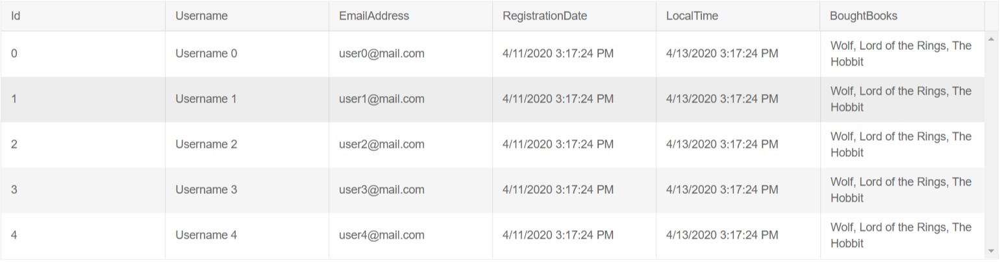
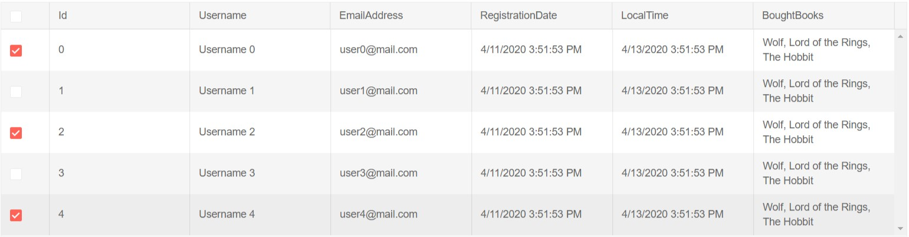
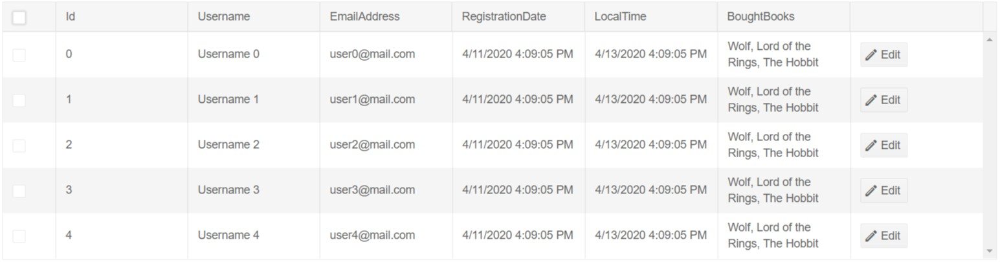
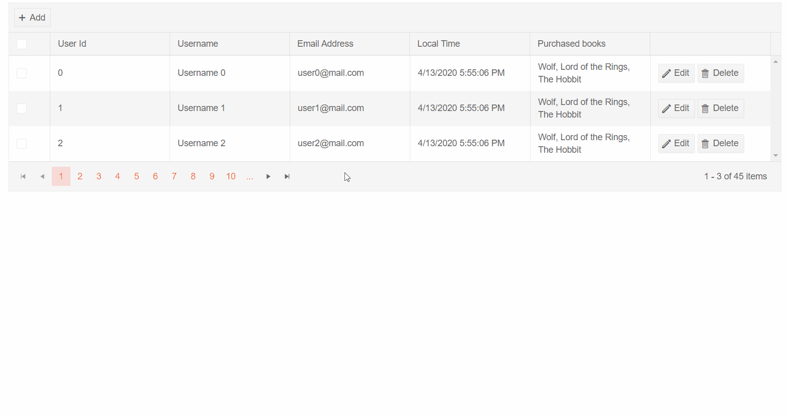

# Automatically Generated Columns

The Grid allows you to automatically generate a column for each public property of a given model. The properties that do not have a `setter` will not be editable.

To enable Automatic Column Generation, set the `AutoGenerateColumns` parameter of the Grid to `true`.

The content of this article will be separated into groups for clarity:
* [Grid with only Automatically Generated Columns](#grid-with-only-automatically-generated-columns)
* [Grid with Automatically Generated and Explicitly Generated Columns](#grid-with-automatically-and-explicitly-generated-columns)
 * [Default positioning of the Automatically Generated Columns](#default-positioning-of-the-automatically-generated-columns)
 * [Set explicit position of the Automatically Generated Columns](#set-explicit-position-of-the-automatically-generated-columns)
* [Customization](#customization)
* [Example](#example)


## Grid with only Automatically Generated Columns

If the Grid will not have explicitly defined columns the `GridColumns` tag is not required.

>caption Use the AutoGenerateColumns parameter to generate columns out of a model



````CSHTML
<TelerikGrid Data="@GridData"
             AutoGenerateColumns="true">
</TelerikGrid>

@code {
    public List<GridDataModel> GridData { get; set; }

    public class GridDataModel
    {
        public int Id { get; set; }
        public string Username { get; set; }
        public string EmailAddress { get; set; }
        public DateTime? RegistrationDate { get; set; }
        public DateTime? LocalTime { get; set; }
        private static List<string> Books = new List<string>() { "Wolf", "Lord of the Rings", "The Hobbit" };
        public string BoughtBooks { get; set; } = String.Join(", ", Books);
    }

    protected override void OnInitialized()
    {
        GridData = new List<GridDataModel>();
        for (int i = 0; i < 15; i++)
        {
            GridData.Add(new GridDataModel()
            {
                Id = i,
                Username = $"Username {i}",
                EmailAddress = $"user{i}@mail.com",
                RegistrationDate = DateTime.Now.AddDays(-2),
                LocalTime = DateTime.Now
            });
        }

        base.OnInitialized();
    }
}
````
## Grid with Automatically Generated and Explicitly Generated Columns

#### Default positioning of the Automatically Generated Columns

By default the Automatically Generated Columns are ordered after the Explicitly Generated ones.

>caption Observe the default positioning of the Automatically Generated Columns



````CSHTML
<TelerikGrid Data="@GridData"
             AutoGenerateColumns="true">
    <GridColumns>
        <GridCheckboxColumn />
    </GridColumns>
</TelerikGrid>

@code {
    public List<GridDataModel> GridData { get; set; }

    public class GridDataModel
    {
        public int Id { get; set; }
        public string Username { get; set; }
        public string EmailAddress { get; set; }
        public DateTime? RegistrationDate { get; set; }
        public DateTime? LocalTime { get; set; }
        private static List<string> Books = new List<string>() { "Wolf", "Lord of the Rings", "The Hobbit" };
        public string BoughtBooks { get; set; } = String.Join(", ", Books);
    }

    protected override void OnInitialized()
    {
        GridData = new List<GridDataModel>();
        for (int i = 0; i < 5; i++)
        {
            GridData.Add(new GridDataModel()
            {
                Id = i,
                Username = $"Username {i}",
                EmailAddress = $"user{i}@mail.com",
                RegistrationDate = DateTime.Now.AddDays(-2),
                LocalTime = DateTime.Now
            });
        }

        base.OnInitialized();
    }
}
````
#### Set explicit position of the Automatically Generated Columns

To set explicit position of the Automatically Generated Columns you can use the `GridAutoGeneratedColumns` tag inside the `GridColumns` tag.

>tip When the `GridAutoGeneratedColumns` tag is used the `AutoGenerateColumns` parameter of the Grid has to be also set to true.

>caption Observe explicitly set position of the Automatically Generated Columns between a Checkbox and Command columns



````CSHTML
<TelerikGrid Data="@GridData"
             AutoGenerateColumns="true">
    <GridColumns>
        <GridCheckboxColumn />
        <GridAutoGeneratedColumns />
        <GridCommandColumn>
            <GridCommandButton Command="Edit" Icon="edit">Edit</GridCommandButton>
        </GridCommandColumn>
    </GridColumns>
</TelerikGrid>

@code {
    public List<GridDataModel> GridData { get; set; }

    public class GridDataModel
    {
        public int Id { get; set; }
        public string Username { get; set; }
        public string EmailAddress { get; set; }
        public DateTime? RegistrationDate { get; set; }
        public DateTime? LocalTime { get; set; }
        private static List<string> Books = new List<string>() { "Wolf", "Lord of the Rings", "The Hobbit" };
        public string BoughtBooks { get; set; } = String.Join(", ", Books);
    }

    protected override void OnInitialized()
    {
        GridData = new List<GridDataModel>();
        for (int i = 0; i < 5; i++)
        {
            GridData.Add(new GridDataModel()
            {
                Id = i,
                Username = $"Username {i}",
                EmailAddress = $"user{i}@mail.com",
                RegistrationDate = DateTime.Now.AddDays(-2),
                LocalTime = DateTime.Now
            });
        }

        base.OnInitialized();
    }
}
````

## Customization

* You can set the `Title` of the column through the `[Display(Name="The Desired Title")]` attribute on the fields of your model.
* You can set the `[Display(AutoGenerateField=false)]` attribute over a property of your model if you want to prevent auto-generation of a column from that field.
* You can prevent data mutation by setting the `[Editable]` attribute to `false` on fields of your model.
* You can set custom width to all auto-generated columns through the `ColumnWidth` parameter of `GridAutoGeneratedColumns`. By default they will be equally distributed to fill the width of the Grid.

>tip To enable horizontal scrolling you have to set the `ColumnWidth` parameter so that the sum of all columns is greater than the Grid width. More information can be found in the [Column Width]() article.

>tip To use the custom attributes you have to insert the `System.ComponentModel.DataAnnotations` using statement to your razor page. You can use all validation attributes in conjunction with the custom attributes listed above.

## Example

>caption Obeserve the behavior of auto-generated columns with CRUD operations, Selection, Paging and using the custom attributes.




````CSHTML
@using System.ComponentModel.DataAnnotations
@using System.Collections.ObjectModel

<TelerikGrid Data="@GridData"
             AutoGenerateColumns="true"
             EditMode="GridEditMode.Popup"
             Pageable="true"
             SelectionMode="GridSelectionMode.Multiple"
             @bind-SelectedItems="@SelectedUsers"
             PageSize="@PageSize"
             OnCreate="@CreateItem"
             OnUpdate="@UpdateItem"
             OnDelete="@DeleteItem">
    <GridToolBar>
        <GridCommandButton Command="Add" Icon="add">Add</GridCommandButton>
    </GridToolBar>
    <GridColumns>
        <GridCheckboxColumn />
        <GridAutoGeneratedColumns />
        <GridCommandColumn>
            <GridCommandButton Command="Edit" Icon="edit">Edit</GridCommandButton>
            <GridCommandButton Command="Delete" Icon="delete">Delete</GridCommandButton>
        </GridCommandColumn>
    </GridColumns>
</TelerikGrid>

@if (SelectedUsers.Any())
{
    <h4 class="text-info">Selected users:</h4>
    @foreach (var user in SelectedUsers)
    {
        <div class="card">
            <div class="card-body">
                <h5>@user.Username</h5>
                <h6 class="card-subtitle mb-2 text-muted">@user.EmailAddress</h6>
                <p class="card-text">
                    Registered on: @user.RegistrationDate.ToShortDateString()
                </p>
                <p class="card-text">
                    Purchased books: @user.BoughtBooks
                </p>
            </div>
        </div>
    }
}

@code {
    public List<GridDataModel> GridData { get; set; }
    public IEnumerable<GridDataModel> SelectedUsers { get; set; } = new ObservableCollection<GridDataModel>();

    public int PageSize { get; set; } = 3;

    public class GridDataModel
    {
        [Editable(false)]
        [Display(Name = "User Id")]
        public int Id { get; set; }
        public string Username { get; set; }

        [Display(Name = "Email Address")]
        public string EmailAddress { get; set; }

        [Display(AutoGenerateField = false)]
        public DateTime RegistrationDate { get; set; }

        [Display(Name = "Local Time")]
        public DateTime LocalTime { get; set; }
        private static List<string> Books = new List<string>() { "Wolf", "Lord of the Rings", "The Hobbit" };

        [Display(Name = "Purchased books")]
        public string BoughtBooks { get; set; } = String.Join(", ", Books);
    }

    #region CUD operations
    private void UpdateItem(GridCommandEventArgs args)
    {
        // perform actual data source operations here through your service

        var item = args.Item as GridDataModel;
        var index = GridData.FindIndex(x => x.Id == item.Id);
        if (index != -1)
        {
            GridData[index] = item;
        }
    }
    private void CreateItem(GridCommandEventArgs args)
    {
        // perform actual data source operations here through your service

        var item = args.Item as GridDataModel;

        item.Id = GridData.Count + 1;

        GridData.Insert(0, item);
    }

    private void DeleteItem(GridCommandEventArgs args)
    {
        // perform actual data source operations here through your service

        var item = args.Item as GridDataModel;

        GridData.Remove(item);
    }
    #endregion

    protected override void OnInitialized()
    {
        GridData = new List<GridDataModel>();
        for (int i = 0; i < 45; i++)
        {
            GridData.Add(new GridDataModel()
            {
                Id = i,
                Username = $"Username {i}",
                EmailAddress = $"user{i}@mail.com",
                RegistrationDate = DateTime.Now.AddDays(-2),
                LocalTime = DateTime.Now
            });
        }

        base.OnInitialized();
    }
}
````

## See also
 * [Live demo: Frozen Columns](https://demos.telerik.com/blazor-ui/grid/frozen-columns)
