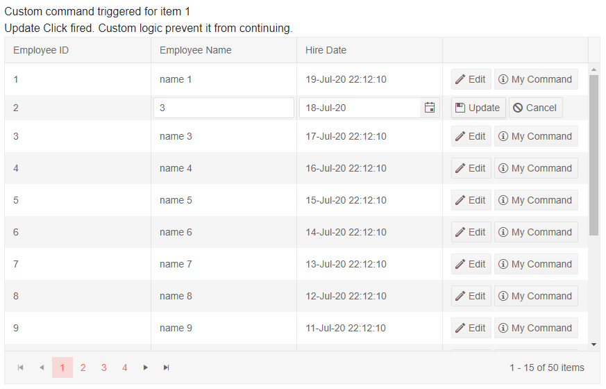

# Grid Command Column

The command column of a grid allows you to initiate [inline]() or [popup]() editing, or to execute your own commands.

To define it, add a `GridCommandColumn` in the `GridColumns` collection of a grid. The command column takes a collection of `GridCommandButton` instances that invoke the commands. It also offers the `Title` property so you can set its header text.

>tip The lists below showcase the available features and their use. After them you can find a code example that shows declarations and handling.

The `GridCommandButton` tag offers the following features:

* `Command` - the command that will be invoked. Can be one of the built-in commands (see below), or a custom command name.
* `OnClick` - the event handler that the button will fire. If used on a built-in command, this handler will fire before the [corresponding CRUD event](). Cancelling it will prevent the built-in CRUD event from firing.
* `ShowInEdit` - a boolean property indicating whether the button is only visible while the user is editing/inserting data.
* `ChildContent` - the text the button will render. You can also place it between the command button's opening and closing tags.
* Appearance properties like `Icon`, `Class`, `Enabled` that are come from the underlying [Button Component features]().

There are three built-in commands:

* `Edit` - initiates the inline or popup editing (depending on the GridEditMode configuration of the grid).
* `Save` - performs the actual update operation after the data has been changed. Triggers the `OnUpdate` or `OnCreate` event so you can perform the data source operation. Which event is triggered depends on whether the item was added through the grid or not.
* `Cancel` - aborts the current operation (edit or insert).

The `OnClick` handler of the commands receives an argument of type `GridCommandEventArgs` that exposes the following properties:

* `IsCancelled` - set this to true to prevent the operation if the business logic requires it.
* `Item` - the model item the grid row is bound to. You can use it to access the model fields and methods in order to preform the actual data source operations.
* `IsNew` - a boolean field indicating whether the item was just added through the grid interface.

>tip For handling CRUD operations we recommend that you use the grid events (`OnEdit`, `OnUpdate`, `OnCancel`, `OnCreate`). The `OnClick` handler is available for the built-in commands to provide consistency of the API.

>tip The event handlers use `EventCallback` and can be syncronous or async. This example shows async versions, and the signature for the syncrhronous handlers is `void MyHandlerName(GridCommandEventArgs args)`.

>caption Example of adding and handling command columns for inline editing of a grid

````CSHTML
Edit will be cancelled for "name 2". There is a deliberate delay in the event handlers to showcase their async nature. Actual CRUD operations are not implemented, the code showcases how you can obtain the information so you can use it.
<br />
@CustomCommandResult

<TelerikGrid Data=@GridData EditMode="@GridEditMode.Inline"
			 Pageable="true" PageSize="15" Height="500px">
	<GridColumns>
		<GridColumn Field=@nameof(SampleData.ID) Editable="false" Title="Employee ID" />
		<GridColumn Field=@nameof(SampleData.Name) Title="Employee Name" />
		<GridColumn Field=@nameof(SampleData.HireDate) Title="Hire Date" />
		<GridCommandColumn>
			<GridCommandButton Command="Edit" Icon="edit" OnClick="@MyEditHandler">Edit</GridCommandButton>
			<GridCommandButton Command="Save" Icon="save" ShowInEdit="true" OnClick="@MyUpdateHandler">Update</GridCommandButton>
			<GridCommandButton Command="Cancel" Icon="cancel" ShowInEdit="true" OnClick="@MyCancelHandler">Cancel</GridCommandButton>
			<GridCommandButton Command="MyOwnCommand" Icon="information" ShowInEdit="false" OnClick="@MyCustomCommand">My Command</GridCommandButton>
		</GridCommandColumn>
	</GridColumns>
</TelerikGrid>

@code {
	//in a real case, keep the models in dedicated locations, this is just an easy to copy and see example
	public class SampleData
	{
		public int ID { get; set; }
		public string Name { get; set; }
		public DateTime HireDate { get; set; }
	}

	public IEnumerable<SampleData> GridData = Enumerable.Range(1, 50).Select(x => new SampleData
	{
		ID = x,
		Name = "name " + x,
		HireDate = DateTime.Now.AddDays(-x)
	});

	private async Task MyEditHandler(GridCommandEventArgs args)
	{
		Console.WriteLine("Edit Click fired. Please wait for the long operation to finish");

		int empId = (args.Item as SampleData).ID;

		//example of cancelling an event based on condition
		//we recommend you do this in the corresponding CRUD event
		if (empId == 2)
		{
			args.IsCancelled = true;
		}

		await Task.Delay(2000); //simulate actual long running async operation
		//await httpClient.PutJsonAsync("myApiUrl/" + empId, args.Item as SampleData); //sample HTTP call
	}

	private async Task MyUpdateHandler(GridCommandEventArgs args)
	{
		Console.WriteLine("Update Click fired. Please wait for the long operation to finish");

		SampleData theUpdatedItem = args.Item as SampleData;
		//save changes, for example by using the model fields and/or methods
		//we recommend you do this in the corresponding CRUD event

		//if you have a context added through an @inject statement, you could call its SaveChanges() method
		//myContext.SaveChanges();

		await Task.Delay(2000); //simulate actual long running async operation
		//await httpClient.PutJsonAsync("myApiUrl/" + theUpdatedItem.ID, theUpdatedItem); //sample HTTP call
	}

	private async Task MyCancelHandler(GridCommandEventArgs args)
	{
		Console.WriteLine("Cancel Click fired. Please wait for the long operation to finish");

		SampleData theUpdatedItem = args.Item as SampleData;
		//revert the changes
		//we recommend you do this in the corresponding CRUD event

		//if you have a context added through an @inject statement, you could use something like this to abort changes
		//foreach (var entry in nwContext.ChangeTracker.Entries().Where(entry => entry.State == EntityState.Modified))
		//{
		//  entry.State = EntityState.Unchanged;
		//}

		await Task.Delay(2000); //simulate actual long running async operation
		//await httpClient.PutJsonAsync("myApiUrl/" + theUpdatedItem.ID, theUpdatedItem); //sample HTTP call

		//inform the view to update
		StateHasChanged();
	}

	private MarkupString CustomCommandResult;

	private async Task MyCustomCommand(GridCommandEventArgs args)
	{
		Console.WriteLine("The Custom command fired. Please wait for the long operation to finish");

		CustomCommandResult = new MarkupString(string.Format("Custom command triggered for item {0}", (args.Item as SampleData).ID));

		await Task.Delay(2000); //simulate actual long running async operation
		//await httpClient.PutJsonAsync("myApiUrl/" + item.Id, item); //sample HTTP call

		//inform the UI for changes because this sample implementation needs it
		StateHasChanged();
	}
}
````

>caption The result from the code snippet above, after Edit was clicked on the first row, and the custom command button on the third row was clicked.



## See Also

  * [Live Demo: Grid Command Column](https://demos.telerik.com/blazor-ui/grid/inlineediting)
