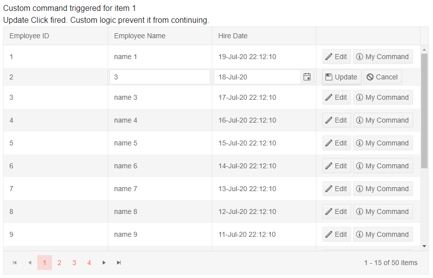

# Grid Command Column

The command column of a grid allows you to initiate [inline](slug:grid-editing-inline) or [popup](slug:grid-editing-popup) editing, or to execute your own commands.

To define it, add a `GridCommandColumn` in the `GridColumns` collection of a grid. The command column takes a collection of `GridCommandButton` instances that invoke the commands. It also provides the data item `context` and a `Title` property to set its header text.

In this article:

* [Grid Command Column Features](#features)
   * [GridCommandButton](#the-gridcommandbutton-tag)
   * [Built-in Commands](#built-in-commands)
   * [OnClick Handler](#the-onclick-handler)
   * [Context](#context)
   * [Header Template](#header-template)
* [Code Example](#example)

## Features

The section describes the available features and their use.

### The GridCommandButton Tag

The `GridCommandButton` tag offers the following features:

* `Command` - the command that will be invoked. Can be one of the built-in commands (see below), or a custom command name.
* `Icon` - the command button icon, which can be a font icon, an SVG icon or a custom icon. Use in the same way as the [Button component `Icon`](slug:button-icons).
* `OnClick` - the event handler that the button will fire. If used on a built-in command, this handler will fire before the [corresponding CRUD event](slug:grid-editing-overview). Cancelling it will prevent the built-in CRUD event from firing.
* `ShowInEdit` - a boolean property indicating whether the button is visible only in edit mode or only in display mode.
* `ChildContent` - the text the button will render. You can also place it between the command button's opening and closing tags.
* You can customize the appearance of the `GridCommandButton` by applying the [appearance attributes available for the TelerikButton](slug:button-appearance).

### Built-in Commands

There are five built-in commands:

* `Add` - initiates the creation of a new item.
* `Edit` - initiates the inline or popup editing (depending on the GridEditMode configuration of the grid).
* `Delete` - initiates the [deletion of an existing item](slug:grid-editing-overview#delete-operations).
* `Save` - performs the actual update operation after the data has been changed. Triggers the `OnUpdate` or `OnCreate` event so you can perform the data source operation. Which event is triggered depends on whether the item was created or edited.
* `Cancel` - aborts the current operation (edit or insert).

> All commands, except `Delete` require [enabled editing](slug:grid-editing-overview).

### The OnClick handler

The `OnClick` handler of the commands receives an argument of type `GridCommandEventArgs` that exposes the following properties:

* `IsCancelled` - set this to true to prevent the operation if the business logic requires it.
* `Item` - the model item of the Grid row. You can use it to access the model fields and preform the actual data source operations. This property is applicable only for command buttons that are inside a Grid row, not the toolbar.
* `IsNew` - a boolean field indicating whether the item was just added through the grid interface.

>tip For handling CRUD operations we recommend that you use the grid events (`OnEdit`, `OnUpdate`, `OnCancel`, `OnCreate`). The `OnClick` handler is available for the built-in commands to provide consistency of the API.

### Context

The command column provides access to the data item via `context`. This may be useful for conditional statements or passing parameters to custom business logic.

Use a **named** context variable to avoid errors when nesting components or `RenderFragment`s in general. In such cases, the exception will be similar to ["Child content element ... uses the same parameter name ('context') as enclosing child content element ..."](slug:nest-renderfragment).

>caption Using GridCommandColumn context

<div class="skip-repl"></div>

````RAZOR
<GridCommandColumn Context="dataItem">
    @{ var product = (Product)dataItem; }

    @if (product.Quantity > 0)
    {
        @* Can edit products in stock. *@
        <GridCommandButton Command="Edit">Edit</GridCommandButton>
        <GridCommandButton Command="Save" ShowInEdit="true">Save</GridCommandButton>
        <GridCommandButton Command="Cancel" ShowInEdit="true">Cancel</GridCommandButton>
    }

    @* Can delete products out of stock. *@
    <GridCommandButton Command="Delete"
                       Enabled="@( product.Quantity == 0 )"
                       Title="@( product.Quantity > 0 ? "Cannot delete products in stock" : string.Empty )">
        Delete
    </GridCommandButton>
</GridCommandColumn>
````

### Header Template

The Grid command column supports [`HeaderTemplate`](slug:grid-templates-command-column-header) that allows you to customize the header cell's rendering.

## Example

The following code example demonstrates declarations and handling.

>tip The event handlers use `EventCallback` and can be synchronous or async. This example shows async versions, and the signature for the synchronous handlers is `void MyHandlerName(GridCommandEventArgs args)`.

>caption Example of handling custom commands in a grid column

<demo metaUrl="client/grid/columns-command/" height="600"></demo>

>caption The result from the code snippet above, after the custom command button was clicked on the first row, and after the user tried to edit the second row to put the number "3" in the Name column.



## Using Components in Grid Command Column

@[template](/_contentTemplates/grid/common-link.md#using-components-in-templates)

## See Also

* [Live Demo: Grid Command Column](https://demos.telerik.com/blazor-ui/grid/editing-inline)
* [Blazor Grid](slug:grid-overview)
