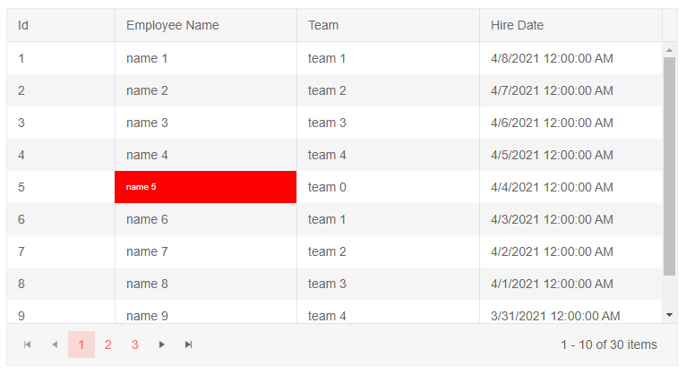
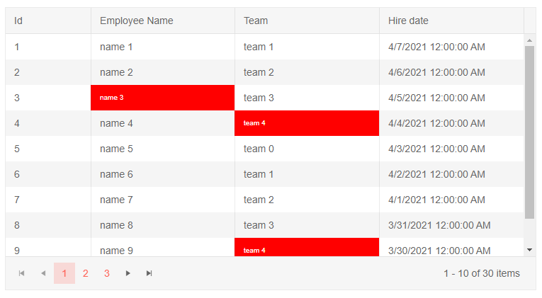

# Grid Column Events

This article explains the events available for the Columns of the Telerik Grid for Blazor.

* [OnCellRender](#oncellrender)

## OnCellRender

This event fires upon the rendering of the Grids columns. It receives an argument of type `GridCellRenderEventArgs` which exposes the following fields:

* `Item` - an object you can cast to your model class to obtain the current data item.
* `Value` - an object that contains the value that is rendered in the Grid cell. You can cast it to its data type, for example to a `string`, `DateTime` or a number.
* `Class` - the CSS class that will be applied to the cells. The CSS rules that are set for that class will be visibly rendered on the Grid cells.

>caption Use the OnCellRender event to apply custom format to Grid cells based on certain value

````CSHTML
@* Conditional styling/formatting for a cell *@

<style>
    .myCustomCellFormatting {
        background-color: red;
        color: white;
        font-size: 10px;
    }
</style>

<TelerikGrid Data="@MyData"
             Height="400px"
             Pageable="true"
             Width="750px">
    <GridColumns>
        <GridColumn Field="@(nameof(SampleData.Id))" Width="120px" />
        <GridColumn Field="@(nameof(SampleData.Name))"
                    Title="Employee Name"
                    Groupable="false"
                    OnCellRender="@OnCellRenderHandler" />
        <GridColumn Field="@(nameof(SampleData.Team))" Title="Team" />
        <GridColumn Field="@(nameof(SampleData.HireDate))" Title="Hire Date" />
    </GridColumns>
</TelerikGrid>

@code {

    void OnCellRenderHandler(GridCellRenderEventArgs args)
    {
        var item = args.Item as SampleData;

        if (item.Name.Contains("5"))
        {
            args.Class = "myCustomCellFormatting";
        }
    }
    public IEnumerable<SampleData> MyData = Enumerable.Range(1, 30).Select(x => new SampleData
    {
        Id = x,
        Name = "name " + x,
        Team = "team " + x % 5,
        HireDate = DateTime.Now.AddDays(-x).Date
    });

    public class SampleData
    {
        public int Id { get; set; }
        public string Name { get; set; }
        public string Team { get; set; }
        public DateTime HireDate { get; set; }
    }
}
````




>tip You can also pass lambda expressions to the OnCellRender parameter. Thus, you can provide additional meta data to the OnCellRender handler ( for example column title ) apart from the `GridCellRenderEventArgs` that it receives by default.

>caption Use the OnCellRender event to apply custom format to Grid cells based on certain cell value and column name

````CSHTML
@* Conditional styling/formatting for cells *@

<style>
    .myCustomCellFormatting {
        background-color: red;
        color: white;
        font-size: 10px;
    }
</style>

<TelerikGrid Data="@MyData"
             Height="400px"
             Pageable="true"
             Width="750px">
    <GridColumns>
        <GridColumn Field="@(nameof(SampleData.Id))" Width="120px" />
        <GridColumn Field="@(nameof(SampleData.Name))" Title = "Employee Name"
                    Groupable="false"
                    OnCellRender="@((x) => OnCellRenderHandler(x, "Employee Name"))" />
        <GridColumn Field="@(nameof(SampleData.Team))" Title="Team" OnCellRender="@((x) => OnCellRenderHandler(x, "Team"))" />
        <GridColumn Field="@(nameof(SampleData.HireDate))" Title="Hire date" />
    </GridColumns>
</TelerikGrid>

@code {   

    void OnCellRenderHandler(GridCellRenderEventArgs args, string columnName)
    {
        var item = args.Item as SampleData;

        if ((columnName == "Employee Name" && item.Name.Contains("3")) ||
             (columnName == "Team" && item.Team.Contains("4")))
        {
            args.Class = "myCustomCellFormatting";
        }
    }

    public IEnumerable<SampleData> MyData = Enumerable.Range(1, 30).Select(x => new SampleData
    {
        Id = x,
        Name = "name " + x,
        Team = "team " + x % 5,
        HireDate = DateTime.Now.AddDays(-x).Date
    });

    public class SampleData
    {
        public int Id { get; set; }
        public string Name { get; set; }
        public string Team { get; set; }
        public DateTime HireDate { get; set; }
    }
}
````



## See Also

  * [Grid Overview]()
  * [Grid Events]()
  * [Manual Data Source Operations]()
