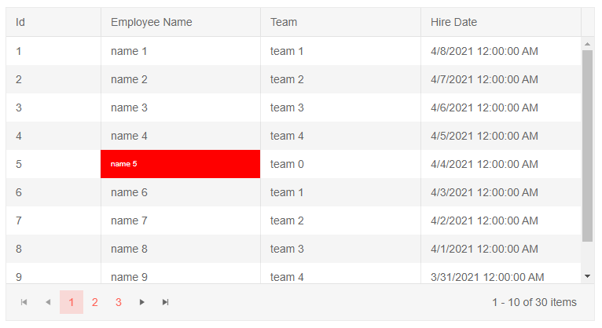
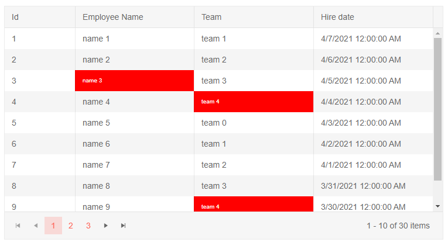

# Grid Column Events

This article explains the events available for the Columns of the Telerik Grid for Blazor.

* [OnCellRender](#oncellrender)

## OnCellRender

This event fires upon the rendering of the Grids columns. It receives an argument of type `GridCellRenderEventArgs` which exposes the following fields:

* `Item` - an object you can cast to your model class to obtain the current data item.
* `Value` - an object that contains the value that is rendered in the Grid cell. You can cast it to its data type, for example to a `string`, `DateTime` or a number.
* `Class` - the CSS class that will be applied to the cells. The CSS rules that are set for that class will be visibly rendered on the Grid cells.

>caption Use the OnCellRender event to apply custom format to Grid cells based on certain value

<demo metaUrl="client/grid/columns-cell-render/" height="500"></demo>

>tip You can also pass lambda expressions to the OnCellRender parameter. Thus, you can provide additional meta data to the OnCellRender handler ( for example column title ) apart from the `GridCellRenderEventArgs` that it receives by default.

>caption Use the OnCellRender event to apply custom format to Grid cells based on certain cell value and column name

<demo metaUrl="client/grid/columns-cell-render-lambda/" height="500"></demo>

## See Also

* [Grid Overview](slug:grid-overview)
* [Grid Events](slug:grid-events)
* [Manual Data Source Operations](slug:components/grid/manual-operations)
* [Blazor Grid](slug:grid-overview)
