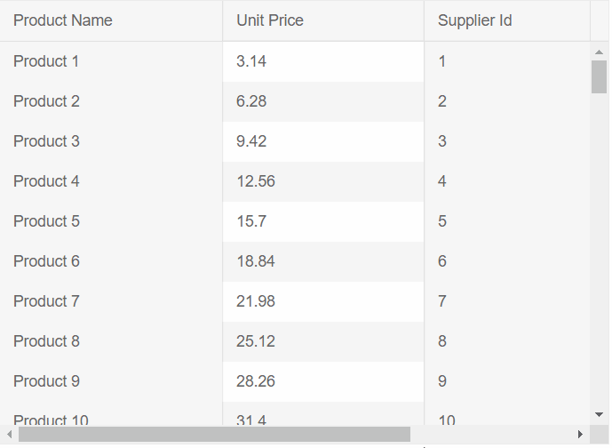
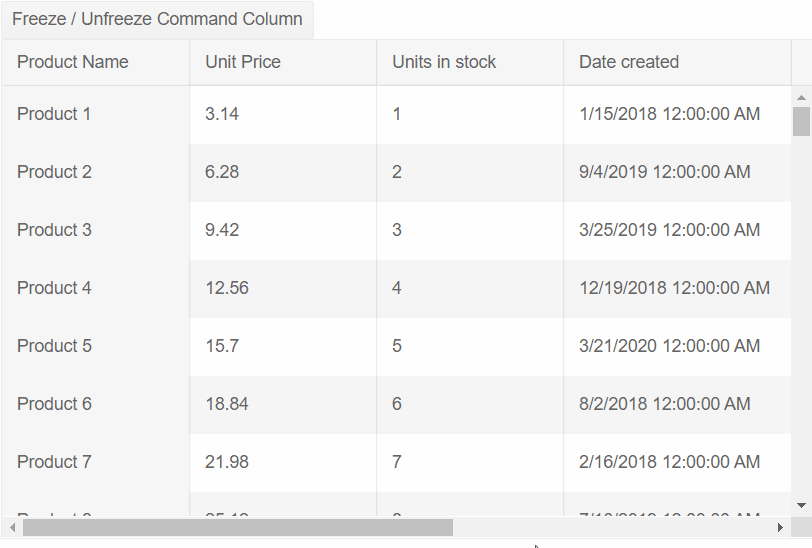

# Frozen Columns

The Grid lets you freeze one or more columns. This will allow the user to [scroll](#scrolling) horizontally through the Grid, but still be able to keep some important columns visible at all times (such as ID or command column).

To enable the column freezing, set the `Locked` parameter of the column to `true`.

If the column you want to freeze is not the first in the list, the grid must be scrollable. This requires that there are enough columns with their `Width` set so that the grid has a horizontal scrollbar (the sum of the Widths of the columns exceeds the Width of the grid). You can read more about the scrolling behavior of the grid in the [Grid Column Width Behavior]() article.

>caption Observe the behavior of a locked column that is neither first, nor last

````CSHTML
@*You can observe the behavior of a frozen column that is neither first, nor last*@

<TelerikGrid Data="@GridData"
             Width="550px"
             Height="400px">
    <GridColumns>
        <GridColumn Field=@nameof(Product.ProductName) Title="Product Name" Width="200px" Locked="true" />
        <GridColumn Field=@nameof(Product.UnitPrice) Title="Unit Price" Width="200px" />
        <GridColumn Field=@nameof(Product.SupplierId) Title="Supplier Id" Width="150px" Locked="true" />
        <GridColumn Field="@nameof(Product.UnitsInStock)" Title="Units In Stock" Width="200px" />
    </GridColumns>
</TelerikGrid>


@code {
    private bool isFrozen { get; set; } = false;
    private string Result { get; set; }

    #region Sample data
    public List<Product> GridData { get; set; }
    static Random RandomGenerator = new Random();
    protected override void OnInitialized()
    {
        GridData = GenerateProducts();
    }

    private List<Product> GenerateProducts()
    {
        List<Product> products = new List<Product>();

        for (int i = 1; i <= 100; i++)
        {
            var product = new Product()
            {
                ProductId = i,
                ProductName = "Product " + i.ToString(),
                SupplierId = i,
                UnitPrice = (decimal)(i * 3.14),
                UnitsInStock = (short)(i * 1),
            };
            products.Add(product);
        }
        return products;
    }

    public class Product
    {
        public int ProductId { get; set; }
        public string ProductName { get; set; }
        public int SupplierId { get; set; }
        public decimal UnitPrice { get; set; }
        public short UnitsInStock { get; set; }
    }
    #endregion
}
````
>caption The result of the code snippet above



>caption Use and toggle Frozen Columns in the Telerik Grid

````CSHTML
@* Click on the Freeze / Unfreeze button to observe Freezing and Unfreezing a column at runtime.
This approach can be used to programmatically toggle the Locked parameter of any column *@

<TelerikButton OnClick="@(() => isFrozen = !isFrozen)">Freeze / Unfreeze Command Column</TelerikButton>

@if (!string.IsNullOrEmpty(Result))
{
    <div class="alert alert-info w-25">@Result</div>
}

<TelerikGrid Data="@GridData"
             Width="650px"
             Height="400px">
    <GridToolBar>
        <GridCommandButton Command="Add" Icon="add">Add Product</GridCommandButton>
    </GridToolBar>
    <GridColumns>
        <GridColumn Field=@nameof(Product.ProductName) Title="Product Name" Width="150px" Locked="true" />
        <GridColumn Field=@nameof(Product.UnitPrice) Title="Unit Price" Width="150px" />
        <GridColumn Field=@nameof(Product.UnitsInStock) Title="Units in stock" Width="150px" />
        <GridColumn Field=@nameof(Product.CreatedAt) Title="Date created" Width="250px" />
        <GridColumn Field=@nameof(Product.Discontinued) Title="Discontinued" Width="150px" />
        <GridCommandColumn Width="250px" Locked="@isFrozen">
            <GridCommandButton Command="CustomCommand"
                               Icon="information"
                               OnClick="@((GridCommandEventArgs  e) => Result = $"click from {(e.Item as Product).ProductName}" )">
                                Information
            </GridCommandButton>
        </GridCommandColumn>
    </GridColumns>
</TelerikGrid>


@code {
    private bool isFrozen { get; set; } = false;
    private string Result { get; set; }

    #region Sample data
    public List<Product> GridData { get; set; }
    DateTime StartDate = new DateTime(2018, 1, 1);
    static Random RandomGenerator = new Random();
    protected override void OnInitialized()
    {
        GridData = GenerateProducts();
    }

    private List<Product> GenerateProducts()
    {
        List<Product> products = new List<Product>();

        for (int i = 1; i <= 100; i++)
        {
            var product = new Product()
            {
                ProductId = i,
                ProductName = "Product " + i.ToString(),
                SupplierId = i,
                UnitPrice = (decimal)(i * 3.14),
                UnitsInStock = (short)(i * 1),
                Discontinued = RandomGenerator.NextDouble() >= 0.5,
                CreatedAt = GetRandomDate(StartDate)
            };
            products.Add(product);
        }
        return products;
    }

    private DateTime GetRandomDate(DateTime startDate)
    {
        int range = (DateTime.Today - startDate).Days;
        return startDate.AddDays(RandomGenerator.Next(range));
    }

    public class Product
    {
        public int ProductId { get; set; }
        public string ProductName { get; set; }
        public int SupplierId { get; set; }
        public decimal UnitPrice { get; set; }
        public short UnitsInStock { get; set; }
        public bool Discontinued { get; set; }
        public DateTime CreatedAt { get; set; }
    }
    #endregion
}
````
>caption The result from the code snippet above



## See also
 * [Live demo: Frozen Columns](https://demos.telerik.com/blazor-ui/grid/grid/locked-columns)
