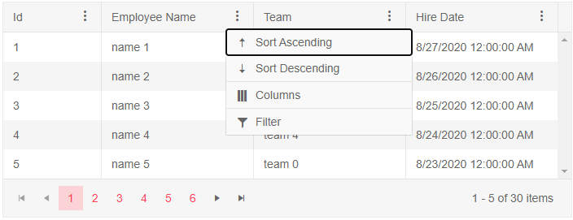
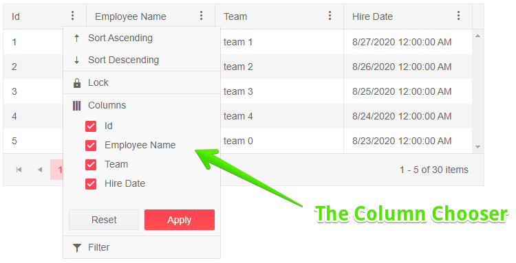
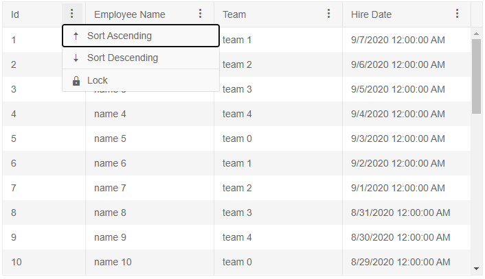

# Column Menu

The Grid allows you to setup a menu for it's columns. It enables you to perform high-level customization like [sorting](), [filtering](), [showing or hiding]() columns and [freezing or unfreezing]() them.

In this article:
* [Basics](#basics)
* [Notes](#notes)
* [Features](#features)
    * [Column Chooser](#column-chooser)
* [Limitations](#limitations)
* [Example](#example)

## Basics

To enable the column menu set the `ShowColumnMenu` parameter of the `<TelerikGrid>` tag to `true`. This will enable the menu for each column of the Grid.

By default all the [features](#features) of the Column Menu are enabled.

>caption Enable the column menu for all Grid columns. Basic example.

````CSHTML
@* Set the ShowColumnMenu parameter to true *@

<TelerikGrid Data="@MyData" 
             Pageable="true"
             PageSize="5"
             Width="700px"
             FilterMode="@GridFilterMode.FilterMenu"
             Sortable="true"
             ShowColumnMenu="true">
    <GridColumns>
        <GridColumn Field="@(nameof(SampleData.Id))" Width="120px" />
        <GridColumn Field="@(nameof(SampleData.Name))" Title="Employee Name" Groupable="false" />
        <GridColumn Field="@(nameof(SampleData.Team))" Title="Team" />
        <GridColumn Field="@(nameof(SampleData.HireDate))" Title="Hire Date" />
    </GridColumns>
</TelerikGrid>

@code {
    public IEnumerable<SampleData> MyData = Enumerable.Range(1, 30).Select(x => new SampleData
    {
        Id = x,
        Name = "name " + x,
        Team = "team " + x % 5,
        HireDate = DateTime.Now.AddDays(-x).Date
    });

    public class SampleData
    {
        public int Id { get; set; }
        public string Name { get; set; }
        public string Team { get; set; }
        public DateTime HireDate { get; set; }
    }
}
````

>caption The result from the code snippet above




## Features

To control the features of the `Column Menu` use the `<GridColumnMenuSettings>`, nested inside the `<GridSettings>`. See the [Examples](#examples) section for a code snippet.

* To disable sorting from the Column Menu for all columns set the `Sortable` parameter to `false`.

* To control the filtering from the Column Menu set the `FilterMode` parameter to a member of the `ColumnMenuFilterMode` enum:
    * `None` - disables the filtering from the Column Menu.
    * `FilterMenu` - enables a filter menu to apply filtering.

* To disable locking and unlocking of a column from the Column Menu, set the `Lockable` parameter of the column to `false`.

* To hide a column from the Grid use the [Column Chooser](#column-chooser).

### Column Chooser



The Column Chooser is enabled by default in the Column Menu and allows you to toggle the visiblity of Grid columns from the Column Menu. By the default all columns are visible under the `Columns` section of the Column Menu. 

To hide a column from the Column Chooser set the `VisibleInColumnChooser` property of the adjacent column to `false`.

To disable the Column Chooser from the Column Menu set the `ShowColumnChooser` paramter of the `<GridColumnMenuSettings>` to `false`.

To disable the Column Chooser from the Column Menu for a specific column set the `ShowColumnChooser` paramter of the Grid column to false.

## Notes

* Applying settings to a Grid column like `Filterable="false"`, `Sortable="false"`, `Lockable="false"` will take precendense over the common settings applied in the `<GridColumnMenuSettings>` and disable the above-mentioned functionalities for the adjacent column.

* To disable the Column Menu for a specific column in the Grid set the `ShowColumnMenu` parameter of the column to `false`.

* To disable filtering and sorting for a specific column set the `Filterable` and `Sortable` parameters of the column to `false`.


## Limitations

List of know limitations of the Column Menu:

* An exception will be thrown if the `FilterMode` of the Grid is set to `FilterRow` and a column menu is used as the filter descriptors of the two features are not compatible.

* If the Grid has a [frozen]() column (`Locked="true"`) that column cannot be unfrozen from the column menu.


## Example

>caption Use the GridColumnMenuSettings tag to control the common feature of the Column Menu

````CSHTML
@* Disable the column chooser from the Column Menu and disable the filtering for the Id column. *@

<TelerikGrid Data="@MyData" 
             Height="400px"
             Width="700px"
             ShowColumnMenu="true">
    <GridSettings>
        <GridColumnMenuSettings Sortable="true"
                                Lockable="true"
                                FilterMode="@ColumnMenuFilterMode.FilterMenu"
                                ShowColumnChooser="false">
        </GridColumnMenuSettings>
    </GridSettings>
    <GridColumns>
        <GridColumn Field="@(nameof(SampleData.Id))" Width="120px" Filterable="false" />
        <GridColumn Field="@(nameof(SampleData.Name))" Title="Employee Name" />
        <GridColumn Field="@(nameof(SampleData.Team))" Title="Team" />
        <GridColumn Field="@(nameof(SampleData.HireDate))" Title="Hire Date" />
    </GridColumns>
</TelerikGrid>

@code {
    public IEnumerable<SampleData> MyData = Enumerable.Range(1, 30).Select(x => new SampleData
    {
        Id = x,
        Name = "name " + x,
        Team = "team " + x % 5,
        HireDate = DateTime.Now.AddDays(-x).Date
    });

    public class SampleData
    {
        public int Id { get; set; }
        public string Name { get; set; }
        public string Team { get; set; }
        public DateTime HireDate { get; set; }
    }
}
````



## See Also

  * [Live Demo: Visible Columns](https://demos.telerik.com/blazor-ui/grid/columns)
