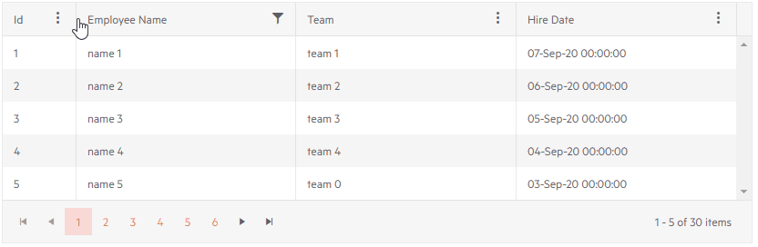

# Column Menu

The Grid allows you to setup a menu for its columns. It enables you to perform high-level customization like [sorting](), [filtering](), [showing or hiding]() columns and [freezing or unfreezing]() them.

>caption Telerik Column Menu for the Grid


In this article:
* [Basics](#basics)
* [Features](#features)
    * [Sorting](#sorting)
    * [Filtering](#filtering)
    * [Frozen Columns](#frozen-columns)
    * [Column Chooser](#column-chooser)
    * [Sections](#sections)
* [Notes](#notes)

## Basics

To enable the column menu set the `ShowColumnMenu` parameter of the `<TelerikGrid>` tag to `true`. This will enable the menu for each column of the Grid.

To disable the Column Menu for a specific column in the Grid set the `ShowColumnMenu` parameter of the column to `false`.

You can see the what the column menu can do and how to control its settings in the [Features](#features) section. By default, all of them are enabled.

>caption Enable the column menu for all Grid columns. Results in the screnshot above.

````CSHTML
@* Set the ShowColumnMenu parameter to true *@

<TelerikGrid Data="@MyData"
             Pageable="true"
             PageSize="5"
             FilterMode="@GridFilterMode.FilterMenu"
             Sortable="true"
             ShowColumnMenu="true">
    <GridColumns>
        <GridColumn Field="@(nameof(SampleData.Id))" Width="80px" />
        <GridColumn Field="@(nameof(SampleData.Name))" Title="Employee Name" Groupable="false" />
        <GridColumn Field="@(nameof(SampleData.Team))" Title="Team" />
        <GridColumn Field="@(nameof(SampleData.HireDate))" Title="Hire Date" />
    </GridColumns>
</TelerikGrid>

@code {
    public IEnumerable<SampleData> MyData = Enumerable.Range(1, 30).Select(x => new SampleData
    {
        Id = x,
        Name = "name " + x,
        Team = "team " + x % 5,
        HireDate = DateTime.Now.AddDays(-x).Date
    });

    public class SampleData
    {
        public int Id { get; set; }
        public string Name { get; set; }
        public string Team { get; set; }
        public DateTime HireDate { get; set; }
    }
}
````

## Features

To control the common features of the `Column Menu` use the `<GridColumnMenuSettings>`, nested inside the `<GridSettings>`:

* [Sorting](#sorting)
* [Filtering](#filtering)
* [Frozen Columns](#frozen-columns)
* [Column Chooser](#column-chooser)
* [Sections](#sections)

### Sorting

To remove the sorting option from the Column Menu set the `Sortable` parameter of the `GridColumnMenuSettings` tag to `false`.


### Filtering

To control whether filtering is possible from the Column Menu set the `FilterMode` parameter of the `GridColumnMenuSettings` tag to a member of the `ColumnMenuFilterMode` enum:

* `None` - disables the filtering from the Column Menu.
* `FilterMenu` - enables a filter menu to apply filtering.


### Frozen Columns

To disable locking and unlocking of a column from the Column Menu, set the `Lockable` parameter of the column to `false`.


### Column Chooser

The Column Chooser in the Column Menu and allows you to toggle the visiblity of Grid columns from the Column Menu. By the default all columns are visible under the `Columns` section of the Column Menu (click the Columns item to expand it).


To disable the column chooser, set the `ShowColumnChooser` parameter of the `<GridColumnMenuSettings>` to `false`.

To hide a column from the Column Chooser set the `VisibleInColumnChooser` property of the column to `false`.

### Sections

You can organize the columns in the [Column Chooser](#column-chooser) in different sections. In order to achieve the desired user interface:

1. Use the `GridColumnMenuChooser` tag (child to the `GridColumnMenuSettings`)

1. Add the [Template]() tag

1. Provide `GridColumnMenuChooserGroup` which is a collection of the columns that should be in the section
    
    * You can use the `Title` parameter to render a Title for the section

1. Use the `GridColumnMenuChooserItem` to denote the columns that should be in the group

    * You must use set the `ColumnId` parameter of the `GridColumnMenuChooserItem` to the value of the [`Id`](#grid-bound-column-parameters) parameter of the corresponding Grid Column.


>caption Organize the columns in the Column Chooser in sections

````CSHTML
@* Organize the columns in the Column Chooser in some sections. Use the Id and ColumnId parameters of the Grid Column and GridColumnMenuChooserItem respectively to relate them. *@

<TelerikGrid Data="@MyData"
             Pageable="true"
             PageSize="5"
             Width="700px"
             FilterMode="@GridFilterMode.FilterMenu"
             Sortable="true"
             ShowColumnMenu="true">
    <GridSettings>
        <GridColumnMenuSettings>
            <GridColumnMenuChooser>
                <Template>
                    <GridColumnMenuChooserGroup Title="Personal Information">
                        <GridColumnMenuChooserItem ColumnId="id-column-id" />
                        <GridColumnMenuChooserItem ColumnId="firstname-column-id" />
                        <GridColumnMenuChooserItem ColumnId="lastname-column-id" />
                    </GridColumnMenuChooserGroup>
                    <GridColumnMenuChooserGroup Title="Employee Information">
                        <GridColumnMenuChooserItem ColumnId="companyname-column-id" />
                        <GridColumnMenuChooserItem ColumnId="team-column-id" />
                        <GridColumnMenuChooserItem ColumnId="hiredate-column-id" />
                    </GridColumnMenuChooserGroup>
                </Template>
            </GridColumnMenuChooser>
        </GridColumnMenuSettings>
    </GridSettings>
    <GridColumns>
        <GridColumn Field="@(nameof(SampleData.Id))" Width="80px" Id="id-column-id" />
        <GridColumn Field="@(nameof(SampleData.FirstName))" Title="First Name" Id="firstname-column-id" />
        <GridColumn Field="@(nameof(SampleData.LastName))" Title="Last Name" Id="lastname-column-id" />
        <GridColumn Field="@(nameof(SampleData.CompanyName))" Title="Company" Id="companyname-column-id" />
        <GridColumn Field="@(nameof(SampleData.Team))" Title="Team" Id="team-column-id" />
        <GridColumn Field="@(nameof(SampleData.HireDate))" Title="Hire Date" Id="hiredate-column-id" />
    </GridColumns>
</TelerikGrid>

@code {
    public IEnumerable<SampleData> MyData = Enumerable.Range(1, 30).Select(x => new SampleData
    {
        Id = x,
        FirstName = $"FirstName {x}",
        LastName = $"LastName {x}",
        CompanyName = $"Company {x}",
        Team = "team " + x % 5,
        HireDate = DateTime.Now.AddDays(-x).Date
    });

    public class SampleData
    {
        public int Id { get; set; }
        public string FirstName { get; set; }
        public string LastName { get; set; }
        public string CompanyName { get; set; }
        public string Team { get; set; }
        public DateTime HireDate { get; set; }
    }
}
````

### Example of Column Menu Features Settings

>caption Use the GridColumnMenuSettings tag to control the common features of the Column Menu, use column parameters to affect its relationship with the column menu

````CSHTML
@* Disable filtering and locking columns, hide a column from the chooser (Team), disable the menu for a column (Name). *@

<TelerikGrid Data="@MyData"
             Pageable="true"
             PageSize="5"
             FilterMode="@GridFilterMode.FilterMenu"
             Sortable="true"
             ShowColumnMenu="true">
    <GridSettings>
        <GridColumnMenuSettings Lockable="false"
                                FilterMode="@ColumnMenuFilterMode.None">
        </GridColumnMenuSettings>
    </GridSettings>
    <GridColumns>
        <GridColumn Field="@(nameof(SampleData.Id))" Width="80px" />
        <GridColumn Field="@(nameof(SampleData.Name))" Title="Employee Name" ShowColumnMenu="false" />
        <GridColumn Field="@(nameof(SampleData.Team))" Title="Team" VisibleInColumnChooser="false" />
        <GridColumn Field="@(nameof(SampleData.HireDate))" Title="Hire Date" />
    </GridColumns>
</TelerikGrid>

@code {
    public IEnumerable<SampleData> MyData = Enumerable.Range(1, 30).Select(x => new SampleData
    {
        Id = x,
        Name = "name " + x,
        Team = "team " + x % 5,
        HireDate = DateTime.Now.AddDays(-x).Date
    });

    public class SampleData
    {
        public int Id { get; set; }
        public string Name { get; set; }
        public string Team { get; set; }
        public DateTime HireDate { get; set; }
    }
}
````

>caption Column menu with filtering, locking and sorting, but without a column chooser



## Notes

* Applying settings to a Grid column like `Filterable="false"`, `Sortable="false"`, `Lockable="false"` will take precendence over the common settings applied in the `<GridColumnMenuSettings>` and disable the above-mentioned functionalities for the corresponding column.

* An exception will be thrown if the `FilterMode` of the Grid is set to `FilterRow` and a column menu is used - the filter descriptors of the two features are not compatible.

* If the Grid has a [frozen]() column (`Locked="true"`), that column cannot be unfrozen from the column menu.

* If you are using the [Column Chooser Template]() or you are grouping the columns into [sections](#sections), it is recommended to add the `Title` parameter to all Grid Columns 

## See Also

  * [Live Demo: Visible Columns](https://demos.telerik.com/blazor-ui/grid/columns)
