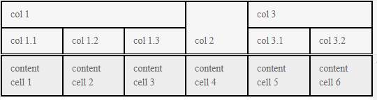

# Multi-Column Headers

The grid allows you to stack several columns under one header to visually group relevant fields for your end users.

To use multiple column headers:

1. Define a `GridColumn` instance for each multi-column header you want. Set its `Title`.
1. Under its `<Columns>` nested tag, add the columns you want it to contain.

You will find the following sections in this article:

* [Basic Example](#basic-example)
* [Behavior With Other Features](#behavior-with-other-features)

## Basic Example

The following code snippet shows how you can group columns in the grid in multi-column headers. You can also use "regular" columns at the root level, not all of them have to be column groups.

>caption Multiple Column Headers in the Grid


````CSHTML
@* See the root-level GridColumn tags that have their own Columns collections *@

<TelerikGrid Data=@GridData
             Pageable="true" Sortable="true" Resizable="true" Reorderable="true"
             ShowColumnMenu="true" FilterMode="@GridFilterMode.FilterMenu"
             Width="800px" Height="400px">
    <GridColumns>
        <GridColumn Title="Personal Information">
            <Columns>
                <GridColumn Field=@nameof(Customer.FirstName) Title="First Name" Width="100px" />
                <GridColumn Field=@nameof(Customer.LastName) Title="Last Name" Width="100px" />
            </Columns>
        </GridColumn>
        <GridColumn Title="Company">
            <Columns>
                <GridColumn Field=@nameof(Customer.CompanyName) Title="Name" />
                <GridColumn Field=@nameof(Customer.HasCompanyContract) Title="Has Contract" Width="120px" />
            </Columns>
        </GridColumn>
        <GridColumn Title="Contact Details">
            <Columns>
                <GridColumn Field="@nameof(Customer.Email)" Title="Email"></GridColumn>
                <GridColumn Field="@nameof(Customer.Phone)" Title="Phone"></GridColumn>
                <GridColumn Field="@nameof(Customer.City)" Title="City"></GridColumn>
            </Columns>
        </GridColumn>
        <GridColumn Title="Admin Settings">
            <Columns>
                <GridColumn Field=@nameof(Customer.Id) Title="UserID" />
                <GridColumn Field=@nameof(Customer.PasswordHash) Title="Pass Hash" Width="100px" />
            </Columns>
        </GridColumn>
    </GridColumns>
</TelerikGrid>

@code {
    public List<Customer> GridData { get; set; }

    public class Customer
    {
        public int Id { get; set; }
        public string PasswordHash { get; set; }
        public string FirstName { get; set; }
        public string LastName { get; set; }
        public string CompanyName { get; set; }
        public bool HasCompanyContract { get; set; }
        public string Email { get; set; }
        public string Phone { get; set; }
        public string City { get; set; }
    }

    // generation of dummy data
    protected override void OnInitialized()
    {
        GridData = GenerateData();
    }

    List<Customer> GenerateData()
    {
        var data = new List<Customer>();

        string[] fNames = new string[] { "Nancy", "John", "Orlando", "Jane", "Bob", "Juan" };
        string[] lNames = new string[] { "Harris", "Gates", "Smith", "Caprio", "Gash", "Gee" };
        string[] cNames = new string[] { "Acme", "Northwind", "Contoso" };
        string[] cities = new string[] { "Denver", "New York", "LA", "London", "Paris", "Helsinki", "Moscow", "Sofia" };
        Random rnd = new Random();

        for (int i = 0; i < 150; i++)
        {
            string fName = fNames[rnd.Next(0, fNames.Length)];
            string lName = lNames[rnd.Next(0, lNames.Length)];
            string cName = cNames[rnd.Next(0, cNames.Length)];
            data.Add(new Customer
            {
                Id = i,
                PasswordHash = "not shown",
                FirstName = fName,
                LastName = lName,
                CompanyName = cName,
                HasCompanyContract = i % 3 == 0,
                Email = $"{fName}.{lName}@{cName}.com",
                Phone = $"{rnd.Next(100, 999)}-555-{rnd.Next(100, 999)}",
                City = cities[rnd.Next(0, cities.Length)]
            });
        }

        return data;
    }
}
````


## Behavior With Other Features

This section explains how using multi column headers changes behaviors of other component functionalities or how certain features behave with multi-column headers. If a feature is not listed, it is not affected.

* [Width](#width)
* [Sorting, Filtering, Grouping, Editing](#sorting-filtering-grouping-editing)
* [Resizing](#resizing)
* [Reordering](#reordering)
* [Column Menu](#column-menu)
* [State Management](#state-management)
* [Locked columns](#locked-columns)
* [Keyboard navigation](#keyboard-navigation)


### Width

The `Width` paramter of a multi-column header is ignored, its width depends on the sum of the widths for its child columns.


### Sorting, Filtering, Grouping, Editing

These functionalities do not work on a multi-column header column, but only on the actual child columns.

The column used for the multiple column header serves for presentation purposes only. It does not use the `Field` parameter and cannot perform data source operations such as filtering, sorting, grouping, editing, because they would span several fields and that is not possible.

Individual columns under a shared group header can be sorted, filtered, grouped and edited as usual.


### Resizing

Multi-column headers can be resized and resizing is similar to standard columns.

Individual columns under a shared group header can be resized as well.

The `Resizable` parameter is honored for both individual columns and column group headers.


### Reordering

Column reordering works according to the following rules:

* Root multi-header columns can be reordered with other root multi-header columns.
    * Reordering a group of columns moves all its child columns as well.
* Individual columns can be reordered within their parent group only.
    * Child columns of different parent columns (and/or on different levels) cannot be reordered.

The `Reordable` parameter is honored for both individual columns and column group headers.


### Column Menu

A multi-header column cannot have a column menu. It does not show up in the list of columns in the column chooser of individual columns from the last level. If you hide all child columns, the parent column will also hide.


### State Management

The state of a multi-header column is handled in the same way as a standard column. The columns in the state are listed in a flat list in the order of definition. For example, for the following setup:

````CSHTML
<TelerikGrid>
    <GridColumns>
        <GridColumn Title="column 1">
            <Columns>
                <GridColumn Title="column 1.1" />
                <GridColumn Title="column 1.2" />
            </Columns>
        </GridColumn>

        <GridColumn Title="column 2"></GridColumn>
    </GridColumns>
</TelerikGrid>
````

The State will be:

| Column state index | Column     |
|--------------------|------------|
| 0                  | column 1   |
| 1                  | column 1.1 |
| 2                  | column 1.2 |
| 3                  | column 2   |

Note that this order is different than the order in which the blazor framework initializes the column components, its goal is to be similar to a human-readable order that matches the column definition.


### Locked columns

You can lock an entire multi-column header through its `Locked` parameter. Doing so will lock all its child columns.

Therefore, we advise that you do not set `Locked=false` for child columns of locked parent columns, and you can consider setting `Lockable=false` on them to prevent the user from unpinning them and getting sub-optimal layout. Setting `Locked=true` for a child column is not supported.


### Keyboard navigation

The keyboard navigation follows the functionality of Excel. Notable specifics include the fact that Excel tries to "memorize" the level of previously navigated cells when moving.

Let's take the following sample configuration as an examle:



Sample scenario:

1. Focus is on "content cell 4"
2. ArrowUp moves the focus to "col 2"
3. ArrowLeft moves the focus to "col 1.3" (and not "col 1" - it is assumed that the active row is the one with "col 1.1", "col 1.2", etc. columns)
4. ArrowUp moves the focus to "col 1"
5. ArrowRight moves the focus to "col 2"
6. ArrowLeft moves the focus to "col 1" (and not to "col 1.3" - it is assumed that the active row is the one with "col 1", "col 2" and "col 3" columns)


## See Also

  * [Live Demo: Multi-Column Headers](https://demos.telerik.com/blazor-ui/grid/multicolumn-headers)
