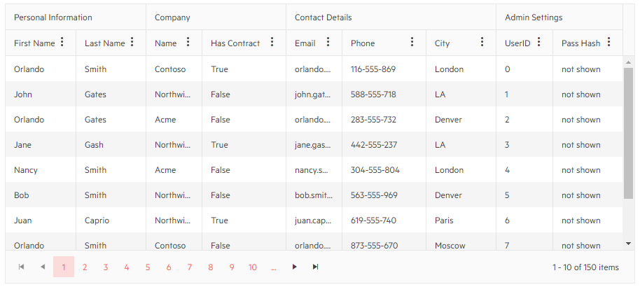

# Multi-Column Headers

The Grid allows you to stack several columns under one header to visually group relevant fields for your end users.

To use multiple column headers:

1. Define a `GridColumn` instance for each multi-column header you want. Set its `Title` or [`HeaderTemplate`](slug:grid-templates-column-header).
1. Under its `<Columns>` nested tag, add the columns you want it to contain.

While you can set all the parameters of such a multi-column header column, it only supports and works with the `Title`, and the nested `HeaderTemplate` and `Columns` tags (templates).

You will find the following sections in this article:

* [Basic Example](#basic-example)
* [Behavior With Other Features](#behavior-with-other-features)

## Basic Example

The following code snippet shows how you can group columns in the Grid in multi-column headers. You can also use "regular" columns at the root level, not all of them have to be column groups.

>caption Multiple Column Headers in the Grid

<demo metaUrl="client/grid/columns-multi-column-headers/" height="550"></demo>

## Behavior With Other Features

@[template](/_contentTemplates/grid/common-link.md#multi-column-headers-feature-integration)

## See Also

* [Live Demo: Multi-Column Headers](https://demos.telerik.com/blazor-ui/grid/multi-column-headers)
* [Blazor Grid](slug:grid-overview)