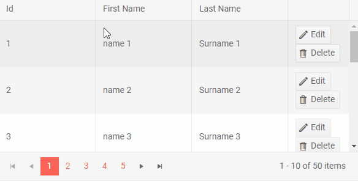

# Resize Columns

The Grid features two different column resizing mechanisms:

* [Resize by Dragging](#resize-by-dragging)
* [Fit to Content](#autofit-columns)

The [example at the end of this page](#example) shows both options in action.

## Resize by Dragging

The Grid allows users to resize columns by dragging the borders between header cells.

To enable such column resizing, set the `Resizable` parameter of the grid to `true`.

To prevent the user from resizing a certain column, set its own parameter `Resizable="false"`. Note that the user can still resize other columns around it.

## Autofit Columns

When column resizing is enabled, a double click on the resize handle between the header cells will automatically fit the column width to the content of the header, data and footers. This will remove text wrapping in the component.

The Grid also exposes methods to programmatically resize columns to fit their contents:

* `AutoFitColumn(string id)` - autofits the column with the specified [`Id` attribute](#identification);
* `AutoFitColumns(IEnumerable<string> ids)` - autofits multiple columns at once'
* `AutoFitAllColumns()` - autofits all applicable columns (for example, this method does not affect the hierarchy expand/collapse columns);

Autofitting specific columns preserves the current widths of all the other columns. Similar to [column resizing](#resize-by-dragging), column autofitting can trigger a horizontal Grid scrollbar, or leave empty space after the last column.

Programmatic autofitting works even if column resizing is disabled.


### Limitations

List of the known limitations of the AutoFit Columns feature:

* Auto-fitting the columns on initial load of the Grid is not supported.

* Auto-fitting the columns is not supported with [Virtual Columns]()

>note Check the [AutoFit all Grid columns on initial load knowledge-based article]() to see a possible solution to achieve this behavior. 


## Example

>caption How Column Resizing Works in the Telerik Grid



>caption Grid Column Resizing and Autofitting

````CSHTML
@* Grid column resizing and autofitting *@
@* Drag the border between column headers to change the column width. The command column is not resizable by the user. *@

<TelerikButton OnClick="@AutoFitSingleColumn">AutoFit ID Column</TelerikButton>
<TelerikButton OnClick="@AutoFitMultipleColumns">AutoFit String Columns</TelerikButton>
<TelerikButton OnClick="@AutoFitAllColumns">AutoFit All Columns</TelerikButton>

<TelerikGrid @ref="@Grid"
             Data="@GridData"
             Resizable="true"
             Pageable="true" PageSize="10" Sortable="true" Height="300px">
    <GridColumns>
        <GridColumn Field=@nameof(SampleData.Id) Title="ID" Id="IDColumn" />
        <GridColumn Field=@nameof(SampleData.Name) Title="First Name" Id="NameColumn1" />
        <GridColumn Field=@nameof(SampleData.LastName) Title="Last Name" Id="NameColumn2" />
        <GridCommandColumn Width="100px" Resizable="false">
            <GridCommandButton Command="Save" Icon="save" ShowInEdit="true">Update</GridCommandButton>
            <GridCommandButton Command="Edit" Icon="edit">Edit</GridCommandButton>
            <GridCommandButton Command="Delete" Icon="delete">Delete</GridCommandButton>
            <GridCommandButton Command="Cancel" Icon="cancel" ShowInEdit="true">Cancel</GridCommandButton>
        </GridCommandColumn>
    </GridColumns>
</TelerikGrid>

@code {
    public TelerikGrid<SampleData> Grid { get; set; }
    public List<SampleData> GridData { get; set; }

    private void AutoFitSingleColumn()
    {
        Grid.AutoFitColumn("IDColumn");
    }

    private void AutoFitMultipleColumns()
    {
        var columns = new List<string>() { "NameColumn1", "NameColumn2" };
        Grid.AutoFitColumns(columns);
    }

    private void AutoFitAllColumns()
    {
        Grid.AutoFitAllColumns();
    }

    protected override void OnInitialized()
    {
        GridData = GetData();
    }

    private List<SampleData> GetData()
    {
        return Enumerable.Range(1, 50).Select(x => new SampleData
        {
            Id = x,
            Name = $"name {x}",
            LastName = $"Surname {x}"
        }).ToList();
    }

    public class SampleData
    {
        public int Id { get; set; }
        public string Name { get; set; }
        public string LastName { get; set; }
    }
}
````

## See Also

  * [Live Demo: Column Resizing](https://demos.telerik.com/blazor-ui/grid/column-resizing)
