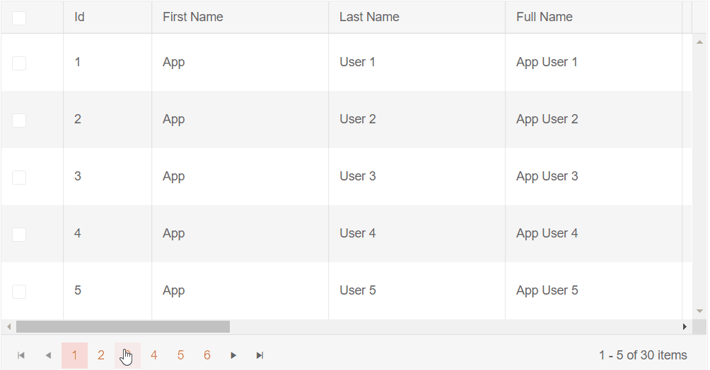
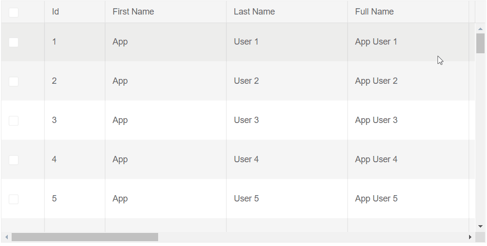
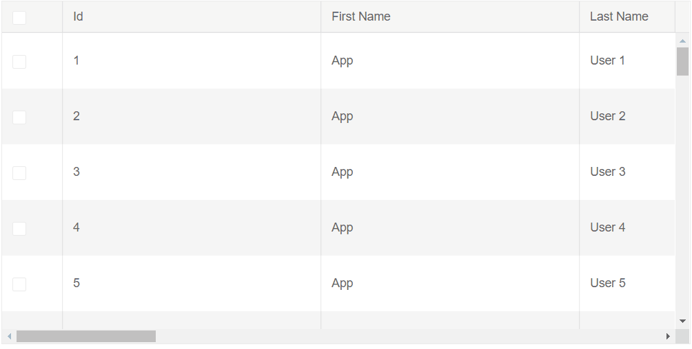

# Virtualized Columns

The Telerik Blazor Grid provides Virtual Scrolling for its Columns. This means that columns and the corresponding data will be rendered only for the currently visible viewport. When changing the [Page]() or [Sorting]() the Grid, fewer elements are rendered which improves the responsiveness and the overall user experience.

This article provides the following sections:
* [Basics](#basics)
* [Limitations](#limitations)
* [Notes](#notes)
* [More Examples](#more-examples)
    * [Virtualized Columns and Rows](#virtualized-columns-and-rows)
    * [Virtualized Autogenerated Columns](#virtualized-autogenerated-columns)


## Basics

The targeted scenario is for a Grid with big number of columns, since the performance improvement will be most significant there.

To enable Virtualized Columns:

1. Set the `ColumnVirtualization` parameter of the Grid to `true`.
1. Set the `Width` parameter of all columns in `px` so that the total sum is greater than the `Width` of the Grid.
    * This will enable horizontal scrollbar which is required. You can read more about the scrolling behavior of the grid in the [Grid Column Width Behavior]() article.
1. Set the `RowHeight` so that the content of all cells fits in the row. For more information see the [Notes](#notes) section.
1. Set the `Height` of the Grid in `px`. For more information see the [Notes](#notes) section.
1. Set the `Width` parameter of the Grid in `px`.


>caption Basic setup of the Virtualized Columns

````CSHTML
@* Observe the behavior of the Grid with enabled ColumnVirtualization *@

<TelerikGrid Data="@MyData"
             Width="800px"
             Height="400px"
             RowHeight="65"
             ColumnVirtualization="true"
             Pageable="true" PageSize="5">
    <GridColumns>
        <GridCheckboxColumn Title="Select" Width="70px" />
        <GridColumn Field="@(nameof(User.Id))" Width="100px" />
        <GridColumn Field="@(nameof(User.FirstName))" Title="First Name" Width="200px" />
        <GridColumn Field="@(nameof(User.LastName))" Title="Last Name" Width="200px" />
        <GridColumn Field="@(nameof(User.FullName))" Title="Full Name" Width="200px" />
        <GridColumn Field="@(nameof(User.DateOfBirth))" Title="Date of Birth" Width="200px" />
        <GridColumn Field="@(nameof(User.Age))" Title="Age" Width="100px" />
        <GridColumn Field="@(nameof(User.EmailAddress))" Title="Email Address" Width="200px" />
        <GridColumn Field="@(nameof(User.RegistrationDate))" Title="Registration Date" Width="200px" />
        <GridColumn Field="@(nameof(User.LocalTime))" Title="Local Time" Width="200px" />
        <GridColumn Field="@(nameof(User.UserNumber))" Title="User Number" Width="300px" />
        <GridColumn Field="@(nameof(User.Gender))" Title="Gender" Width="200px" />
        <GridCommandColumn Width="250px" Title="Command Column">
            <GridCommandButton Command="Edit" Icon="edit">Edit</GridCommandButton>
            <GridCommandButton Command="Delete" Icon="delete">Delete</GridCommandButton>
        </GridCommandColumn>
    </GridColumns>
</TelerikGrid>

@code {
    public IEnumerable<User> MyData = Enumerable.Range(1, 30).Select(x => new User
    {
        Id = x,
        FirstName = "App",
        LastName = $"User {x}",
        DateOfBirth = new DateTime(1970, 1, 1),
        EmailAddress = $"app-user{x}@mail.com",
        RegistrationDate = DateTime.Today.AddDays(-x),
        LocalTime = DateTime.Now,
        UserNumber = Guid.NewGuid(),
        Gender = x % 2 == 0 ? "Male" : "Female"
    });

    public class User
    {
        public int Id { get; set; }
        public string FirstName { get; set; }
        public string LastName { get; set; }
        public string FullName
        {
            get
            {
                string fullName = $"{FirstName} {LastName}";
                return fullName;
            }
        }
        public DateTime DateOfBirth { get; set; }
        public int Age
        {
            get
            {
                var timeSpan = DateTime.Today - DateOfBirth;
                var years = timeSpan.Days / 365;
                return years;
            }
        }
        public string EmailAddress { get; set; }
        public Guid UserNumber { get; set; }
        public DateTime RegistrationDate { get; set; }
        public DateTime LocalTime { get; set; }
        public string Gender { get; set; }
    }
}
````
>caption The result from the code snippet above - scrolling through the grid is the same as without virtual scrolling, but the rendering performance and responsiveness of all other actions will be improved.



## Limitations

* Virtualized and [Frozen]() are not supported to work together. The idea behind freezing some columns is so that they are visible at all time disregarding their position in the Grid. The Virtualized Columns, on the other hand, render only the columns for the current Grid viewport.

## Notes

 * The `RowHeight` must accommodate the height of all the possible cells and their content in order to ensure good appearance. If certain cells that are not rendered have content that is taller than the rendered ones, you may experience glitches and unstable scrolling.
    * If the row/cell height the browser would render is larger than the `RowHeight` value due to the cell contents, the browser will ignore the `RowHeight`. The actual cell height can depend on the chosen Theme or other CSS rules, or on cell data that falls on more than one line. Inspect the rendered HTML to make sure the grid setting matches the rendering.
 * The `Height` of the Grid must be explicitly set in `px`. By default the Height is set by the browser depending on the contents. When a new column is rendered during horizontal scrolling, it might increase or decrease the vertical size of the row and cause issues with the rendering and abnormal visual behavior for the users.
 * Rendering the Virtual Columns in Client-side Blazor Applications is slower due to the Framework rendering limitations. In the Server-side Applications this issue is not present.


## More Examples

The column virtualization can work together with other similar features in the grid:

* [With Row Virtualization](#virtualized-columns-and-rows)
* [With Automatically Generated Columns](#virtualized-autogenerated-columns)

### Virtualized Columns and Rows

You can use Virtualized Columns and Rows together. More information on Virtual Rows can be found in the [Virtual Scrolling]() article.

>caption Use Virtualized Columns and Rows together

````CSHTML
@*Observe the behavior of the Grid with Virtual Rows and Columns*@

<TelerikGrid Data="@MyData"
             Width="800px"
             RowHeight="65"
             Height="400px"
             ScrollMode="GridScrollMode.Virtual"
             ColumnVirtualization="true">
    <GridColumns>
        <GridCheckboxColumn Title="Select" Width="70px" />
        <GridColumn Field="@(nameof(User.Id))" Width="100px" />
        <GridColumn Field="@(nameof(User.FirstName))" Title="First Name" Width="200px" />
        <GridColumn Field="@(nameof(User.LastName))" Title="Last Name" Width="200px" />
        <GridColumn Field="@(nameof(User.FullName))" Title="Full Name" Width="200px" />
        <GridColumn Field="@(nameof(User.DateOfBirth))" Title="Date of Birth" Width="200px" />
        <GridColumn Field="@(nameof(User.Age))" Title="Age" Width="100px" />
        <GridColumn Field="@(nameof(User.EmailAddress))" Title="Email Address" Width="200px" />
        <GridColumn Field="@(nameof(User.RegistrationDate))" Title="Registration Date" Width="200px" />
        <GridColumn Field="@(nameof(User.LocalTime))" Title="Local Time" Width="200px" />
        <GridColumn Field="@(nameof(User.UserNumber))" Title="User Number" Width="300px" />
        <GridColumn Field="@(nameof(User.Gender))" Title="Gender" Width="200px" />
        <GridCommandColumn Width="250px" Title="Command Column">
            <GridCommandButton Command="Edit" Icon="edit">Edit</GridCommandButton>
            <GridCommandButton Command="Delete" Icon="delete">Delete</GridCommandButton>
        </GridCommandColumn>
    </GridColumns>
</TelerikGrid>

@code {
    public IEnumerable<User> MyData = Enumerable.Range(1, 50).Select(x => new User
    {
        Id = x,
        FirstName = "App",
        LastName = $"User {x}",
        DateOfBirth = new DateTime(1970, 1, 1),
        EmailAddress = $"app-user{x}@mail.com",
        RegistrationDate = DateTime.Today.AddDays(-x),
        LocalTime = DateTime.Now,
        UserNumber = Guid.NewGuid(),
        Gender = x % 2 == 0 ? "Male" : "Female"
    });

    public class User
    {
        public int Id { get; set; }
        public string FirstName { get; set; }
        public string LastName { get; set; }
        public string FullName
        {
            get
            {
                string fullName = $"{FirstName} {LastName}";
                return fullName;
            }
        }
        public DateTime DateOfBirth { get; set; }
        public int Age
        {
            get
            {
                var timeSpan = DateTime.Today - DateOfBirth;
                var years = timeSpan.Days / 365;
                return years;
            }
        }
        public string EmailAddress { get; set; }
        public Guid UserNumber { get; set; }
        public DateTime RegistrationDate { get; set; }
        public DateTime LocalTime { get; set; }
        public string Gender { get; set; }
    }
}
````
>caption The result from the code snippet above



### Virtualized Autogenerated Columns

Column virtualization is commonly used when you have many columns. You may not have to declare them yourself, the grid can do this for you through its [Automatically Generated Columns]() feature.

>note In order to add Virtualized Autogenerated Columns, the `ColumnWidth` parameter must be set in pixels.

````CSHTML
@*Grid with Virtual Autogenerated Columns*@

<TelerikGrid Data="@MyData"
             Width="800px"
             RowHeight="65"
             Height="400px"
             ColumnVirtualization="true"
             AutoGenerateColumns="true">
    <GridColumns>
        <GridCheckboxColumn Title="Select" Width="70px" />
        <GridAutoGeneratedColumns ColumnWidth="200px" />
        <GridCommandColumn Width="250px" Title="Command Column">
            <GridCommandButton Command="Edit" Icon="edit">Edit</GridCommandButton>
            <GridCommandButton Command="Delete" Icon="delete">Delete</GridCommandButton>
        </GridCommandColumn>
    </GridColumns>
</TelerikGrid>

@code {
    public IEnumerable<User> MyData = Enumerable.Range(1, 50).Select(x => new User
    {
        Id = x,
        FirstName = "App",
        LastName = $"User {x}",
        DateOfBirth = new DateTime(1970, 1, 1),
        EmailAddress = $"app-user{x}@mail.com",
        RegistrationDate = DateTime.Today.AddDays(-x),
        LocalTime = DateTime.Now,
        UserNumber = Guid.NewGuid(),
        Gender = x % 2 == 0 ? "Male" : "Female"
    });

    public class User
    {
        public int Id { get; set; }

        [Display(Name = "First Name")]
        public string FirstName { get; set; }

        [Display(Name = "Last Name")]
        public string LastName { get; set; }

        [Display(Name = "Full Name")]
        public string FullName
        {
            get
            {
                string fullName = $"{FirstName} {LastName}";
                return fullName;
            }
        }

        [Display(Name = "Date of Birth")]
        public DateTime DateOfBirth { get; set; }

        [Display(Name = "Age")]
        public int Age
        {
            get
            {
                var timeSpan = DateTime.Today - DateOfBirth;
                var years = timeSpan.Days / 365;
                return years;
            }
        }

        [Display(Name = "Email Address")]
        public string EmailAddress { get; set; }

        [Display(Name = "User Number")]
        public Guid UserNumber { get; set; }

        [Display(Name = "Registration Date")]
        public DateTime RegistrationDate { get; set; }

        [Display(Name = "Local Time")]
        public DateTime LocalTime { get; set; }

        [Display(Name = "Gender")]
        public string Gender { get; set; }
    }
}
````
>caption The result from the code snippet above




## See also
 * [Live demo: Virtual Columns](https://demos.telerik.com/blazor-ui/grid/column-virtualization)
 * [Virtual Scrolling]()
 * [Grid Column Width Behavior]()
 * [Automatically Generated Columns]()
