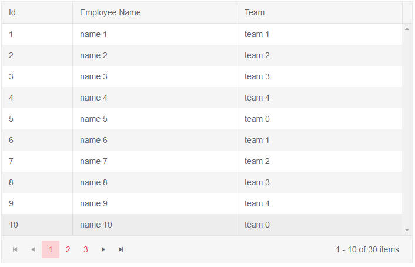
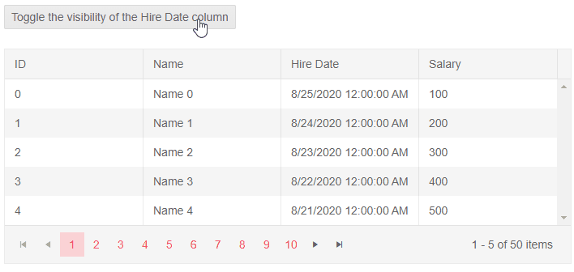
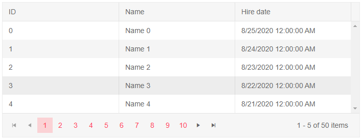
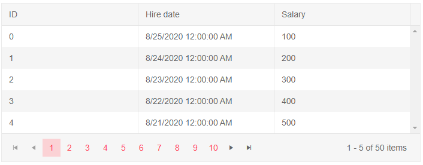

# Visible Columns

The Grid allows you to programatically hide some of its columns. 

In this article:
* [Basics](#basics)
* [Notes](#notes)
* [Examples](#examples)
    * [Toggle The Visibility Of A Column On Button Click](#toggle-the-visibility-of-a-column-on-button-click)
    * [Hidden Grid Column With Template](#hidden-grid-column-with-template)
    * [Hide A Grid Column Based On A Condition](#hide-a-grid-column-based-on-a-condition)

## Basics

To hide a Grid column set its `Visible` parameter to `false`. To hide a column based on a certain condition you can pass, for example, a ternary operator or a method that returns `bool` - the app can provide an expression according to its logic (like screen size).

>caption Hide a column from the Grid. Basic example.

````CSHTML
@* Hide the Hire Date Grid column by setting the Visible parameter to false *@

<TelerikGrid Data="@MyData" 
             Pageable="true"
             PageSize="10">
    <GridColumns>
        <GridColumn Field="@(nameof(SampleData.Id))" Width="120px" />
        <GridColumn Field="@(nameof(SampleData.Name))" Title="Employee Name" />
        <GridColumn Field="@(nameof(SampleData.Team))" Title="Team" />
        <GridColumn Field="@(nameof(SampleData.HireDate))" Title="Hire Date" Visible="false" />
    </GridColumns>
</TelerikGrid>

@code {
    public IEnumerable<SampleData> MyData = Enumerable.Range(1, 30).Select(x => new SampleData
    {
        Id = x,
        Name = "name " + x,
        Team = "team " + x % 5,
        HireDate = DateTime.Now.AddDays(-x).Date
    });

    public class SampleData
    {
        public int Id { get; set; }
        public string Name { get; set; }
        public string Team { get; set; }
        public DateTime HireDate { get; set; }
    }
}
````

>caption The result from the code snippet above



## Notes

Non-visible columns (`Visible="false"`) will have the following behavior:

* Will not be [editable]().
* Will not be exported in [excel export]().
* Will not be visible when the data is [grouped]().
* [Templates]() will not be rendered.
    * When using [Row Template]() the visiblity of the column should be implemented by the application in the row template itself - the grid can only toggle the visibility of the header.
* You can control the visibility of the column through the [Grid State]().


## Examples

In this section you will find the following examples:

* [Toggle The Visibility Of A Column On Button Click](#toggle-the-visibility-of-a-column-on-button-click)
* [Hidden Grid Column With Template](#hidden-grid-column-with-template)
* [Hide A Grid Column Based On A Condition](#hide-a-grid-column-based-on-a-condition)

### Toggle The Visibility Of A Column On Button

The application can later the value of the `Visible` parameter and that will toggle the column.

````CSHTML
@* Toggling the visibily of a column keeps its original order in the Grid. *@

<div>
    <TelerikButton OnClick="@(() => isVisible = !isVisible)">Toggle the visibility of the Hire Date column</TelerikButton>
</div>

<br />

<TelerikGrid Data=@MyData
             Pageable="true"
             PageSize="5"
             Width="700px">
    <GridColumns>
        <GridColumn Field=@nameof(SampleData.ID) Title="ID" />
        <GridColumn Field=@nameof(SampleData.Name) Title="Name" />
        <GridColumn Field=@nameof(SampleData.HireDate) Title="Hire Date" Visible="@isVisible" />
        <GridColumn Field=@nameof(SampleData.Salary) Title="Salary" />
    </GridColumns>
</TelerikGrid>

@code {
    public bool isVisible { get; set; } = true;

    // in a real case, keep the models in dedicated locations, this is just an easy to copy and see example
    public class SampleData
    {
        public int ID { get; set; }
        public string Name { get; set; }
        public DateTime HireDate { get; set; }
        public int Salary { get; set; }
    }

    public List<SampleData> MyData { get; set; }

    protected override void OnInitialized()
    {
        MyData = new List<SampleData>();

        for (int i = 0; i < 50; i++)
        {
            MyData.Add(new SampleData()
            {
                ID = i,
                Name = "Name " + i.ToString(),
                Salary = (i + 1) * 100,
                HireDate = DateTime.Today.AddDays(-i)
            });
        }
    }
}
````

>caption The result from the code snippet above



### Hidden Grid Column With Template

When cell-specific templates are used, they are not rendered at all. If you are using the RowTemplate, however, make sure to handle the column visiblity there as well.

````CSHTML
@* The Template for the Salary column will not be rendered *@

<TelerikGrid Data=@MyData
             Pageable="true"
             PageSize="5"
             Width="700px">
    <GridColumns>
        <GridColumn Field=@nameof(SampleData.ID) Title="ID" />
        <GridColumn Field=@nameof(SampleData.Name) Title="Name" />
        <GridColumn Field=@nameof(SampleData.HireDate) Title="Hire date" />
        <GridColumn Field=@nameof(SampleData.Salary) Title="Salary" Visible="false">
            <Template>
                @{ 
                    var item = context as SampleData;
                    @item.Salary.ToString("C2");
                }
            </Template>
        </GridColumn>
    </GridColumns>
</TelerikGrid>

@code {
    // in a real case, keep the models in dedicated locations, this is just an easy to copy and see example
    public class SampleData
    {
        public int ID { get; set; }
        public string Name { get; set; }
        public DateTime HireDate { get; set; }
        public int Salary { get; set; }
    }

    public List<SampleData> MyData { get; set; }

    protected override void OnInitialized()
    {
        MyData = new List<SampleData>();

        for (int i = 0; i < 50; i++)
        {
            MyData.Add(new SampleData()
            {
                ID = i,
                Name = "Name " + i.ToString(),
                Salary = (i + 1) * 100,
                HireDate = DateTime.Today.AddDays(-i)
            });
        }
    }
}
````

>caption The result from the code snippet above



### Hide A Grid Column Based On A Condition

This example shows hiding a column based on a simple condition in its data. You can change it to use other view-model data - such as screen dimensions, user preferences you have stored, or any other logic.

````CSHTML
@* The Name column is hidden, because the data for the grid contains "Name 2" *@

<TelerikGrid Data=@MyData
             Pageable="true"
             PageSize="5"
             Width="700px">
    <GridColumns>
        <GridColumn Field=@nameof(SampleData.ID) Title="ID" />
        <GridColumn Field=@nameof(SampleData.Name) Title="Name" Visible="@((MyData.Any(x => x.Name.Contains("Name 2"))) ? false : true)" />
        <GridColumn Field=@nameof(SampleData.HireDate) Title="Hire date" />
        <GridColumn Field=@nameof(SampleData.Salary) Title="Salary" />
    </GridColumns>
</TelerikGrid>

@code {
    // in a real case, keep the models in dedicated locations, this is just an easy to copy and see example
    public class SampleData
    {
        public int ID { get; set; }
        public string Name { get; set; }
        public DateTime HireDate { get; set; }
        public int Salary { get; set; }
    }

    public List<SampleData> MyData { get; set; }

    protected override void OnInitialized()
    {
        MyData = new List<SampleData>();

        for (int i = 0; i < 50; i++)
        {
            MyData.Add(new SampleData()
            {
                ID = i,
                Name = "Name " + i.ToString(),
                Salary = (i + 1) * 100,
                HireDate = DateTime.Today.AddDays(-i)
            });
        }
    }
}
````

>caption The result from the code snippet above



## See Also

  * [Live Demo: Visible Columns](https://demos.telerik.com/blazor-ui/grid/columns)
