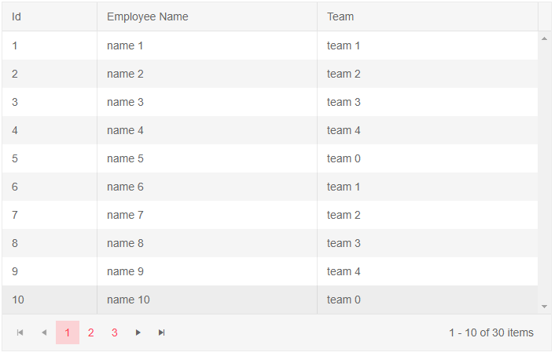
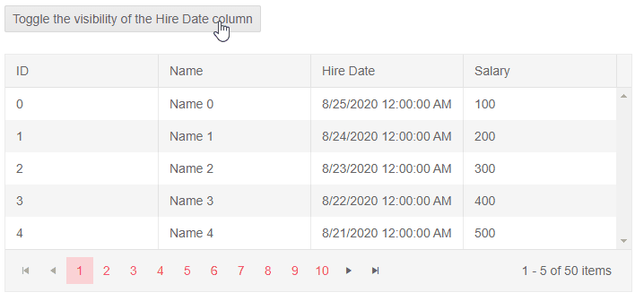
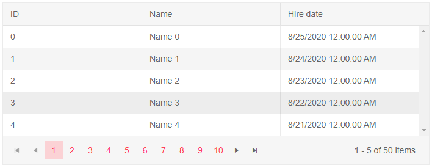
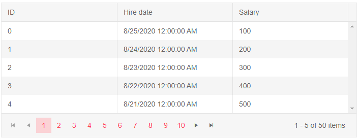

# Visible Columns

The Grid allows you to programmatically hide some of its columns. 

In this article:
* [Basics](#basics)
* [Notes](#notes)
* [Examples](#examples)
    * [Toggle The Visibility Of A Column On Button Click](#toggle-the-visibility-of-a-column-on-button-click)
    * [Hidden Grid Column With Template](#hidden-grid-column-with-template)
    * [Hide A Grid Column Based On A Condition](#hide-a-grid-column-based-on-a-condition)

## Basics

To hide a Grid column set its `Visible` parameter to `false`. To hide a column based on a certain condition you can pass, for example, a ternary operator or a method that returns `bool` - the app can provide an expression according to its logic (like screen size).

>caption Hide a column from the Grid. Basic example.

<demo metaUrl="client/grid/columns-visible/" height="450"></demo>

>caption The result from the code snippet above

## Notes

Non-visible columns (`Visible="false"`) will have the following behavior:

* Will not be [editable](slug:grid-editing-overview).
* Will not be exported in [excel export](slug:grid-export-excel).
* Will not be visible when the data is [grouped](slug:components/grid/features/grouping).
* [Templates](slug:components/grid/features/templates) will not be rendered.
    * When using [Row Template](slug:grid-templates-row) the visiblity of the column should be implemented by the application in the row template itself - the grid can only toggle the visibility of the header.
* You can control the visibility of the column through the [Grid State](slug:grid-state).

## Examples

In this section you will find the following examples:

* [Toggle The Visibility Of A Column On Button Click](#toggle-the-visibility-of-a-column-on-button-click)
* [Hidden Grid Column With Template](#hidden-grid-column-with-template)
* [Hide A Grid Column Based On A Condition](#hide-a-grid-column-based-on-a-condition)

### Toggle The Visibility Of A Column On Button Click

The application can later the value of the `Visible` parameter and that will toggle the column.

<demo metaUrl="client/grid/columns-visible-toggle/" height="500"></demo>

>caption The result from the code snippet above

### Hidden Grid Column With Template

When cell-specific templates are used, they are not rendered at all. If you are using the RowTemplate, however, make sure to handle the column visiblity there as well.

<demo metaUrl="client/grid/columns-visible-template/" height="500"></demo>

>caption The result from the code snippet above

### Hide A Grid Column Based On A Condition

This example shows hiding a column based on a simple condition in its data. You can change it to use other view-model data - such as screen dimensions, user preferences you have stored, or any other logic.

<demo metaUrl="client/grid/columns-visible-condition/" height="500"></demo>

>caption The result from the code snippet above

## See Also

* [Live Demo: Visible Columns](https://demos.telerik.com/blazor-ui/grid/columns)
* [Blazor Grid](slug:grid-overview)
