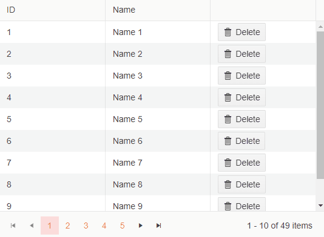

# Delete Confirmation Dialog
The delete confirmation dialog triggers before item deletion. You can enable it by setting the `ConfirmDelete` parameter of the Grid to `true`. 

>caption Delete Confirmation dialog



>caption Enabling of the Delete Confirmation Dialog

````CSHTML
@* Grid with enabled Delete Confirmation Dialog *@

@using System.ComponentModel.DataAnnotations

<TelerikGrid Data=@MyData Pageable="true" Height="400px"
             OnDelete="@DeleteHandler" ConfirmDelete="true">
    <GridColumns>
        <GridColumn Field=@nameof(SampleData.ID) Title="ID" />
        <GridColumn Field=@nameof(SampleData.Name) Title="Name" />
        <GridCommandColumn>
            <GridCommandButton Command="Delete" Icon="delete">Delete</GridCommandButton>
        </GridCommandColumn>
    </GridColumns>
</TelerikGrid>

@code {
    async Task DeleteHandler(GridCommandEventArgs args)
    {
        SampleData item = (SampleData)args.Item;

        await MyService.Delete(item);

        await GetGridData();
    }

    public class SampleData
    {
        public int ID { get; set; }
        [Required]
        public string Name { get; set; }
    }

    List<SampleData> MyData { get; set; }

    async Task GetGridData()
    {
        MyData = await MyService.Read();
    }

    protected override async Task OnInitializedAsync()
    {
        await GetGridData();
    }

    public static class MyService
    {
        private static List<SampleData> _data { get; set; } = new List<SampleData>();

        public static async Task<List<SampleData>> Read()
        {
            if (_data.Count < 1)
            {
                for (int i = 1; i < 50; i++)
                {
                    _data.Add(new SampleData()
                    {
                        ID = i,
                        Name = "Name " + i.ToString()
                    });
                }
            }

            return await Task.FromResult(_data);
        }

        public static async Task Delete(SampleData itemToDelete)
        {
            _data.Remove(itemToDelete);
        }
    }
}
````


## See Also

* [Live Demo: Grid Inline Editing](https://demos.telerik.com/blazor-ui/grid/editing-inline)
* [Live Demo: Grid PopUp Editing](https://demos.telerik.com/blazor-ui/grid/editing-popup)
* [Live Demo: Grid InCell Editing](https://demos.telerik.com/blazor-ui/grid/editing-incell)
* [Live Demo: Grid Custom Editor Template](https://demos.telerik.com/blazor-ui/grid/custom-editor)
* [Live Demo: Grid Custom Edit Form](https://demos.telerik.com/blazor-ui/grid/editing-custom-form)

