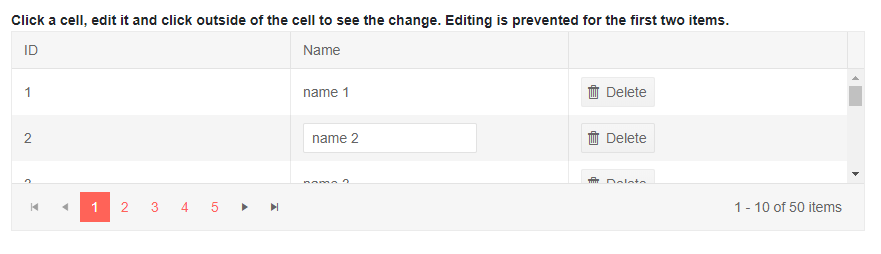

# Grid InCell Editing

In Cell editing allows the user to click the cell and type the new value. When they remove focus from the input, the `OnUpdate` event fires, where the data-access logic can move it to the actual data source.

You can handle the `OnUpdate`, `OnCreate` and `OnDelete` events to perform the CUD operations, as shown in the example below. To add a new item, you must also add a [command column]() with a `Save` command and a [toolbar]() with an `Add` command. Cancellation of changes is not supported at the moment, you can prevent them by not calling the data access layer.

To enable InCell editing mode, set the `EditMode` property of the grid to `Telerik.Blazor.GridEditMode.Incell`, then handle the CRUD events as shown in the example below.

@[template](/_contentTemplates/grid/common-link.md#async-events-link)

>caption Values are set in the model as soon as the user finishes editing a field, and you can receive them through the grid events

````CSHTML
Click a cell, edit it and click outside of the cell to see the change. Editing is prevented for the first two items.

<TelerikGrid Data=@MyData EditMode="@GridEditMode.Incell" Pageable="true" Height="500px"
        OnUpdate="@UpdateHandler" OnEdit="@EditHandler" OnDelete="@DeleteHandler" OnCreate="@CreateHandler">
    <GridToolBar>
        <GridCommandButton Command="Add" Icon="add">Add Employee</GridCommandButton>
    </GridToolBar>
    <GridColumns>
        <GridColumn Field=@nameof(SampleData.ID) Title="ID" Editable="false" />
        <GridColumn Field=@nameof(SampleData.Name) Title="Name" />
        <GridCommandColumn>
            <GridCommandButton Command="Save" Icon="save" ShowInEdit="true">Update</GridCommandButton>
            <GridCommandButton Command="Delete" Icon="delete">Delete</GridCommandButton>
        </GridCommandColumn>
    </GridColumns>
</TelerikGrid>

@code {
    public void EditHandler(GridCommandEventArgs args)
    {
        SampleData item = (SampleData)args.Item;

        //prevent opening for edit based on condition
        if (item.ID < 3)
        {
            args.IsCancelled = true;//the general approach for cancelling an event
        }

        Console.WriteLine("Edit event is fired for column " + args.Field);
    }

    public void UpdateHandler(GridCommandEventArgs args)
    {
        string fieldName = args.Field;
        object newVal = args.Value; //you can cast this, if necessary, according to your model

        SampleData item = (SampleData)args.Item;//you can also use the entire model

        //perform actual data source operation here

        //if you have a context added through an @inject statement, you could call its SaveChanges() method
        //myContext.SaveChanges();

        var index = MyData.FindIndex(i => i.ID == item.ID);
        if (index != -1)
        {
            MyData[index] = item;
            // this copies the entire item, consider altering only the needed field
        }

        Console.WriteLine("Update event is fired for " + args.Field + " with value " + args.Value);
    }

    public void CreateHandler(GridCommandEventArgs args)
    {
        SampleData item = (SampleData)args.Item;

        //perform actual data source operation here

        item.ID = MyData.Count + 1;
        MyData.Insert(0, item);

        Console.WriteLine("Create event is fired.");
    }

    public void DeleteHandler(GridCommandEventArgs args)
    {
        SampleData item = (SampleData)args.Item;

        //perform actual data source operation here

        //if you have a context added through an @inject statement, you could call its SaveChanges() method
        //myContext.SaveChanges();

        MyData.Remove(item);

        Console.WriteLine("Delete event is fired.");
    }

    //in a real case, keep the models in dedicated locations, this is just an easy to copy and see example
    public class SampleData
    {
        public int ID { get; set; }
        public string Name { get; set; }
    }

    public List<SampleData> MyData { get; set; }

    protected override void OnInitialized()
    {
        MyData = new List<SampleData>();

        for (int i = 0; i < 50; i++)
        {
            MyData.Add(new SampleData()
            {
                ID = i,
                Name = "Name " + i.ToString()
            });
        }
    }
}
````

>caption The result from the code snippet above, after the user clicks in the Name column of the fifth row



>note It is up to the data access logic to save the data once it is changed in the data collection. The example above showcases when that happens and adds some code to provide a visual indication of the change. In a real application, the code for handling data updates may be entirely different.

## See Also

  * [Live Demo: Grid InCell Editing](https://demos.telerik.com/blazor-ui/grid/editing-incell)
   
  
