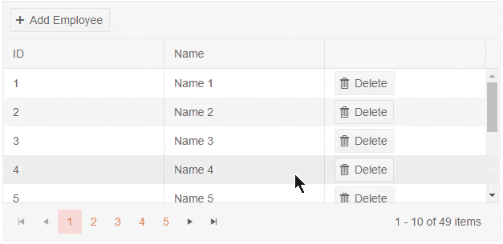

# Grid InCell Editing

In Cell editing allows the user to click cells and type new values immediately like in Excel. There is no need for Edit, Update and Cancel buttons.

Users can use the `Tab`, `Shift+Tab` and `Enter` keys to move between edited cells quickly. If validation is not satisfied, the user cannot exit edit mode, unless they satisfy validation, or cancel changes by pressing `Esc`.

Command columns and non-editable columns are skipped while tabbing.

The InCell edit mode provides a specific user experience and behaves differently than other edit modes. Please review the notes below to get a better understanding of these specifics.


#### Sections in this article

* [Basics](#basics)
* [Event Sequence](#event-sequence)
* [Incell Editing and Selection](#incell-editing-and-selection)
* [Editor Template](#editor-template)


## Basics

To enable InCell editing mode, set the `EditMode` property of the grid to `Telerik.Blazor.GridEditMode.Incell`. You can handle the `OnUpdate`, `OnCreate` and `OnDelete` events to perform the CUD operations, as shown in the example below. 

To add a new item, you must add a [toolbar]() with an `Add` command. `OnCreate` will fire immediately when you click the `Add` button - see [Events Sequence](#events-sequence) below.

It is up to the data access logic to save the data once it is changed in the data collection. The example below showcases when that happens and adds some code to provide a visual indication of the change. In a real application, the code for handling data updates may be entirely different.

>caption Incell Editing Example. See the code comments for details.

````CSHTML
@using System.ComponentModel.DataAnnotations @* for the validation attributes *@

Click a cell, edit it and click outside of the grid to see the change. You can also use Tab, Shift+Tab and Enter to navigate between the cells.
<br />
<strong>Editing is prevented for the first two items.</strong>

<TelerikGrid Data=@MyData EditMode="@GridEditMode.Incell" Pageable="true" Height="500px"
             OnUpdate="@UpdateHandler" OnEdit="@EditHandler" OnDelete="@DeleteHandler" OnCreate="@CreateHandler" OnCancel="@OnCancelHandler">
    <GridToolBar>
        <GridCommandButton Command="Add" Icon="add">Add Employee</GridCommandButton>
    </GridToolBar>
    <GridColumns>
        <GridColumn Field=@nameof(SampleData.ID) Title="ID" Editable="false" />
        <GridColumn Field=@nameof(SampleData.FirstName) Title="Name" />
        <GridColumn Field=@nameof(SampleData.LastName) Title="Last Name" />
        <GridCommandColumn>
            <GridCommandButton Command="Delete" Icon="delete">Delete</GridCommandButton>
        </GridCommandColumn>
    </GridColumns>
</TelerikGrid>

@code {
    void EditHandler(GridCommandEventArgs args)
    {
        SampleData item = (SampleData)args.Item;

        // prevent opening for edit based on condition
        if (item.ID < 3)
        {
            args.IsCancelled = true;// the general approach for cancelling an event
        }

        Console.WriteLine("Edit event is fired.");
    }

    async Task UpdateHandler(GridCommandEventArgs args)
    {
        SampleData item = (SampleData)args.Item;

        // perform actual data source operations here through your service
        await MyService.Update(item);

        // update the local view-model data with the service data
        await GetGridData();

        Console.WriteLine("Update event is fired.");
    }

    async Task DeleteHandler(GridCommandEventArgs args)
    {
        SampleData item = (SampleData)args.Item;

        // perform actual data source operation here through your service
        await MyService.Delete(item);

        // update the local view-model data with the service data
        await GetGridData();

        Console.WriteLine("Delete event is fired.");
    }

    async Task CreateHandler(GridCommandEventArgs args)
    {
        SampleData item = (SampleData)args.Item;

        // perform actual data source operation here through your service
        await MyService.Create(item);

        // update the local view-model data with the service data
        await GetGridData();

        Console.WriteLine("Create event is fired.");
    }

    void OnCancelHandler(GridCommandEventArgs args)
    {
        SampleData item = (SampleData)args.Item;
        Console.WriteLine("Cancel event is fired. Can be useful when people decide to not satisfy validation");
    }


    // in a real case, keep the models in dedicated locations, this is just an easy to copy and see example
    public class SampleData
    {
        public int ID { get; set; }
        [Required]
        public string FirstName { get; set; }
        public string LastName { get; set; }
    }

    public List<SampleData> MyData { get; set; }

    async Task GetGridData()
    {
        MyData = await MyService.Read();
    }

    protected override async Task OnInitializedAsync()
    {
        await GetGridData();
    }

    // the following static class mimics an actual data service that handles the actual data source
    // replace it with your actual service through the DI, this only mimics how the API can look like and works for this standalone page
    public static class MyService
    {
        private static List<SampleData> _data { get; set; } = new List<SampleData>();

        public static async Task Create(SampleData itemToInsert)
        {
            itemToInsert.ID = _data.Count + 1;
            _data.Insert(0, itemToInsert);
        }

        public static async Task<List<SampleData>> Read()
        {
            if (_data.Count < 1)
            {
                for (int i = 1; i < 50; i++)
                {
                    _data.Add(new SampleData()
                    {
                        ID = i,
                        FirstName = "Name " + i.ToString(),
                        LastName = "Last Name " + i.ToString()
                    });
                }
            }

            return await Task.FromResult(_data);
        }

        public static async Task Update(SampleData itemToUpdate)
        {
            var index = _data.FindIndex(i => i.ID == itemToUpdate.ID);
            if (index != -1)
            {
                _data[index] = itemToUpdate;
            }
        }

        public static async Task Delete(SampleData itemToDelete)
        {
            _data.Remove(itemToDelete);
        }
    }
}
````

>caption InCell editing behavior




## Event Sequence

* The `OnCreate` event will fire as soon as you click the `Add` button. The Grid will render the new row and enter edit mode for the first editable column (to fire `OnEdit` and let the user alter the column). This means you should have [default values]() that satisfy any initial validation and requirements your models may have.

    * This means that there is no actual inserted item, an item in InCell editing is always in Edit mode, never in Insert mode. Thus, you cannot use the `InsertedItem` field of the Grid [State](). If you want to insert items programmatically in the Grid, alter the `Data` collection, and use the `OriginalEditItem` feature of the state (see the [Initiate Editing or Inserting of an Item](#initiate-editing-or-inserting-of-an-item) example - it can put the InLine and PopUp edit modes in Insert mode, but this cannot work for InCell editing).

* The `OnEdit` event fires every time a cell is opened for editing. Until version **2.27**, the event fired **once per row** - when the user edits a cell from a different row.

* The `OnUpdate` event fires every time an edited cell is closed. Until version **2.27**, the event fired **once per row** - when the currently edited row loses focus.

* If there is a cell that is being edited at the moment, clicking on another cell will first close the current cell and fire `OnUpdate`. To start editing the new cell, you need a second click. When the user removes focus from the Grid or the current row, the `OnUpdate` event fires, where the data-access logic can move it to the actual data source. 

* The `OnCancel` event works only when pressing `Esc`. The `Cancel` command button is not supported. Clicking outside the currently edited cell will trigger `OnUpdate` and thus, clicking on the `Cancel` command button will not fire the `OnCancel` event, because an update has already occured.


## Incell Editing and Selection

* To enable item selection with InCell Edit Mode, add a `<GridCheckboxColumn />` to the `<Columns>` collection. More information on that can be read in the [Selection](#notes) article.

    * To see how to select the row that is being edited in InCell edit mode without using a `<GridCheckboxColumn />` check out the [Row Selection in Edit with InCell EditMode]() Knowledge Base article.


## Editor Template

When using an [editor template](#edit-template), the grid cannot know what the custom editor needs to do, what it contains, and when it needs to close the cell and update the data, because this is up to the editor. This has the following implications:

* The grid will still capture `Enter` and `Tab` keypresses when the cell is focused, and will close the cell with the corresponding `OnUpdate` call. You can either use that (e.g., a standard input will let the keypress event propagate to the grid cell), or you can prevent the event propagation and use only your business logic. If you don't do anything, you will get the default grid behavior for the keyboard navigation even with custom editors.

* The grid can no longer capture the `onblur` event in a custom editor like it does for built-in editors. It uses it to call `OnUpdate` when the user clicks away from the current row with the mouse. So, when an editor template is open, clicking away will not close it and save the row.

    If you want to get this behavior, you can use the grid [state]() to close the cell and you can also invoke the desired operations on the data according to your business logic. For example, a suitable event the Telerik input components provide is `OnBlur`.
    
    **.razor**
    
        <EditorTemplate>
            @{
                CurrentlyEditedLine = context as SampleData;
                <TelerikTextBox OnBlur="@CloseEditorAndSave" 
                    Width="100%" @bind-Value="@CurrentlyEditedLine.LastName">
                </TelerikTextBox>

            }
        </EditorTemplate>


    **C#**
    
        SampleData CurrentlyEditedLine { get; set; }
        TelerikGrid<SampleData> Grid { get; set; }
    
        async Task CloseEditorAndSave()
        {
            var state = Grid?.GetState();
            if (state.EditItem != null)
            {
                // we can reuse the code from the OnUpdate handler
                await UpdateHandler(new GridCommandEventArgs()
                {
                    Item = state.EditItem
                });
                
                // use the state to remove the edited item (close the editor)
                state.EditItem = null;
                state.OriginalEditItem = null;
                await Grid.SetState(state);
            }
        }

* Using an editor template requires that there is a focusable element in the editor template in order to maintain the tab order when using the keyboard. For example, if you prevent editing based on a runtime condition (setting `Editable=false` for the entire column does not require this), you must provide a focusable element, here is one way to add such an element:
    
    **.razor**
    
        <EditorTemplate>
        @{
            if (myCurrentEditCondition)
            {
                <MyCustomEditor />
            }
            else
            {
                <div tabindex="0">editing not allowed</div>
            }
        }
    </EditorTemplate>


## See Also

  * [Live Demo: Grid InCell Editing](https://demos.telerik.com/blazor-ui/grid/editing-incell)
  * [Grid Selection Documentation]()
