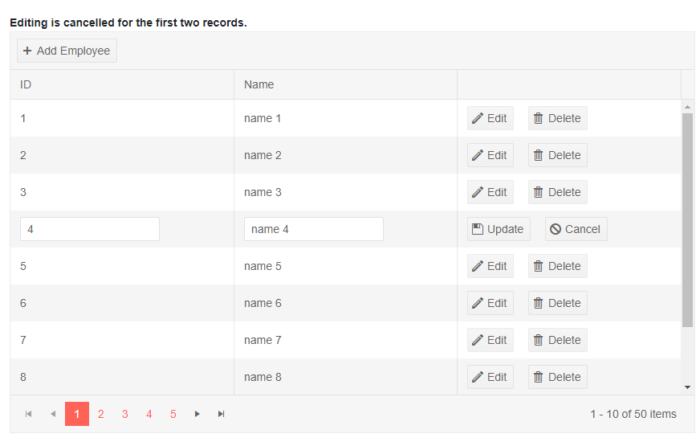

# Grid Inline Editing

Inline editing lets the user click an [Edit command button]() on the row, and all its editable columns open up for changes. They can then click an `Save` command button to submit the changes to the data access layer. This fires the `OnUpdate` event of the grid where your code receives the updated model so you can work with the data (for example, to call the appropriate method of your service).

In a similar fashion, the `Cancel` and `Delete` command buttons fire events on the grid to let you handle the data source operations.

You can also cancel the events by setting the `IsCancelled` property of the event arguments to `true`. This lets you prevent the user from editing certain records, inserting or deleting items, based on your application logic.

To enable Inline editing in the grid, set its `EditMode` property to `Telerik.Blazor.GridEditMode.Inline`, then handle the CRUD events as shown in the example below.


>caption The Command buttons and the grid events let you handle data operations in Inline edit mode

````CSHTML
Use the command buttons to control the CUD operations. <br />
<strong>Editing is cancelled for the first two records</strong>. 

<TelerikGrid Data=@MyData EditMode="@GridEditMode.Inline" Pageable="true" Height="500px"
        OnUpdate="@UpdateHandler" OnEdit="@EditHandler" OnDelete="@DeleteHandler" OnCreate="@CreateHandler" OnCancel="@CancelHandler">
    <GridToolBar>
        <GridCommandButton Command="Add" Icon="add">Add Employee</GridCommandButton>
    </GridToolBar>
    <GridColumns>
        <GridColumn Field=@nameof(SampleData.ID) Title="ID" Editable="false" />
        <GridColumn Field=@nameof(SampleData.Name) Title="Name" />
        <GridCommandColumn>
            <GridCommandButton Command="Save" Icon="save" ShowInEdit="true">Update</GridCommandButton>
            <GridCommandButton Command="Edit" Icon="edit">Edit</GridCommandButton>
            <GridCommandButton Command="Delete" Icon="delete">Delete</GridCommandButton>
            <GridCommandButton Command="Cancel" Icon="cancel" ShowInEdit="true">Cancel</GridCommandButton>
        </GridCommandColumn>
    </GridColumns>
</TelerikGrid>

@code {
    void EditHandler(GridCommandEventArgs args)
    {
        SampleData item = (SampleData)args.Item;

        // prevent opening for edit based on condition
        if (item.ID < 3)
        {
            args.IsCancelled = true;// the general approach for cancelling an event
        }

        Console.WriteLine("Edit event is fired.");
    }

    async Task UpdateHandler(GridCommandEventArgs args)
    {
        SampleData item = (SampleData)args.Item;

        // perform actual data source operations here through your service

        // if the grid Data is not tied to the service, you may need to update the local view data too
        var index = MyData.FindIndex(i => i.ID == item.ID);
        if (index != -1)
        {
            MyData[index] = item;
        }

        Console.WriteLine("Update event is fired.");
    }

    async Task DeleteHandler(GridCommandEventArgs args)
    {
        SampleData item = (SampleData)args.Item;

        // perform actual data source operation here through your service

        // if the grid Data is not tied to the service, you may need to update the local view data too
        MyData.Remove(item);

        Console.WriteLine("Delete event is fired.");
    }

    async Task CreateHandler(GridCommandEventArgs args)
    {
        SampleData item = (SampleData)args.Item;

        // perform actual data source operation here through your service

        // if the grid Data is not tied to the service, you may need to update the local view data too
        item.ID = MyData.Count + 1;
        MyData.Insert(0, item);

        Console.WriteLine("Create event is fired.");
    }

    async Task CancelHandler(GridCommandEventArgs args)
    {
        SampleData item = (SampleData)args.Item;

        // if necessary, perform actual data source operation here through your service

        Console.WriteLine("Cancel event is fired.");
    }


    // in a real case, keep the models in dedicated locations, this is just an easy to copy and see example
    public class SampleData
    {
        public int ID { get; set; }
        public string Name { get; set; }
    }

    public List<SampleData> MyData { get; set; }

    protected override void OnInitialized()
    {
        MyData = new List<SampleData>();

        for (int i = 0; i < 50; i++)
        {
            MyData.Add(new SampleData()
            {
                ID = i,
                Name = "Name " + i.ToString()
            });
        }
    }
}
````

>caption The result from the code snippet above, after the Edit button was clicked on the fourth row



>note It is up to the data access logic to save the data once it is changed in the data collection, or to revert changes. The example above showcases the events that allow you to do that. In a real application, the code for handling data operations may be entirely different.

## See Also

  * [Live Demo: Grid Inline Editing](https://demos.telerik.com/blazor-ui/grid/editing-inline)
   
