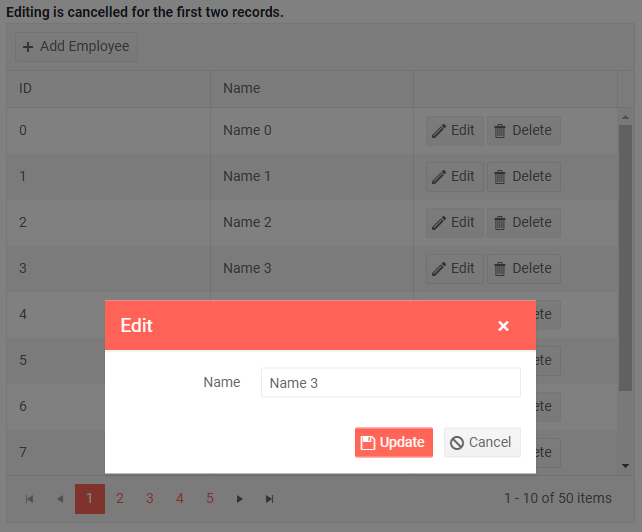

# Grid PopUp Editing

In this article:

* [Basics](#basics)
* [Customization](#customization)

## Basics

Popup editing lets the user click an [Edit command button]() on the row, and a popup shows up with all its editable columns open up for changes. They can then click the `Save` button in the dialog to submit the changes to the model. This fires the `OnUpdate` event of the grid where your code receives the updated model so you can work with the data (for example, to call the appropriate method of your service).

In a similar fashion, the `Cancel`, `Delete` command buttons and the `Add` toolbar button fire events on the grid to let you handle the data source operations.

You can also cancel the events by setting the `IsCancelled` property of the event arguments to `true`. This lets you prevent the user from editing certain records, inserting or deleting items, based on your application logic.

To enable PopUp editing in the grid, set its `EditMode` property to `Telerik.Blazor.GridEditMode.Popup`, then handle the CRUD events as shown in the example below.

The PopUp editing mode supports [validation](). To use it, all you need to do is decorate your model with the desired annotations. Validation errors will be shown in the popup and will prevent the Update operation.


>caption The Command buttons and the grid events let you handle data operations in PopUp edit mode (see the code comments for details)

````CSHTML
@using System.ComponentModel.DataAnnotations
@* Used for the model annotations only *@

<strong>Editing is cancelled for the first two records.</strong>

<TelerikGrid Data=@MyData EditMode="@GridEditMode.Popup" Pageable="true" Height="500px"
             OnUpdate="@UpdateHandler" OnEdit="@EditHandler" OnDelete="@DeleteHandler" OnCreate="@CreateHandler" OnCancel="@CancelHandler">
    <GridToolBar>
        <GridCommandButton Command="Add" Icon="add">Add Employee</GridCommandButton>
    </GridToolBar>
    <GridColumns>
        <GridColumn Field=@nameof(SampleData.ID) Title="ID" Editable="false" />
        <GridColumn Field=@nameof(SampleData.Name) Title="Name" />
        <GridCommandColumn>
            <GridCommandButton Command="Save" Icon="save" ShowInEdit="true">Update</GridCommandButton>
            <GridCommandButton Command="Edit" Icon="edit">Edit</GridCommandButton>
            <GridCommandButton Command="Delete" Icon="delete">Delete</GridCommandButton>
            <GridCommandButton Command="Cancel" Icon="cancel" ShowInEdit="true">Cancel</GridCommandButton>
        </GridCommandColumn>
    </GridColumns>
</TelerikGrid>

@code {
    void EditHandler(GridCommandEventArgs args)
    {
        SampleData item = (SampleData)args.Item;

        // prevent opening for edit based on condition
        if (item.ID < 3)
        {
            args.IsCancelled = true;// the general approach for cancelling an event
        }

        Console.WriteLine("Edit event is fired.");
    }

    async Task UpdateHandler(GridCommandEventArgs args)
    {
        SampleData item = (SampleData)args.Item;

        // perform actual data source operations here through your service
        await MyService.Update(item);

        // update the local view-model data with the service data
        await GetGridData();

        Console.WriteLine("Update event is fired.");
    }

    async Task DeleteHandler(GridCommandEventArgs args)
    {
        SampleData item = (SampleData)args.Item;

        // perform actual data source operation here through your service
        await MyService.Delete(item);

        // update the local view-model data with the service data
        await GetGridData();

        Console.WriteLine("Delete event is fired.");
    }

    async Task CreateHandler(GridCommandEventArgs args)
    {
        SampleData item = (SampleData)args.Item;

        // perform actual data source operation here through your service
        await MyService.Create(item);

        // update the local view-model data with the service data
        await GetGridData();

        Console.WriteLine("Create event is fired.");
    }

    async Task CancelHandler(GridCommandEventArgs args)
    {
        SampleData item = (SampleData)args.Item;

        // if necessary, perform actual data source operation here through your service

        Console.WriteLine("Cancel event is fired.");
    }

    // in a real case, keep the models in dedicated locations, this is just an easy to copy and see example
    public class SampleData
    {
        public int ID { get; set; }

        [Required(ErrorMessage = "The employee must have a name")]
        public string Name { get; set; }
    }

    public List<SampleData> MyData { get; set; }

    async Task GetGridData()
    {
        MyData = await MyService.Read();
    }

    protected override async Task OnInitializedAsync()
    {
        await GetGridData();
    }

    // the following static class mimics an actual data service that handles the actual data source
    // replace it with your actual service through the DI, this only mimics how the API can look like and works for this standalone page
    public static class MyService
    {
        private static List<SampleData> _data { get; set; } = new List<SampleData>();

        public static async Task Create(SampleData itemToInsert)
        {
            itemToInsert.ID = _data.Count + 1;
            _data.Insert(0, itemToInsert);
        }

        public static async Task<List<SampleData>> Read()
        {
            if (_data.Count < 1)
            {
                for (int i = 1; i < 50; i++)
                {
                    _data.Add(new SampleData()
                    {
                        ID = i,
                        Name = "Name " + i.ToString()
                    });
                }
            }

            return await Task.FromResult(_data);
        }

        public static async Task Update(SampleData itemToUpdate)
        {
            var index = _data.FindIndex(i => i.ID == itemToUpdate.ID);
            if (index != -1)
            {
                _data[index] = itemToUpdate;
            }
        }

        public static async Task Delete(SampleData itemToDelete)
        {
            _data.Remove(itemToDelete);
        }
    }
}
````

>caption The result from the code snippet above, after the Edit button was clicked on the third row



>note It is up to the data access logic to save the data once it is changed in the data collection, or to revert changes. The example above showcases the events that allow you to do that. In a real application, the code for handling data operations may be entirely different.

## Customization

The Grid exposes options to customize the edit popup and its form. Define the desired configuration in the `GridPopupEditSettings` and `GridPopupEditFormSettings` tags under the `GridSettings` tag.

### Popup Customization

The `GridPopupEditSettings` nested tag exposes the following parameters to allow popup customization:

@[template](/_contentTemplates/common/popup-edit-customization.md#popup-settings)

### Edit Form Customization

The `GridPopupEditFormSettings` nested tag exposes the following parameters to allow edit form customization:

@[template](/_contentTemplates/common/popup-edit-customization.md#edit-form-settings)

>caption Customize the popup edit form

````CSHTML
@*The snippet focuses on the popup edit form customization. CRUD events are not handled for brevity*@

<TelerikGrid Data=@MyData EditMode="@GridEditMode.Popup" Pageable="true" Height="500px">
    <GridSettings>
        <GridPopupEditSettings MaxWidth="600px"
                               MaxHeight="300px"
                               Class="custom-popup">
        </GridPopupEditSettings>
        <GridPopupEditFormSettings Orientation="@FormOrientation.Horizontal"
                                   ButtonsLayout="FormButtonsLayout.Center"
                                   Columns="2">
        </GridPopupEditFormSettings>
    </GridSettings>
    <GridToolBar>
        <GridCommandButton Command="Add" Icon="add">Add Employee</GridCommandButton>
    </GridToolBar>
    <GridColumns>
        <GridColumn Field=@nameof(SampleData.Id) />
        <GridColumn Field=@nameof(SampleData.Name) />
        <GridColumn Field=@nameof(SampleData.Team) />
        <GridColumn Field=@nameof(SampleData.HireDate) />
        <GridCommandColumn>
            <GridCommandButton Command="Save" Icon="save" ShowInEdit="true">Update</GridCommandButton>
            <GridCommandButton Command="Edit" Icon="edit">Edit</GridCommandButton>
            <GridCommandButton Command="Delete" Icon="delete">Delete</GridCommandButton>
            <GridCommandButton Command="Cancel" Icon="cancel" ShowInEdit="true">Cancel</GridCommandButton>
        </GridCommandColumn>
    </GridColumns>
</TelerikGrid>

@code {

    // in a real case, keep the models in dedicated locations, this is just an easy to copy and see example
    public class SampleData
    {
        public int Id { get; set; }
        public string Name { get; set; }
        public string Team { get; set; }
        public DateTime HireDate { get; set; }
    }

    public List<SampleData> MyData = Enumerable.Range(1, 30).Select(x => new SampleData
        {
            Id = x,
            Name = "name " + x,
            Team = "team " + x % 5,
            HireDate = DateTime.Now.AddDays(-x).Date
        }).ToList();
}
````

## See Also

  * [Live Demo: Grid PopUp Editing](https://demos.telerik.com/blazor-ui/grid/editing-popup)
  * [Custom Editor Template Per Field](#edit-template)
  * [Custom Editor Layout](https://github.com/telerik/blazor-ui/tree/master/grid/custom-popup-form)
   
