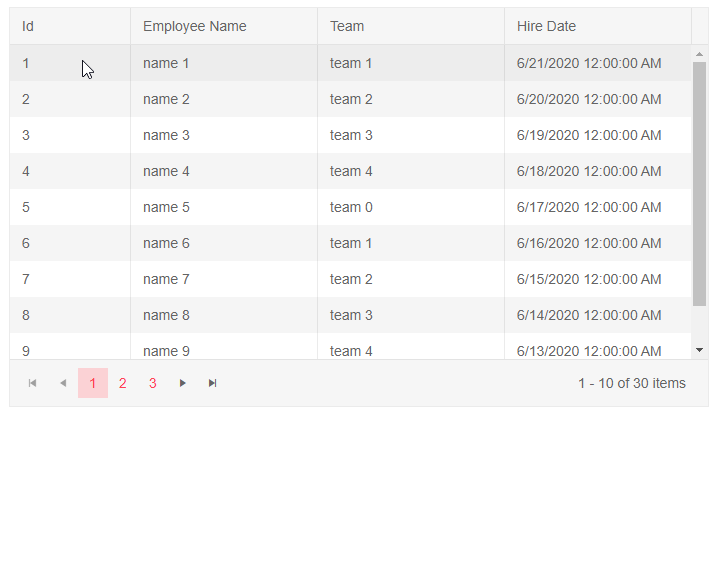

# Grid Events

This article explains the events available in the Telerik Grid for Blazor. They are grouped logically.

* [CUD Events](#cud-events) - events related to Creating, Updating and Deleting items
* [Read Event](#read-event) - event related to obtaining data
* [Other Events](#other-events) - other events the grid provides
    * [State Events](#state-events)
	* [Command Button Click](#command-button-click)
	* [SelectedItemsChanged](#selecteditemschanged)
	* [OnRowClick](#onrowclick)
	* [OnRowDoubleClick](#onrowdoubleclick)
	* [OnRowContextMenu](#onrowcontextmenu)
	* [OnRowExpand](#onrowexpand)
	* [OnRowCollapse](#onrowcollapse)
	* [PageChanged](#pagechanged)

## CUD Events

The `OnCreate`, `OnUpdate` and `OnDelete` events let you get the data item that the user changed so you can transfer the user action to the actual data source.

The `OnEdit` and `OnCancel` events let you respond to user actions - when they want to edit an item and when the want to cancel changes on an item they have been editing. You can use them to, for example, prevent editing of certain items based on some condition.

You can read more about the CUD events in the [Editing Overview]() article.

## Read Event

In the common case, you provide all the data to the grid's `Data` collection and the grid performs operations like paging, filtering, sorting on it for you. In some cases you may want to do this with your own code (for example, to retrieve only a small number of items in order to improve the backend performance). You can do this by attaching to the `OnRead` event where you can perform all the data read operations in the grid. You can read more about them in the [Manual Data Source Operations]() article.


## Other Events

### State Events

The grid state lets you control through code the aspects of the grid the user can control in the UI - such as filtering, sorting, grouping. The grid provides two events related to the state:

* `OnStateInit` - fires when the grid initializes so you can provide a stored version of the grid.

* `OnStateChanged` - fires when the user performs an action so you can see what area was changed and, if needed, alter the grid state.

Review the [grid state]() article for more details and examples on how the grid state works and what you can do with it.

### Command Button Click

The command buttons of a grid provide an `OnClick` event before firing their built-in command (such as opening a row for editing, or adding a new row). You can do this to implement some additional logic and to also handle custom commands - both from a [Command Column](), and from a [Toolbar Button]()

### SelectedItemsChanged

Fires when the item selection is enabled and the user changes the selected [item](#selecteditemschanged-event) or [items](#selecteditemschanged-event).

### OnRowClick

The `OnRowClick` event fires as a response to the user clicking on a row of the Grid. Clicking on the `GridCommandButton`, select row `CheckBox`, expanding a `Detail Template` or when the row is in `edit/insert mode` will not trigger the event.

The event handler receives a `GridRowClickEventArgs` object which provides the model of the clicked row in the `Item` field that you can cast to your model type.

@[template](/_contentTemplates/grid/common-link.md#rowclick-args)

The `OnRowClick` event fires before selection happens.

>caption Use the OnRowClick event to load data on demand based on the clicked row

````CSHTML
@* Use the OnRowClick event to load data on demand based on the clicked row *@

There is a deliberate delay in the data loading to showcase the async nature of the event

<TelerikGrid Data="@MyData"
             Height="400px"
             Width="700px"
             Pageable="true"
             OnRowClick="@OnRowClickHandler"
             SelectionMode="@GridSelectionMode.Single"
             @bind-SelectedItems="@SelectedItems">
    <GridColumns>
        <GridColumn Field="@(nameof(SampleData.Id))" Width="120px" />
        <GridColumn Field="@(nameof(SampleData.Name))" Title="Employee Name" />
        <GridColumn Field="@(nameof(SampleData.Team))" Title="Team" />
        <GridColumn Field="@(nameof(SampleData.HireDate))" Title="Hire Date" />
    </GridColumns>
</TelerikGrid>

@if (ProjectData.Any())
{
    <br />
    <TelerikGrid Data="@ProjectData" AutoGenerateColumns="true"
                 Pageable="true" PageSize="4" Width="700px">
    </TelerikGrid>
}

@code {
    // enable single row selection to showcase the clicked row to the user. Not mandatory
    public IEnumerable<SampleData> SelectedItems { get; set; } = Enumerable.Empty<SampleData>();

    // data that will be loaded on demand for the next components - another grid in this sample
    public List<ProjectModel> ProjectData { get; set; } = new List<ProjectModel>();

    async Task OnRowClickHandler(GridRowClickEventArgs args)
    {
        var model = args.Item as SampleData;

        ProjectData = await GetProjectData(model.Id);
        @[template](/_contentTemplates/grid/common-link.md#rowclick-args-example)
    }

    async Task<List<ProjectModel>> GetProjectData(int id)
    {
        await Task.Delay(500); // simulate loading data from a service, remove from a real app

        ProjectData = new List<ProjectModel>()
        {
            new ProjectModel()
            {
                ProjectManagerId = id,
                ProjectName = $"Project name {id}",
                DueDate = DateTime.Today.AddDays(-id),
                isActive = id % 2 == 0 ? true : false
            }
        };
        return await Task.FromResult(ProjectData);
    }

    public IEnumerable<SampleData> MyData = Enumerable.Range(1, 30).Select(x => new SampleData
    {
        Id = x,
        Name = "name " + x,
        Team = "team " + x % 5,
        HireDate = DateTime.Now.AddDays(-x).Date
    });

    public class SampleData
    {
        public int Id { get; set; }
        public string Name { get; set; }
        public string Team { get; set; }
        public DateTime HireDate { get; set; }
    }

    public class ProjectModel
    {
        public int ProjectManagerId { get; set; }
        public string ProjectName { get; set; }
        public DateTime DueDate { get; set; }
        public bool isActive { get; set; }
    }
}
````

>caption The result from the code snippet above



### OnRowDoubleClick

The `OnRowDoubleClick` event fires as a response to the user double clicking on a row of the Grid. Clicking on the `GridCommandButton`, select row `CheckBox`, expanding a `Detail Template` or when the row is in `edit/insert mode` will not trigger the event.

The event handler receives a `GridRowClickEventArgs` object which provides the model of the clicked row in the `Item` field that you can cast to your model type.

@[template](/_contentTemplates/grid/common-link.md#rowclick-args)

The `OnRowDoubleClick` event fires before selection happens.

>caption Use the OnRowDoubleClick event to receive information on the clicked row

````CSHTML
@* Use the OnRowDoubleClick event to receive information on the row the user clicked on *@

<TelerikGrid Data="@MyData"
             Height="400px"
             Width="700px"
             Pageable="true"
             OnRowDoubleClick="@OnRowDoubleClickHandler">
    <GridColumns>
        <GridColumn Field="@(nameof(SampleData.Id))" Width="120px" />
        <GridColumn Field="@(nameof(SampleData.Name))" Title="Employee Name" Groupable="false" />
        <GridColumn Field="@(nameof(SampleData.Team))" Title="Team" />
        <GridColumn Field="@(nameof(SampleData.HireDate))" Title="Hire Date" />
    </GridColumns>
</TelerikGrid>

@if (!String.IsNullOrEmpty(logger))
{
    <div>
        @logger
    </div>
}

@code {
    string logger = String.Empty;

    void OnRowDoubleClickHandler(GridRowClickEventArgs args)
    {
        var model = args.Item as SampleData;

        logger = $"Double clicked on {model.Name}";
        @[template](/_contentTemplates/grid/common-link.md#rowclick-args-example)
        
    }

    public IEnumerable<SampleData> MyData = Enumerable.Range(1, 30).Select(x => new SampleData
    {
        Id = x,
        Name = "name " + x,
        Team = "team " + x % 5,
        HireDate = DateTime.Now.AddDays(-x).Date
    });

    public class SampleData
    {
        public int Id { get; set; }
        public string Name { get; set; }
        public string Team { get; set; }
        public DateTime HireDate { get; set; }
    }
}
````

### OnRowContextMenu

The `OnRowContextMenu` event fires as a response to the user right clicking on a row of the Grid, the context menu keyboard button or long-touch for mobile devices. Clicking on the `GridCommandButton`, select row `CheckBox`, expanding a `Detail Template` or when the row is in `edit/insert mode` will not trigger the event.

The event handler receives a `GridRowClickEventArgs` object which provides the model of the clicked row in the `Item` field that you can cast to your model type.

@[template](/_contentTemplates/grid/common-link.md#rowclick-args)

The `OnRowContextMenu` is used to [integrate the Context menu](#context-menu-for-a-grid-row) to the Grid Row.

>caption Use the OnRowContextMenu event and get the data model

````CSHTML
@* Get the row model from a context menu action (right click/long tap) *@

<TelerikGrid Data="@MyData"
             Pageable="true"
             PageSize="6"
             OnRowContextMenu="@OnRowContextMenuHandler">
    <GridColumns>
        <GridColumn Field="@(nameof(SampleData.Id))" Width="120px" />
        <GridColumn Field="@(nameof(SampleData.Name))" Title="Employee Name" />
        <GridColumn Field="@(nameof(SampleData.Team))" Title="Team" />
        <GridColumn Field="@(nameof(SampleData.HireDate))" Title="Hire Date" />
    </GridColumns>
</TelerikGrid>

<br />

@logger

@code {
    void OnRowContextMenuHandler(GridRowClickEventArgs args)
    {
        SampleData model = args.Item as SampleData;

        logger = $"OnRowContextMenu event fired from right clicking on {model.Name}";
        @[template](/_contentTemplates/grid/common-link.md#rowclick-args-example)
    }

    public IEnumerable<SampleData> MyData = Enumerable.Range(1, 30).Select(x => new SampleData
    {
        Id = x,
        Name = "name " + x,
        Team = "team " + x % 5,
        HireDate = DateTime.Now.AddDays(-x).Date
    });

    public string logger { get; set; } = String.Empty;


    public class SampleData
    {
        public int Id { get; set; }
        public string Name { get; set; }
        public string Team { get; set; }
        public DateTime HireDate { get; set; }
    }
}
````

### OnRowExpand

The `OnRowExpand` event fires as a response to the user expanding the [`DetailTemplate`]() of the Grid.

The event handler receives a `GridRowToggleEventArgs` object which provides the model of the clicked row in the `Item` field that you can cast to your model type.


>caption Use the OnRowExpand event to load detailed data on demand. Another approach can be found on our [public github repository](https://github.com/telerik/blazor-ui/tree/master/grid/load-on-demand-hierarchy).

````CSHTML
@* Load data on demand for the expanded detail row.  *@

<TelerikGrid Data="salesTeamMembers"
             OnRowExpand="@OnRowExpandHandler">
    <DetailTemplate>
        @{
            var employee = context as MainModel;
            <TelerikGrid Data="employee.Orders" Pageable="true" PageSize="5">
                <GridColumns>
                    <GridColumn Field="OrderId"></GridColumn>
                    <GridColumn Field="DealSize"></GridColumn>
                </GridColumns>
            </TelerikGrid>
        }
    </DetailTemplate>
    <GridColumns>
        <GridColumn Field="Id"></GridColumn>
        <GridColumn Field="Name"></GridColumn>
    </GridColumns>
</TelerikGrid>

@code {
    async Task OnRowExpandHandler(Telerik.Blazor.Components.Grid.GridRowToggleEventArgs args)
    {
        MainModel item = args.Item as MainModel;

        if(item.Orders == null)
        {
            item.Orders = await GenerateOrdersData(item.Id);
        }
    }

    async Task<List<DetailsModel>> GenerateOrdersData(int id)
    {
        var data = new List<DetailsModel>()
        {
            new DetailsModel()
            {
                OrderId = id,
                DealSize = id * 1234,
            }
        };

        return await Task.FromResult(data);
    }

    List<MainModel> salesTeamMembers { get; set; }

    protected override void OnInitialized()
    {
        salesTeamMembers = GenerateData();
    }

    private List<MainModel> GenerateData()
    {
        List<MainModel> data = new List<MainModel>();
        for (int i = 1; i <= 5; i++)
        {
            MainModel mdl = new MainModel { Id = i, Name = $"Name {i}" };
            data.Add(mdl);
        }
        return data;
    }

    public class MainModel
    {
        public int Id { get; set; }
        public string Name { get; set; }
        public List<DetailsModel> Orders { get; set; }
    }

    public class DetailsModel
    {
        public int OrderId { get; set; }
        public double DealSize { get; set; }
    }
}
````

### OnRowCollapse

The `OnRowCollapse` event fires as a response to the user collapsing the [`DetailTemplate`]() of the Grid.

The event handler receives a `GridRowToggleEventArgs` object which provides the model of the clicked row in the `Item` field that you can cast to your model type.

>caption Use the OnRowCollapse event to get the Id of the collapsed row from the data model

````CSHTML
@* Get the Id of the collapsed row *@

<TelerikGrid Data="salesTeamMembers"
             OnRowCollapse="@OnRowCollapseHandler">
    <DetailTemplate>
        @{
            var employee = context as MainModel;
            <TelerikGrid Data="employee.Orders" Pageable="true" PageSize="5">
                <GridColumns>
                    <GridColumn Field="OrderId"></GridColumn>
                    <GridColumn Field="DealSize"></GridColumn>
                </GridColumns>
            </TelerikGrid>
        }
    </DetailTemplate>
    <GridColumns>
        <GridColumn Field="Id"></GridColumn>
        <GridColumn Field="Name"></GridColumn>
    </GridColumns>
</TelerikGrid>

<br />

@logger

@code {
    void OnRowCollapseHandler(Telerik.Blazor.Components.Grid.GridRowToggleEventArgs args)
    {
        MainModel item = args.Item as MainModel;
        logger = $"The collapsed row is with id: {item.Id}";
    }

    public string logger { get; set; } = String.Empty;
    List<MainModel> salesTeamMembers { get; set; }

    protected override void OnInitialized()
    {
        salesTeamMembers = GenerateData();
    }

    private List<MainModel> GenerateData()
    {
        List<MainModel> data = new List<MainModel>();
        for (int i = 0; i < 5; i++)
        {
            MainModel mdl = new MainModel { Id = i, Name = $"Name {i}" };
            mdl.Orders = Enumerable.Range(1, 15).Select(x => new DetailsModel { OrderId = x, DealSize = x ^ i }).ToList();
            data.Add(mdl);
        }
        return data;
    }

    public class MainModel
    {
        public int Id { get; set; }
        public string Name { get; set; }
        public List<DetailsModel> Orders { get; set; }
    }

    public class DetailsModel
    {
        public int OrderId { get; set; }
        public double DealSize { get; set; }
    }
}

````


### PageChanged

The event fires when the user pages the grid.

````CSHTML
@result

<TelerikGrid Data="@MyData" Pageable="true" PageSize="30"
    PageChanged="@PageChangedHandler" Height="300px">
    <GridColumns>
        <GridColumn Field="ID"></GridColumn>
        <GridColumn Field="TheName" Title="Employee Name"></GridColumn>
    </GridColumns>
</TelerikGrid>

@code {
    string result { get; set; }
    async Task PageChangedHandler(int currPage)
    {
        result = $"the user is now on page {currPage}. Note - the indexes are 1-based, not 0-based";
    }

    public IEnumerable<object> MyData = Enumerable.Range(1, 150).Select(x => new { ID = x, TheName = "name " + x });
}
````

## See Also

  * [Grid Overview]()
  * [Grid Editing Overview]()
  * [Manual Data Source Operations]()
