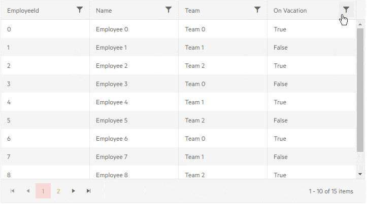

# Grid CheckBoxList Filtering

You can change the [filter menu]() to show a list of checkboxes with the distinct values from the data source. This lets your users filter records by a commonly found value quickly, and select multiple values with east. The behavior is similar to Excel filtering.

To enable the checkbox list filtering in the grid:

1. Set the `FilterMode` parameter of the grid to `Telerik.Blazor.GridFilterMode.FilterMenu`
1. Set the `FilterMenuType` parameter of the grid to `Telerik.Blazor.FilterMenuType.CheckBoxList`. It defaults to `Menu` for the default behavior.

You can also change the filter menu behavior for a particular column - its own `FilterMenuType` parameter can be either `Menu` or `CheckBoxList` regardless of the main grid parameter. This lets you mix both modes as necessary for your application - you can either have all grid columns use the same mode with a single setting, or override it for a few columns that need the less common mode.

>caption CheckList filter in the grid

````CSHTML
@* Checkbox List Filter for the Name, Team and Vacation columns, the ID column overrides it to Menu *@

<TelerikGrid Data=@GridData Pageable="true" Height="400px"
             FilterMode="@GridFilterMode.FilterMenu" FilterMenuType="@FilterMenuType.CheckBoxList">
    <GridColumns>
        <GridColumn Field="@(nameof(Employee.EmployeeId))" FilterMenuType="@FilterMenuType.Menu" />
        <GridColumn Field=@nameof(Employee.Name) />
        <GridColumn Field=@nameof(Employee.Team) Title="Team" />
        <GridColumn Field=@nameof(Employee.IsOnLeave) Title="On Vacation" />
    </GridColumns>
</TelerikGrid>

@code {
    public List<Employee> GridData { get; set; }

    protected override void OnInitialized()
    {
        GridData = new List<Employee>();
        var rand = new Random();
        for (int i = 0; i < 15; i++)
        {
            GridData.Add(new Employee()
            {
                EmployeeId = i,
                Name = "Employee " + i.ToString(),
                Team = "Team " + i % 3,
                IsOnLeave = i % 2 == 0
            });
        }
    }

    public class Employee
    {
        public int EmployeeId { get; set; }
        public string Name { get; set; }
        public string Team { get; set; }
        public bool IsOnLeave { get; set; }
    }
}
````

>caption The result from the snippet above




## Custom Data

By default, the grid takes the `Distinct` values from its `Data` to populate the chekcbox list filter.

When using the [`OnRead` event]() to optimize the data operations and perform them on the server/service, the grid will only have the current page of data. This will limit the options the user will see so you may want to provide the full list.

To customize the checkbox list behavior, you should use the [filter menu template](#filter-menu-template). To help with that, you can use the `TelerikCheckBoxListFilter` component inside the `FilterMenuTemplate`. It provides the following settings:

* `FilterDescriptor` - the filter descriptor where filters will be populated when checkboxes are selected. The component creates the necessary descriptors for you and reads existing ones. This makes it easy to plug into the grid.

* `Data` - the data that will be rendered in the checkbox list. This is where you can supply the desired options to change what the grid displays.

* `Field` - the field from the data that will be used to take the `Distinct` options. It must match the name and type of the column field for which this filter is defined. This lets you use the same models that the grid uses, or to define smaller models to reduce the data you fetch for the filter descriptors.

>caption Provide all filtering options when using OnRead

````CSHTML
@using Telerik.DataSource
@using Telerik.DataSource.Extensions

Filter by selecting a few names. Then filter by the Teams field.<br/>
You will see you have all the options for the teams and all the options for the names.<br />
Now try to filter by the On Vacation column - it will use only the current grid data and you may have only a single option,
    depending on how you filter the data so you may never be able to get back all values.


<TelerikGrid Data=@CurrentGridData Pageable="true" Height="400px"
             TotalCount="Total" OnRead="@OnReadHandler"
             FilterMode="@GridFilterMode.FilterMenu" FilterMenuType="@FilterMenuType.CheckBoxList">
    <GridColumns>
        <GridColumn Field="@(nameof(Employee.EmployeeId))" Filterable="false" />
        <GridColumn Field="@nameof(Employee.Name)">
            <FilterMenuTemplate Context="context">
                <TelerikCheckBoxListFilter Data="@NameOptions"
                                           Field="@(nameof(NameFilterOption.Name))"
                                           @bind-FilterDescriptor="@context.FilterDescriptor">
                </TelerikCheckBoxListFilter>
            </FilterMenuTemplate>
        </GridColumn>
        <GridColumn Field="@nameof(Employee.Team)" Title="Team">
            <FilterMenuTemplate Context="context">
                <TelerikCheckBoxListFilter Data="@TeamsList"
                                           Field="@(nameof(TeamNameFilterOption.Team))"
                                           @bind-FilterDescriptor="@context.FilterDescriptor">
                </TelerikCheckBoxListFilter>
            </FilterMenuTemplate>
        </GridColumn>
        <GridColumn Field="@nameof(Employee.IsOnLeave)" Title="On Vacation" />
    </GridColumns>
</TelerikGrid>

@code {
    List<Employee> AllGridData { get; set; }

    IEnumerable<Employee> CurrentGridData { get; set; }
    int Total { get; set; }

    #region custom-filter-data
    List<TeamNameFilterOption> TeamsList { get; set; }
    List<NameFilterOption> NameOptions { get; set; }

    //obtain filter lists data from the data source to show all options
    async void GetTeamOptions()
    {
        if (TeamsList == null) // sample of caching since we always want all distinct options
        {
            // so it is not null in case this gets called again before data returns - we want to call the service only as necessary
            TeamsList = new List<TeamNameFilterOption>();
            // new up the collection so the parameter gets updated
            TeamsList = new List<TeamNameFilterOption>(await GetNamesFromService());
        }
    }

    async Task<List<TeamNameFilterOption>> GetNamesFromService()
    {
        await Task.Delay(500);// simulate a real service delay

        // this is just one example of getting distinct values from the full data source
        // in a real case you'd probably call your data service here instead
        // or apply further logic (such as tie the returned data to the data the grid will have according to your business logic)
        List<TeamNameFilterOption> data = AllGridData.OrderBy(z => z.Team).Select(z => z.Team).
            Distinct().Select(t => new TeamNameFilterOption { Team = t }).ToList();

        return await Task.FromResult(data);
    }

    async void GetNameOptions()
    {
        if (NameOptions == null)
        {
            NameOptions = new List<NameFilterOption>();
            NameOptions = new List<NameFilterOption>(await GetNameOptionsFromService());
        }
    }

    async Task<List<NameFilterOption>> GetNameOptionsFromService()
    {
        await Task.Delay(500);// simulate a real service delay

        List<NameFilterOption> data = AllGridData.OrderBy(z => z.Name).Select(z => z.Name).
            Distinct().Select(n => new NameFilterOption { Name = n }).ToList();

        return await Task.FromResult(data);
    }
    #endregion custom-filter-data

    async Task OnReadHandler(GridReadEventArgs e)
    {
        //typical data retrieval for the grid
        var filteredData = await AllGridData.ToDataSourceResultAsync(e.Request);
        CurrentGridData = filteredData.Data as IEnumerable<Employee>;
        Total = filteredData.Total;
    }

    protected override async Task OnInitializedAsync()
    {
        // get custom filters data
        GetTeamOptions();
        GetNameOptions();

        // generate data that simulates the database
        AllGridData = new List<Employee>();
        var rand = new Random();
        for (int i = 0; i < 15; i++)
        {
            AllGridData.Add(new Employee()
            {
                EmployeeId = i,
                Name = "Employee " + i.ToString(),
                Team = "Team " + i % 3,
                IsOnLeave = i % 2 == 0
            });
        }
    }

    public class Employee
    {
        public int EmployeeId { get; set; }
        public string Name { get; set; }
        public string Team { get; set; }
        public bool IsOnLeave { get; set; }
    }

    public class TeamNameFilterOption
    {
        public string Team { get; set; }
    }

    public class NameFilterOption
    {
        public string Name { get; set; }
    }
}
````


## See Also

  * [Live Demo: Grid Filter Row](https://demos.telerik.com/blazor-ui/grid/filter-row)
  * [Live Demo: Grid Filter Menu](https://demos.telerik.com/blazor-ui/grid/filter-menu)
