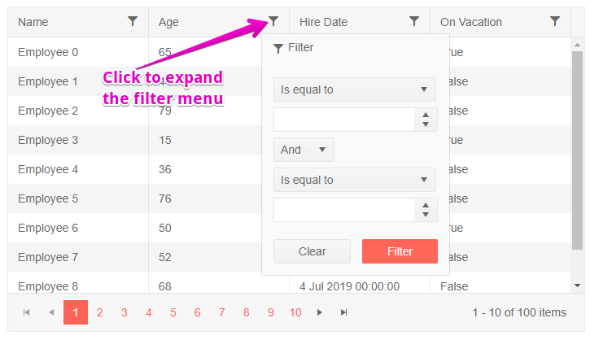

# Grid Filter Menu

One of the [filter modes of the grid]() is a popup menu with filter options that you can open from the column headers.

To enable the filter menu, set the `FilterMode` property of the grid to `Telerik.Blazor.GridFilterMode.FilterMenu`.

The grid will render a button in the column header that you click to get a popup with filtering options. The popup lets you choose filter operator, filter criteria, to apply and clear the filter.

The filter is applied only upon a button click, not upon input change. This may improve performance if you use [manual CRUD operations]() by reducing the number of requests compared to using the [Filter Row]().

>caption Filter Menu in Telerik Grid

````CSHTML
@* Filter menu in the column header *@

<TelerikGrid Data=@GridData FilterMode="Telerik.Blazor.GridFilterMode.FilterMenu"
			 Pageable="true" Height="400px">
	<GridColumns>
		<GridColumn Field=@nameof(Employee.Name) />
		<GridColumn Field=@nameof(Employee.AgeInYears) Title="Age" />
		<GridColumn Field=@nameof(Employee.HireDate) Title="Hire Date" />
		<GridColumn Field=@nameof(Employee.IsOnLeave) Title="On Vacation" />
	</GridColumns>
</TelerikGrid>

@code {
	public List<Employee> GridData { get; set; }

	protected override void OnInitialized()
	{
		GridData = new List<Employee>();
		var rand = new Random();
		for (int i = 0; i < 100; i++)
		{
			GridData.Add(new Employee()
			{
				EmployeeId = i,
				Name = "Employee " + i.ToString(),
				AgeInYears = rand.Next(10, 80),
				HireDate = DateTime.Now.Date.AddDays(rand.Next(-20, 20)),
				IsOnLeave = i % 3 == 0
			});
		}
	}

	public class Employee
	{
		public int? EmployeeId { get; set; }
		public string Name { get; set; }
		public int? AgeInYears { get; set; }
		public DateTime HireDate { get; set; }
		public bool IsOnLeave { get; set; }
	}
}
````

>caption The result from the code snippet above, after the "Age" column has been filtered with <= 30 operator.




## Filter From Code

You can set the grid filters from your code through the grid [state]().

@[template](/_contentTemplates/grid/state.md#initial-state)

>caption Set filtering programmatically

````CSHTML
@[template](/_contentTemplates/grid/state.md#filter-menu-from-code)
````

@[template](/_contentTemplates/grid/state.md#filter-menu-default-filters)


## See Also

  * [Grid Filtering Overview]()
  * [Live Demo: Grid Filter Menu](https://demos.telerik.com/blazor-ui/grid/filter-menu)
