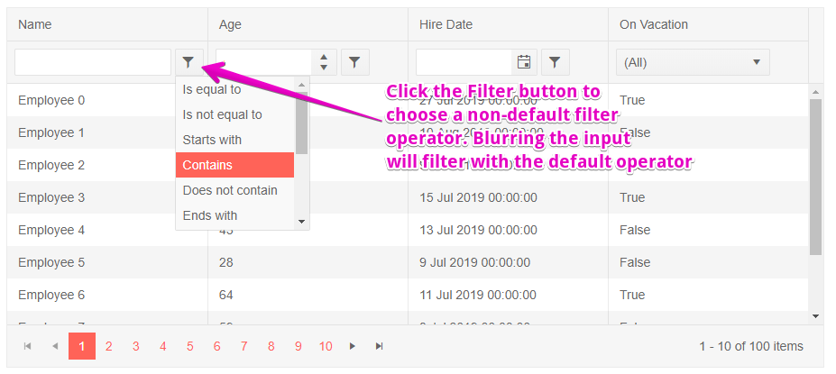
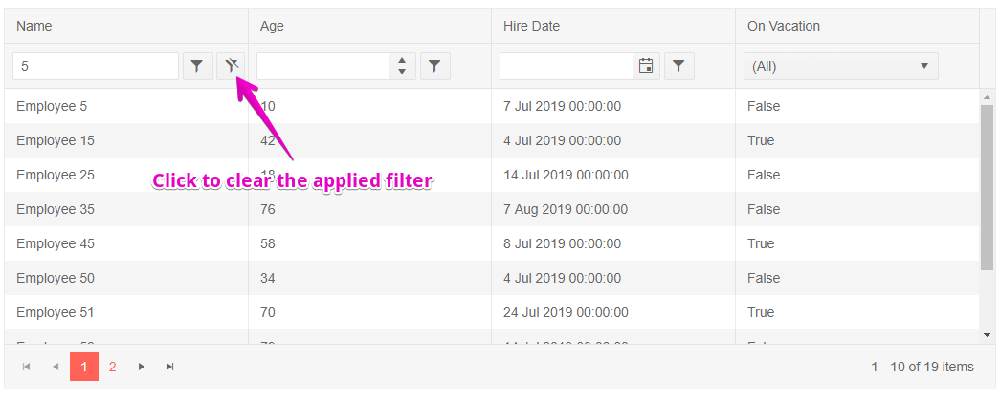

# Grid Filter Row

One of the [filter modes of the grid]() is a row of filter elements below the column headers.

To enable the filter row set the `FilterMode` property of the grid to `Telerik.Blazor.GridFilterMode.FilterRow`.

The grid will render a row below the column headers with UI that you can use to fill in the filter criteria. You can type in the input to execute the default operator as you type, or click a button to choose a different filter operator (like "contains", "greater than" and so on). Filters are applied as the user types in the inputs.

Once a filter is a applied to a column, a button will appear that lets you clear that filter.

>caption Filter Row in Telerik Grid

````CSHTML
@* Filter row mode *@

<TelerikGrid Data=@GridData FilterMode="Telerik.Blazor.GridFilterMode.FilterRow" Pageable="true" Height="400px">
	<GridColumns>
		<GridColumn Field=@nameof(Employee.Name) />
		<GridColumn Field=@nameof(Employee.AgeInYears) Title="Age" />
		<GridColumn Field=@nameof(Employee.HireDate) Title="Hire Date" />
		<GridColumn Field=@nameof(Employee.IsOnLeave) Title="On Vacation" />
	</GridColumns>
</TelerikGrid>

@code {
	public List<Employee> GridData { get; set; }

	protected override void OnInitialized()
	{
		GridData = new List<Employee>();
		var rand = new Random();
		for (int i = 0; i < 100; i++)
		{
			GridData.Add(new Employee()
			{
				EmployeeId = i,
				Name = "Employee " + i.ToString(),
				AgeInYears = rand.Next(10, 80),
				HireDate = DateTime.Now.Date.AddDays(rand.Next(-20, 20)),
				IsOnLeave = i % 3 == 0
			});
		}
	}

	public class Employee
	{
		public int? EmployeeId { get; set; }
		public string Name { get; set; }
		public int? AgeInYears { get; set; }
		public DateTime HireDate { get; set; }
		public bool IsOnLeave { get; set; }
	}
}
````

>caption The result from the code snippet above, before and after the user filled in a filter and clicked on the filter button






## Filter From Code

You can set the grid filters from your code through the grid [state]().

@[template](/_contentTemplates/grid/state.md#initial-state)

>caption Set filtering programmatically

````CSHTML
@[template](/_contentTemplates/grid/state.md#filter-row-from-code)
````


## See Also

  * [Grid Filtering Overview]()
  * [Live Demo: Grid Filter Row](https://demos.telerik.com/blazor-ui/grid/filter-row)
