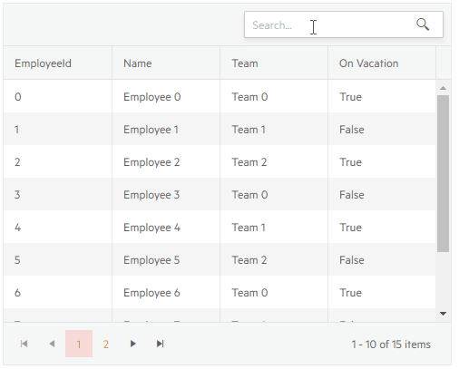

# Grid Toolbar Searchbox

In addition to the [main filtering options](), you can add a search box in the grid toolbar that lets the user type their query and the grid will look up all visible string columns with a case-insensitive `Contains` operator, and filter them accordingly. You can change the filter delay, and the fields the grid will use - see the [Customize the SearchBox](#customize-the-searchbox) section below.

The search box is independent from the standard filters. If you have filters applied, the searchbox will amend and respect them. Thus, you can also apply filtering to results returned from the search box.

To enable the search box, add the `<GridSearchBox>` tag in the `<GridToolBar>`.

>caption Search box in the Telerik grid

````CSHTML
@* A search panel in the grid toolbar *@

<TelerikGrid Data=@GridData Pageable="true" Height="400px">
    <GridToolBar>
        <GridSearchBox />
    </GridToolBar>
    <GridColumns>
        <GridColumn Field="@(nameof(Employee.EmployeeId))" />
        <GridColumn Field=@nameof(Employee.Name) />
        <GridColumn Field=@nameof(Employee.Team) Title="Team" />
        <GridColumn Field=@nameof(Employee.IsOnLeave) Title="On Vacation" />
    </GridColumns>
</TelerikGrid>

@code {
    public List<Employee> GridData { get; set; }

    protected override void OnInitialized()
    {
        GridData = new List<Employee>();
        var rand = new Random();
        for (int i = 0; i < 15; i++)
        {
            GridData.Add(new Employee()
            {
                EmployeeId = i,
                Name = "Employee " + i.ToString(),
                Team = "Team " + i % 3,
                IsOnLeave = i % 2 == 0
            });
        }
    }

    public class Employee
    {
        public int EmployeeId { get; set; }
        public string Name { get; set; }
        public string Team { get; set; }
        public bool IsOnLeave { get; set; }
    }
}
````

>caption The result from the code snippet above



## Customize the SearchBox

The `GridSearchBox` component offers the following settings to customize its behavior:

* `DebounceDelay` - the time in `ms` with which the typing is debounced. This provides a performance optimization when using the `OnRead` event - filtering does not happen on every keystroke anymore. The default value is `300`.

* `Fields` - a list of `string` that denotes the fields names that the grid should search in. By default, the grid looks in all string fields in its currently visible columns, and you can define a subset of that.

* `Class` - a CSS class rendered on the wrapper of the searchbox so you can customize its appearance.

>caption Customize the search box to have a long filter delay and to only use certain fields

````CSHTML
@* Increased delay and a subset of the columns are allowed for filtering *@

<TelerikGrid Data=@GridData Pageable="true" Height="400px">
    <GridToolBar>
         <GridSearchBox DebounceDelay="1000" Fields="@SearchableFields" />
    </GridToolBar>
    <GridColumns>
        <GridColumn Field="@(nameof(Employee.EmployeeId))" />
        <GridColumn Field=@nameof(Employee.Name) />
        <GridColumn Field=@nameof(Employee.Team) Title="Team" />
        <GridColumn Field=@nameof(Employee.IsOnLeave) Title="On Vacation" />
    </GridColumns>
</TelerikGrid>

@code {
    List<string> SearchableFields = new List<string> { "Team" };

    List<Employee> GridData { get; set; }

    protected override void OnInitialized()
    {
        GridData = new List<Employee>();
        var rand = new Random();
        for (int i = 0; i < 15; i++)
        {
            GridData.Add(new Employee()
            {
                EmployeeId = i,
                Name = "Employee " + i.ToString(),
                Team = "Team " + i % 3,
                IsOnLeave = i % 2 == 0
            });
        }
    }

    public class Employee
    {
        public int EmployeeId { get; set; }
        public string Name { get; set; }
        public string Team { get; set; }
        public bool IsOnLeave { get; set; }
    }
}
````


## See Also

  * [Grid Filtering Overview]()
  * [Live Demo: Grid Filter Searchbox](https://demos.telerik.com/blazor-ui/grid/searchbox)

