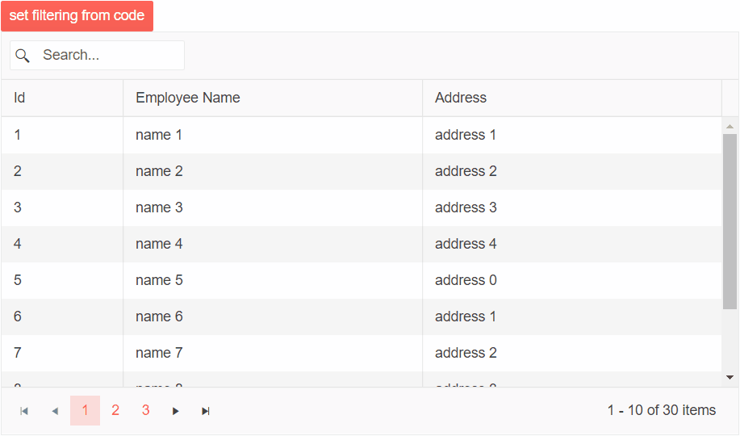

# Grid Toolbar SearchBox

In addition to the [main filtering options](), you can add a SearchBox in the Grid Toolbar.

>caption In this article:

* [Basics](#basics)
* [Filter From Code](#filter-from-code)
* [Customize the SearchBox](#customize-the-searchbox)


## Basics

The SearchBox lets the user type their query and the grid will look up all visible string columns with a case-insensitive `Contains` operator, and filter them accordingly. You can change the filter delay, and the fields the grid will use - see the [Customize the SearchBox](#customize-the-searchbox) section below.

The SearchBox is independent from the standard filters. If you have filters applied, the SearchBox will respect them and add additional filtering criteria. Thus, you can also apply filtering to results returned from it.

To enable the SearchBox, add the `<GridSearchBox>` tag in the `<GridToolBarTemplate>`.

>caption SearchBox in the Telerik Grid

````CSHTML
@* A search panel in the Grid Toolbar *@

<TelerikGrid Data=@GridData Pageable="true" Height="400px">
    <GridToolBarTemplate>
        <span class="k-toolbar-spacer"></span> @* add this spacer to keep the searchbox on the right *@
        <GridSearchBox />
    </GridToolBarTemplate>
    <GridColumns>
        <GridColumn Field="@(nameof(Employee.EmployeeId))" />
        <GridColumn Field=@nameof(Employee.Name) />
        <GridColumn Field=@nameof(Employee.Team) Title="Team" />
        <GridColumn Field=@nameof(Employee.IsOnLeave) Title="On Vacation" />
    </GridColumns>
</TelerikGrid>

@code {
    public List<Employee> GridData { get; set; }

    protected override void OnInitialized()
    {
        GridData = new List<Employee>();
        var rand = new Random();
        for (int i = 0; i < 15; i++)
        {
            GridData.Add(new Employee()
            {
                EmployeeId = i,
                Name = "Employee " + i.ToString(),
                Team = "Team " + i % 3,
                IsOnLeave = i % 2 == 0
            });
        }
    }

    public class Employee
    {
        public int EmployeeId { get; set; }
        public string Name { get; set; }
        public string Team { get; set; }
        public bool IsOnLeave { get; set; }
    }
}
````

>caption The result from the code snippet above


## Filter From Code

You can set the Grid filters programmatically through the component [state]().

@[template](/_contentTemplates/grid/state.md#initial-state)

>caption The result from the code snippet below.



>caption Set programmatically SearchBox Filter.

````Razor
@* This snippet shows how to set filtering state to the Grid from your code.
  Applies to the SearchBox filter *@

@using Telerik.DataSource;

<TelerikButton ThemeColor="primary" OnClick="@SetGridFilter">set filtering from code</TelerikButton>

<TelerikGrid Data="@MyData" Height="400px" @ref="@Grid"
             Pageable="true">
    <GridToolBarTemplate>
        <GridSearchBox />
    </GridToolBarTemplate>
    <GridColumns>
        <GridColumn Field="@(nameof(SampleData.Id))" Width="120px" />
        <GridColumn Field="@(nameof(SampleData.Name))" Title="Employee Name" />
        <GridColumn Field="@(nameof(SampleData.Address))" Title="Address" />
    </GridColumns>
</TelerikGrid>

@code {
    public TelerikGrid<SampleData> Grid { get; set; }

    async Task SetGridFilter()
    {
        GridState<SampleData> desiredState = new GridState<SampleData>()
        {
            SearchFilter = CreateSearchFilter()
        };

        await Grid.SetStateAsync(desiredState);
    }

    private IFilterDescriptor CreateSearchFilter()
    {
        var descriptor = new CompositeFilterDescriptor();
        var fields = new List<string>() { "Name", "Address" };
        var searchValue = "name 10";
        descriptor.LogicalOperator = FilterCompositionLogicalOperator.Or;

        foreach (var field in fields)
        {
            var filter = new FilterDescriptor(field, FilterOperator.Contains, searchValue);

            filter.MemberType = typeof(string);

            descriptor.FilterDescriptors.Add(filter);
        }

        return descriptor;
    }

    public IEnumerable<SampleData> MyData = Enumerable.Range(1, 30).Select(x => new SampleData
    {
        Id = x,
        Name = "name " + x,
        Address = "address " + x % 5,
    });

    public class SampleData
    {
        public int Id { get; set; }
        public string Name { get; set; }
        public string Address { get; set; }
    }
}
  
````

## Customize the SearchBox

The `GridSearchBox` component offers the following settings to customize its behavior:

@[template](/_contentTemplates/common/parameters-table-styles.md#table-layout)

| Attribute | Type and Default Value | Description |
|----------|----------|----------|
| `Class` | `string`| a CSS class rendered on the wrapper of the searchbox so you can customize its appearance.
| `DebounceDelay` | `int` <br/> (300) | the time in milliseconds with which searching is debounced. This provides a performance optimization when using the `OnRead` event - filtering does not happen on every keystroke during fast typing.
| `Fields` |  `List<string>` | The collection of fields to search in. By default, the Grid searches in all string fields, which are bound to visible columns. You can only define a subset of those fields. It is also possible to programmatically [search in string fields, which are not displayed in the Grid]().
| `Placeholder` | `string` <br/> (`Search...`(localized))| Specifies the placeholder attribute of the SearchBox component.
| `Width` | `string` | Specifies the width of the SearchBox component.


>caption Customize the SearchBox to have a long filter delay, search in certain fields only and use a custom placeholder

````CSHTML
@* Increased delay, a subset of the columns are allowed for filtering and a custom placeholder *@

<TelerikGrid Data=@GridData Pageable="true" Height="400px">
    <GridToolBarTemplate>
        <GridSearchBox DebounceDelay="1000"
                       Fields="@SearchableFields"
                       Placeholder="Search Team..." />
    </GridToolBarTemplate>
    <GridColumns>
        <GridColumn Field="@(nameof(Employee.EmployeeId))" />
        <GridColumn Field=@nameof(Employee.Name) />
        <GridColumn Field=@nameof(Employee.Team) Title="Team" />
        <GridColumn Field=@nameof(Employee.IsOnLeave) Title="On Vacation" />
    </GridColumns>
</TelerikGrid>

@code {
    List<string> SearchableFields = new List<string> { "Team" };

    List<Employee> GridData { get; set; }

    protected override void OnInitialized()
    {
        GridData = new List<Employee>();
        var rand = new Random();
        for (int i = 0; i < 15; i++)
        {
            GridData.Add(new Employee()
                {
                    EmployeeId = i,
                    Name = "Employee " + i.ToString(),
                    Team = "Team " + i % 3,
                    IsOnLeave = i % 2 == 0
                });
        }
    }

    public class Employee
    {
        public int EmployeeId { get; set; }
        public string Name { get; set; }
        public string Team { get; set; }
        public bool IsOnLeave { get; set; }
    }
}
````

## See Also

* [Live Demo: Grid Filter Searchbox](https://demos.telerik.com/blazor-ui/grid/searchbox)
* [Highlight or Bold Search Results in the Grid]()
* [Search the Grid in Numeric and Date Model Fields]()
* [Search the Grid in Hidden Fields]()
* [Search the Grid with a `StartsWith` operator]()
* [Search the Grid on Button Click]()
* [Grid Filtering Overview]()
