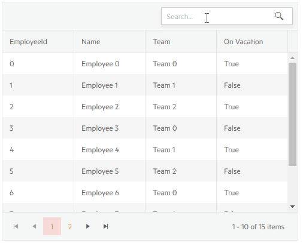

# Grid Filtering

The Grid component offers built-in support for filtering.

In this article:

* [Basics](#basics)
* [Filter Row](#filter-row)
* [Filter Menu](#filter-menu)
* [Toolbar Search Box](#toolbar-search-box)
* [Filter From Code](#filter-from-code)
* [More Examples](#more-examples)


## Basics

To enable filtering, set the grid's `FilterMode` property to one of the following values:

* [`Telerik.Blazor.GridFilterMode.FilterRow`](#filter-row) - a row of filter options is rendered below the column headers
* [`Telerik.Blazor.GridFilterMode.FilterMenu`](#filter-menu) - the column headers render a button that shows a popup with filtering options

The behavior of the filter input and the available filter operators will depend on the column data type. For example, a boolean field will only have the options "is true" and "is false" and will not have operators like "contains" or "greater than".

You can filter more than one column at a time, and all filter rules will be applied together with an `AND` logic.

You can prevent the user from filtering a certain field by setting `Filterable="false"` on its column.

## Filter Row

To enable the filter row set the `FilterMode` property of the grid to `Telerik.Blazor.GridFilterMode.FilterRow`.

The grid will render a row below the column headers with UI that you can use to fill in the filter criteria. You can type in the input to execute the default operator as you type, or click a button to choose a different filter operator (like "contains", "greater than" and so on).

Once a filter is a applied to a column, a button will appear that lets you clear that filter.

>caption Filter Row in Telerik Grid

````CSHTML
@* Filter row mode *@

<TelerikGrid Data=@GridData FilterMode="Telerik.Blazor.GridFilterMode.FilterRow" Pageable="true" Height="400px">
	<GridColumns>
		<GridColumn Field=@nameof(Employee.Name) />
		<GridColumn Field=@nameof(Employee.AgeInYears) Title="Age" />
		<GridColumn Field=@nameof(Employee.HireDate) Title="Hire Date" />
		<GridColumn Field=@nameof(Employee.IsOnLeave) Title="On Vacation" />
	</GridColumns>
</TelerikGrid>

@code {
	public List<Employee> GridData { get; set; }

	protected override void OnInitialized()
	{
		GridData = new List<Employee>();
		var rand = new Random();
		for (int i = 0; i < 100; i++)
		{
			GridData.Add(new Employee()
			{
				EmployeeId = i,
				Name = "Employee " + i.ToString(),
				AgeInYears = rand.Next(10, 80),
				HireDate = DateTime.Now.Date.AddDays(rand.Next(-20, 20)),
				IsOnLeave = i % 3 == 0
			});
		}
	}

	public class Employee
	{
		public int? EmployeeId { get; set; }
		public string Name { get; set; }
		public int? AgeInYears { get; set; }
		public DateTime HireDate { get; set; }
		public bool IsOnLeave { get; set; }
	}
}
````

>caption The result from the code snippet above, before and after the user filled in a filter and clicked on the filter button


## Filter Menu

To use a filter menu, set the `FilterMode` property of the grid to `Telerik.Blazor.GridFilterMode.FilterMenu`.

The grid will render a button in the column header that you click to get a popup with filtering options. The popup lets you choose filter operator, filter criteria, to apply and clear the filter.

A key difference in the behavior from the [filter row](#filter-row) is that the filter is now applied only upon a button click, not upon input change. This may improve performance if you use [manual CRUD operations]() by reducing the number of requests.

>caption Filter Menu in Telerik Grid

````CSHTML
@* Filter menu in the column header *@

<TelerikGrid Data=@GridData FilterMode="Telerik.Blazor.GridFilterMode.FilterMenu"
			 Pageable="true" Height="400px">
	<GridColumns>
		<GridColumn Field=@nameof(Employee.Name) />
		<GridColumn Field=@nameof(Employee.AgeInYears) Title="Age" />
		<GridColumn Field=@nameof(Employee.HireDate) Title="Hire Date" />
		<GridColumn Field=@nameof(Employee.IsOnLeave) Title="On Vacation" />
	</GridColumns>
</TelerikGrid>

@code {
	public List<Employee> GridData { get; set; }

	protected override void OnInitialized()
	{
		GridData = new List<Employee>();
		var rand = new Random();
		for (int i = 0; i < 100; i++)
		{
			GridData.Add(new Employee()
			{
				EmployeeId = i,
				Name = "Employee " + i.ToString(),
				AgeInYears = rand.Next(10, 80),
				HireDate = DateTime.Now.Date.AddDays(rand.Next(-20, 20)),
				IsOnLeave = i % 3 == 0
			});
		}
	}

	public class Employee
	{
		public int? EmployeeId { get; set; }
		public string Name { get; set; }
		public int? AgeInYears { get; set; }
		public DateTime HireDate { get; set; }
		public bool IsOnLeave { get; set; }
	}
}
````

>caption The result from the code snippet above, after the "Age" column has been filtered with <= 30 operator.


## Toolbar Search Box

You can add a search box in the grid toolbar that lets the user type their query and the grid will look up all visible string columns with a case-insensitive `Contains` operator, and filter them accordingly. You can change the filter delay, and the fields the grid will use - see the [Customize the SearchBox](#customize-the-searchbox) section below.

The Search Box is, effectively, a filter on the grid. This means that it applies filter operators to the columns and if you combine it with other filtering modes, the text from the search box will appear on those filter inputs. When you type in the searchbox, all previous filters will be cleared.

To enable the search box, add the `<GridSearchBox>` tag in the `<GridToolBar>`.

>caption Search box in the Telerik grid

````CSHTML
@* A search panel in the grid toolbar *@

<TelerikGrid Data=@GridData Pageable="true" Height="400px">
    <GridToolBar>
        <GridSearchBox />
    </GridToolBar>
    <GridColumns>
        <GridColumn Field="@(nameof(Employee.EmployeeId))" />
        <GridColumn Field=@nameof(Employee.Name) />
        <GridColumn Field=@nameof(Employee.Team) Title="Team" />
        <GridColumn Field=@nameof(Employee.IsOnLeave) Title="On Vacation" />
    </GridColumns>
</TelerikGrid>

@code {
    public List<Employee> GridData { get; set; }

    protected override void OnInitialized()
    {
        GridData = new List<Employee>();
        var rand = new Random();
        for (int i = 0; i < 15; i++)
        {
            GridData.Add(new Employee()
            {
                EmployeeId = i,
                Name = "Employee " + i.ToString(),
                Team = "Team " + i % 3,
                IsOnLeave = i % 2 == 0
            });
        }
    }

    public class Employee
    {
        public int EmployeeId { get; set; }
        public string Name { get; set; }
        public string Team { get; set; }
        public bool IsOnLeave { get; set; }
    }
}
````

>caption The result from the code snippet above



### Customize the SearchBox

The `GridSearchBox` component offers the following settings to customize its behavior:

* `DebounceDelay` - the time in `ms` with which the typing is debounced. This provides a performance optimization when using the `OnRead` event - filtering does not happen on every keystroke anymore. The default value is `300`.

* `Fields` - a list of `string` that denotes the fields names that the gris should search in. By default, the grid looks in all string fields in its currently visible columns, and you can define a subset of that.

* `Class` - a CSS class rendered on the wrapper of the searchbox so you can customize its appearance.

>caption Customize the search box to have a long filter delay and to only use certain fields

````CSHTML
@* Increased delay and a subset of the columns are allowed for filtering *@

<TelerikGrid Data=@GridData Pageable="true" Height="400px">
    <GridToolBar>
         <GridSearchBox DebounceDelay="1000" Fields="@SearchableFields" />
    </GridToolBar>
    <GridColumns>
        <GridColumn Field="@(nameof(Employee.EmployeeId))" />
        <GridColumn Field=@nameof(Employee.Name) />
        <GridColumn Field=@nameof(Employee.Team) Title="Team" />
        <GridColumn Field=@nameof(Employee.IsOnLeave) Title="On Vacation" />
    </GridColumns>
</TelerikGrid>

@code {
    List<string> SearchableFields = new List<string> { "Team" };

    List<Employee> GridData { get; set; }

    protected override void OnInitialized()
    {
        GridData = new List<Employee>();
        var rand = new Random();
        for (int i = 0; i < 15; i++)
        {
            GridData.Add(new Employee()
            {
                EmployeeId = i,
                Name = "Employee " + i.ToString(),
                Team = "Team " + i % 3,
                IsOnLeave = i % 2 == 0
            });
        }
    }

    public class Employee
    {
        public int EmployeeId { get; set; }
        public string Name { get; set; }
        public string Team { get; set; }
        public bool IsOnLeave { get; set; }
    }
}
````


## Filter From Code

You can set the grid filters from your code through the grid [state]().

@[template](/_contentTemplates/grid/state.md#initial-state)

>caption Set sorting programmatically

````FilterRow
@[template](/_contentTemplates/grid/state.md#filter-row-from-code)
````
````FilterMenu
@[template](/_contentTemplates/grid/state.md#filter-menu-from-code)
````

## More Examples

The following articles and sample projects can be helpful when implementing filtering:

* [Capture Filtered event](#get-and-override-user-action-that-changes-the-grid) - the grid state lets you know when it changes so you can capture different aspects of the change

* [Server Filtering]() - this article explains how to implement manual data source operations so you can offload the work to the server. It provides the overview of how to setup the grid for that, and examples - several with local data and links a repository with examples using REST API endpoints.

* [Filter and Edit Enum fields]()

* [Leave only one option in the Filter Menu]() - this is a CSS approach, or you can implement a [custom filter template]().


## See Also

  * [Live Demo: Grid Filter Row](https://demos.telerik.com/blazor-ui/grid/filter-row)
  * [Live Demo: Grid Filter Menu](https://demos.telerik.com/blazor-ui/grid/filter-menu)
