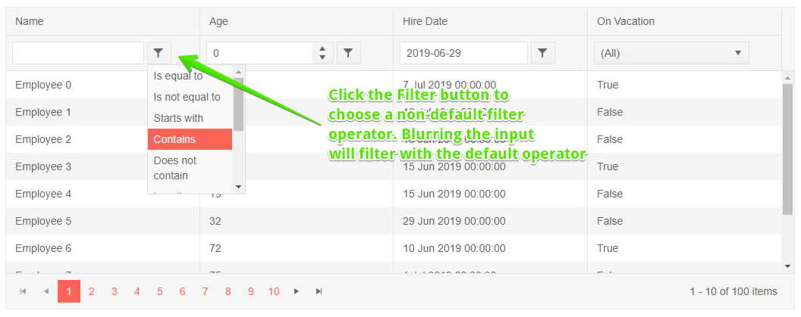
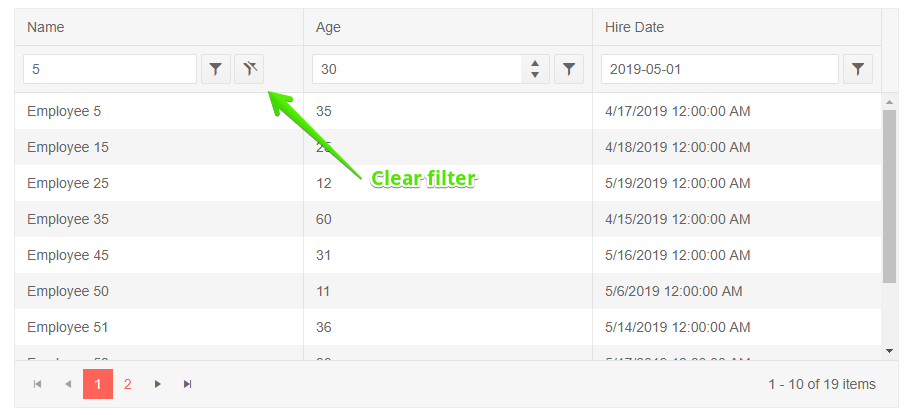

# Grid Filtering

The Grid component offers support for filtering.

To enable filtering, set the grid's `Filterable` property to `true`.

The grid will render a row below the column headers with UI that you can use to fill in the filter criteria. You can click outside of the filter to execute the default operator, or click a button to choose a different filter operator (like "contains", "greater than" and so on).

Once a filter is a applied to a column, a button will appear that lets you clear that filter.

The behavior of the filter header input and the available filter operators will depend on the column data type. For example, a boolean field will only have the options "is true" and "is false" and will not have operators like "contains" or "greater than".

You can filter more than one column at a time, and all filter rules will be applied together with an `AND` logic.

>caption Enable Filtering in Telerik Grid

````CSHTML
@using Telerik.Blazor.Components.Grid

<TelerikGrid Data=@GridData Filterable="true" Pageable="true" Height="400px">
	<TelerikGridColumns>
		<TelerikGridColumn Field=@nameof(Employee.Name) />
		<TelerikGridColumn Field=@nameof(Employee.AgeInYears) Title="Age" />
		<TelerikGridColumn Field=@nameof(Employee.HireDate) Title="Hire Date" />
		<TelerikGridColumn Field=@nameof(Employee.IsOnLeave) Title="On Vacation" />
	</TelerikGridColumns>
</TelerikGrid>

@code {
	public List<Employee> GridData { get; set; }

	protected override void OnInit()
	{
		GridData = new List<Employee>();
		var rand = new Random();
		for (int i = 0; i < 100; i++)
		{
			GridData.Add(new Employee()
			{
				EmployeeId = i,
				Name = "Employee " + i.ToString(),
				AgeInYears = rand.Next(10, 80),
				HireDate = DateTime.Now.Date.AddDays(rand.Next(-20, 20)),
				IsOnLeave = i % 3 == 0
			});
		}
	}

	public class Employee
	{
		public int? EmployeeId { get; set; }
		public string Name { get; set; }
		public int? AgeInYears { get; set; }
		public DateTime HireDate { get; set; }
		public bool IsOnLeave { get; set; }
	}
}
````

>caption The result from the code snippet above, before and after the user filled in a filter and clicked on the filter button






## See Also

  * [Live Demo: Grid Filtering](https://demos.telerik.com/blazor-ui/grid/filtering)
   
  