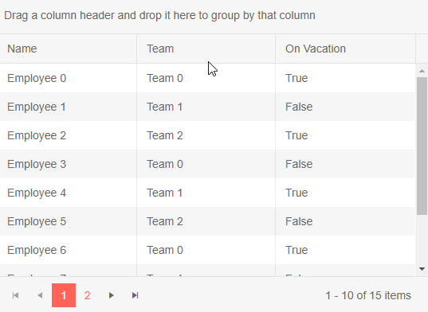

# Grid Grouping

The Grid component offers support for grouping.

* [Basics](#basics)
* [Group From Code](#group-from-code)

## Basics

To enable grouping, set the grid's `Groupable` property to `true`.

Drag a column header to the group panel and the grid will create groups in the data rows based on the available values for that field. An indicator will be shown for the column that is used for grouping. The group header shows the value for the field by which it is grouping.

You can also group by multiple fields and groups for subsequent fields will be nested within their parent groups. When adding a group, you can drag it in the desired position in the list of current groups.

To remove a group setting, click the `[x]` button on its indicator in the group panel.

To prevent grouping by a field, set `Groupable="false"` for on its column. This can be useful for fields with unique values like IDs or names.

You can also use [aggregates]() for the grouped data.

>caption Enable grouping in Telerik Grid

````CSHTML
Drag the column header of the "Team" and/or "On Vacation" column to the group panel at the top

<TelerikGrid Data=@GridData Groupable="true" Pageable="true" Height="400px">
    <GridColumns>
        <GridColumn Field=@nameof(Employee.Name) Groupable="false" />
        <GridColumn Field=@nameof(Employee.Team) Title="Team" />
        <GridColumn Field=@nameof(Employee.IsOnLeave) Title="On Vacation" />
    </GridColumns>
</TelerikGrid>

@code {
    public List<Employee> GridData { get; set; }

    protected override void OnInitialized()
    {
        GridData = new List<Employee>();
        var rand = new Random();
        for (int i = 0; i < 15; i++)
        {
            GridData.Add(new Employee()
            {
                EmployeeId = i,
                Name = "Employee " + i.ToString(),
                Team = "Team " + i % 3,
                IsOnLeave = i % 2 == 0
            });
        }
    }

    public class Employee
    {
        public int EmployeeId { get; set; }
        public string Name { get; set; }
        public string Team { get; set; }
        public bool IsOnLeave { get; set; }
    }
}
````

>caption How grouping works in the Telerik grid




## Group From Code

You can set the grid grouping from your code through the grid [state]().

>caption Set grouping programmatically

````CSHTML
@[template](/_contentTemplates/grid/state.md#group-from-code)
````

## See Also

  * [Live Demo: Grid Grouping](https://demos.telerik.com/blazor-ui/grid/grouping)
  * [Grid Aggregates]()
   
  
