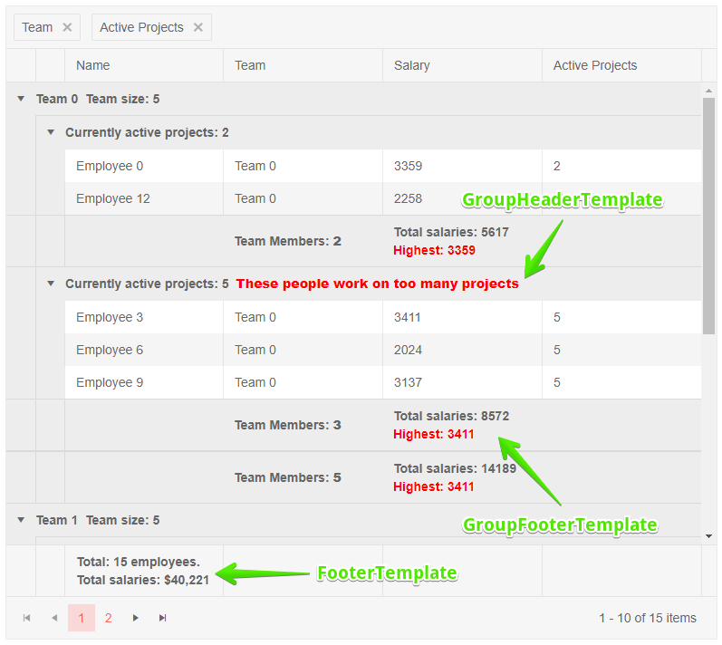

# Grid Aggregates

The Grid component provides built-in aggregates for column values based on [grouping](slug:components/grid/features/grouping) and also a grand total row.

#### In this article:

* [Available Aggregate Functions](#available-aggregate-functions)
* [Where You Can Use Aggregates](#where-you-can-use-aggregates)
* [How to Enable Aggregates](#how-to-enable-aggregates)
* [Example](#example)
* [Notes](#notes)

## Available Aggregate Functions

There are several available aggregate functions under the `Telerik.Blazor.GridAggregateType` enum:

* `Average`
* `Count`
* `Max`
* `Min`
* `Sum`

The `Count` aggregate can be applied to any type of field. The other aggregates can only be applied to numerical fields (e.g., `int`, `decimal`, `double`, etc.).

## Where You Can Use Aggregates

You can use aggregates in the following templates:

* [`GroupFooterTemplate`](slug:grid-templates-column-group-footer) of a `GridColumn` - a footer in the respective column that renders when the grid is grouped.
* [`GroupHeaderTemplate`](slug:grid-templates-group-header) of a `GridColumn` - a header in the respective column that renders when the grid is grouped by that column. The `Value` field in the context carries the current group value.
* [`FooterTemplate`](slug:grid-templates-column-footer) of a `GridColumn` - a grand total row of footers for the entire grid.

## Access The Aggregate Values

You can access the aggregate values through the template `context`:

* All templates expose the aggregate values for the current column.
* The `context` of the `GroupHeaderTemplate` and the `GroupFooterTemplate` has an `AggregateResults` property of a type `Dictionary<string, GridGroupAggregateResult>`. This dictionary allows you to access the aggregates for the other columns in the Grid.

## How to Enable Aggregates

To enable aggregates:

1. Under the `GridAggregates` tag, define the `GridAggregate` entries to enable the aggregations per field you want to use.
1. If the Grid is bound to a [dynamic object (Expando)](https://docs.microsoft.com/en-us/dotnet/csharp/programming-guide/types/walkthrough-creating-and-using-dynamic-objects), set the `FieldType` attribute of the `GridAggregate` tag (it is of type `Type`).
1. Set the grid's `Groupable` property to `true`.
    * If you will be using only `FooterTemplate`s - grouping is not required.
1. Group the grid to see the effect on group-specific templates.


## Example

>caption Use Aggregates in the Telerik Blazor Grid

````RAZOR
@using Telerik.DataSource

<TelerikGrid Data=@GridData
             Groupable="true"
             OnStateInit="@( (GridStateEventArgs<Employee> args) => OnGridStateInit(args) )">
    <GridAggregates>
        <GridAggregate Field=@nameof(Employee.Name) Aggregate="@GridAggregateType.Count" />
        <GridAggregate Field=@nameof(Employee.Team) Aggregate="@GridAggregateType.Count" />
        <GridAggregate Field=@nameof(Employee.Salary) Aggregate="@GridAggregateType.Max" />
        <GridAggregate Field=@nameof(Employee.Salary) Aggregate="@GridAggregateType.Sum" />
        <GridAggregate Field=@nameof(Employee.Salary) Aggregate="@GridAggregateType.Average" />
        <GridAggregate Field=@nameof(Employee.ActiveProjects) Aggregate="@GridAggregateType.Sum" />
    </GridAggregates>
    <GridColumns>
        <GridColumn Field=@nameof(Employee.Name) Groupable="false">
            <FooterTemplate>
                Total employees: @context.Count
                <br />
                @{
                    // you can use aggregates for other fields/columns by extracting the desired one by its
                    // field name and aggregate function from the AggregateResults collection
                    // The type of its Value is determined by the type of its field - decimal for the Salary field here
                    decimal? salaries = (decimal?)context.AggregateResults
                    .FirstOrDefault(r => r.AggregateMethodName == nameof(GridAggregateType.Sum) && r.Member == nameof(Employee.Salary))?.Value;

                    <span>Total salaries: @salaries?.ToString("C0")</span>
                }
            </FooterTemplate>
        </GridColumn>
        <GridColumn Field=@nameof(Employee.Team) Title="Team">
            <GroupHeaderTemplate>
                <span>
                    @context.Value @* the default text you would get without the template *@
                    with employee count: @context.Count
                </span>
            </GroupHeaderTemplate>
            <GroupFooterTemplate>
                Team Members: <strong>@context.Count</strong>
            </GroupFooterTemplate>
        </GridColumn>
        <GridColumn Field=@nameof(Employee.Salary) Title="Salary" Groupable="false" DisplayFormat="{0:C0}">
            <GroupFooterTemplate>
                @* you can use a group footer for non-groupable columns as well *@
                Total salaries: @context.Sum?.ToString("C0")
                <br />
                <span style="color: red;">Highest: @context.Max?.ToString("C0")</span>
            </GroupFooterTemplate>
        </GridColumn>
        <GridColumn Field=@nameof(Employee.ActiveProjects) Title="Active Projects">
            <GroupHeaderTemplate>
                @{
                    <span>Currently active projects: @context.Value</span>

                    //sample of conditional logic in the group header
                    if ((int)context.Value > 3) // in a real case, you may want to ensure type safety and add defensive checks
                    {
                        <strong style="color: red;">These people work on too many projects</strong>
                    }
                }
            </GroupHeaderTemplate>
            <GroupFooterTemplate>
                @*access the aggregates of the ActiveProjects column*@
                Active projects in team: @context.Sum

                @* access the aggregates of the other columns if any *@
                <br />
                <span>Total teams: @context.AggregateResults[nameof(Employee.Team)]?.Count</span>
                <br />
                <span>Total employees: @context.AggregateResults[nameof(Employee.Name)]?.Count</span>
                <br />
                <span>Average salary: @context.AggregateResults[nameof(Employee.Salary)]?.Average?.ToString("C0")</span>
            </GroupFooterTemplate>
        </GridColumn>
    </GridColumns>
</TelerikGrid>

@code {
    private List<Employee> GridData { get; set; } = new();

    private void OnGridStateInit(GridStateEventArgs<Employee> args)
    {
        args.GridState.GroupDescriptors.Add(new GroupDescriptor()
            {
                Member = nameof(Employee.Team)
            });
    }

    protected override void OnInitialized()
    {
        for (int i = 1; i <= 5; i++)
        {
            GridData.Add(new Employee()
                {
                    EmployeeId = i,
                    Name = $"Employee {i}",
                    Team = $"Team {i % 2 + 1}",
                    Salary = Random.Shared.Next(1000, 5000),
                    ActiveProjects = i % 4 == 0 ? 2 : 5
                });
        }
    }

    public class Employee
    {
        public int EmployeeId { get; set; }
        public string Name { get; set; }
        public string Team { get; set; }
        public decimal Salary { get; set; }
        public int ActiveProjects { get; set; }
    }
}
````

>caption The result of the code snippet above after the grid has been grouped by the `Team` and `Active Projects` columns




## Notes 

* You should define only aggregates that you will use to avoid unnecessary calculations that may be noticeable on large data sets.

* If you try to use an aggregate that is not defined, you will get a `null` value.
* If you try to use an aggregate that is not compatible with `Field` type, a runtime error will occur.

* If you update a field of a model the `Data` collection in the view-model, aggregates will not be updated automatically - the grid needs to re-evaluate that data first, and since this is an expensive operation a UI render does not trigger it. You can [update the data collection](slug:grid-refresh-data) yourself, or fetching it anew from the service (example [here](slug:grid-editing-overview), see how the Create/Update/Delete events fetch data anew).

* If you [bind the Grid via `OnRead` event](slug:components/grid/manual-operations), make sure to set `AggregateResults` in the `GridReadEventArgs` event argument object. Otherwise the Grid will calculate aggregates from the data on the current page only.

<div class="skip-repl"></div>

````CS
private async Task OnGridRead(GridReadEventArgs args)
{
    DataSourceResult result = AllGridData.ToDataSourceResult(args.Request);

    args.Data = result.Data;
    args.Total = result.Total;
    args.AggregateResults = result.AggregateResults;
}
````


## See Also

* [Live Demo: Grid Grouping](https://demos.telerik.com/blazor-ui/grid/grouping)
* [Blazor Grid](slug:grid-overview)
