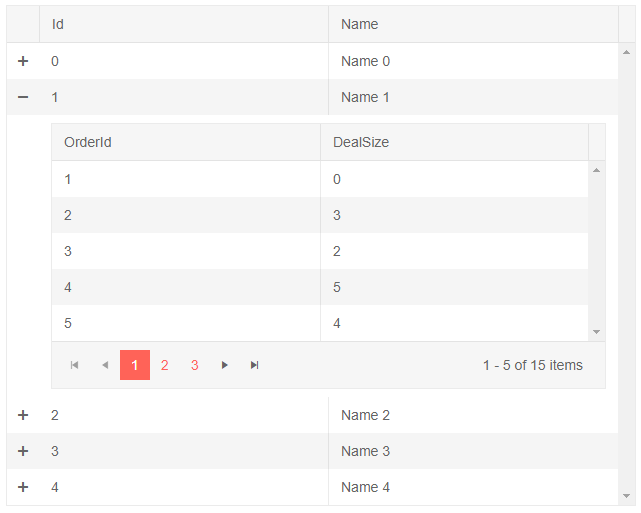

# Grid Hierarchy

The Grid component provides options for visualizing the relations between parent and child records by displaying data in a hierarchical manner through a detail template.

In this article:

* [Basics](#basics)
* [Expand Rows From Code](#expand-rows-from-code)
* [More Examples](#more-examples)

## Basics

To implement hierarchy in the Grid, define a `DetailTemplate` under the main tag of the grid. In this template, you can access the model for the concrete row through the `context`, and use other components to show detailed data from it (for example, another grid, or any other set of components and HTML).

When a detail template is defined, an expand/collapse button is rendered at the beginning of the row that the user can click to show and hide the detailed data.

>caption Define a detail template to show hierarchical data from the model in a nested grid

````CSHTML
Click the + icon to expand the row details

<TelerikGrid Data="salesTeamMembers">
    <DetailTemplate>
        @{
            var employee = context as MainModel;
            <TelerikGrid Data="employee.Orders" Pageable="true" PageSize="5">
                <GridColumns>
                    <GridColumn Field="OrderId"></GridColumn>
                    <GridColumn Field="DealSize"></GridColumn>
                </GridColumns>
            </TelerikGrid>
        }
    </DetailTemplate>
    <GridColumns>
        <GridColumn Field="Id"></GridColumn>
        <GridColumn Field="Name"></GridColumn>
    </GridColumns>
</TelerikGrid>

@code {
    List<MainModel> salesTeamMembers { get; set; }

    protected override void OnInitialized()
    {
        salesTeamMembers = GenerateData();
    }

    private List<MainModel> GenerateData()
    {
        List<MainModel> data = new List<MainModel>();
        for (int i = 0; i < 5; i++)
        {
            MainModel mdl = new MainModel { Id = i, Name = $"Name {i}" };
            mdl.Orders = Enumerable.Range(1, 15).Select(x => new DetailsModel { OrderId = x, DealSize = x^i }).ToList();
            data.Add(mdl);
        }
        return data;
    }

    public class MainModel
    {
        public int Id { get; set; }
        public string Name { get;set; }
        public List<DetailsModel> Orders { get; set; }
    }

    public class DetailsModel
    {
        public int OrderId { get; set; }
        public double DealSize { get; set; }
    }
}
````

>caption The result of the code snippet above, after expanding the second row



>tip To have more levels, simply nest more grids and name the `context` variables. You can find an example in the [Multi-Level Hierarchy]() KB article.


## Expand Rows From Code

You can choose which detail templates will be expanded from your code through the grid [state]() by their indexes (all detail templates are collapsed by default).

@[template](/_contentTemplates/grid/state.md#initial-state)

>caption Expand DetailTemplate hierarchy from code

````CSHTML
@[template](/_contentTemplates/grid/state.md#expand-hierarchy-from-code)
````

## More Examples

The following articles and sample projects can be helpful when implementing hierarchy:

* [Editing in Hierarchy]()

* [Load Hierarchical Data On Demand](https://github.com/telerik/blazor-ui/tree/master/grid/load-on-demand-hierarchy)

* [Multi-Level Hierarchy]()

* [Align Columns in Nested Grids]()

* [Custom Excel Export that Includes Hierarchy](https://github.com/telerik/blazor-ui/tree/master/grid/export-to-xlsx-hierarchy)


## See Also

  * [Live Demo: Grid Hierarchy](https://demos.telerik.com/blazor-ui/grid/hierarchy)
   
  