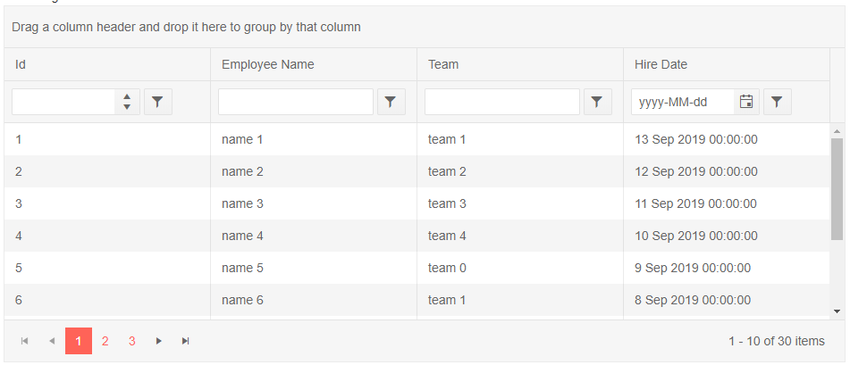
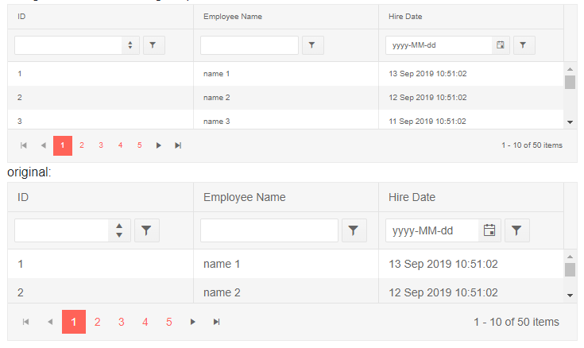

# Blazor Grid Component Overview

This article provides a quick introduction so you can get your first Blazor data grid up and running in a few seconds, a video tutorial, and a list of the key features it provides.

The Telerik Blazor Data Grid provides a comprehensive set of ready-to-use features covering everything from paging, sorting, filtering, editing, and grouping to row virtualization, optimized data reading, keyboard navigation and accessibility support.

The Telerik Blazor grid is built on native Blazor from the ground up, by a company with a long history of making enterprise-ready Grids. This results in a Blazor data grid that delivers lighting fast performance and is highly customizable.

<div class="justify-content-center text-center try-button">
    <a class="button" href="https://www.telerik.com/download-trial-file/v2/ui-for-blazor" target="_blank">Start a free trial</a>
</div>

<style>
.try-button {
    margin-top: 3rem;
    margin-bottom: 3rem;
}
.try-button .button {
    display: inline-block;
    font-size: 18px;
    color: #ffffff;
    background-color: #ff6358;
    border-radius: 2px;
    transition: color .2s ease,background-color .2s ease;
    text-decoration: none;
    padding: 10px 30px 10px 30px;
    line-height: 1.5em;
    height: auto;
}

.try-button .button:hover {
    color: #ffffff;
    background-color: #e74b3c;
}
</style>


>caption To create a basic Telerik Grid:

1. use the `TelerikGrid` tag
1. set its `Data` attribute to the variable that will hold your collection of data
1. under its `GridColumns` tag, set the desired [`GridColumn`]() instances whose `Field` property points to the name of the model field

>caption Get started with the grid by providing it with a data collection and enabling its key features

````CSHTML
General grid with its most common features

<TelerikGrid Data="@MyData" Height="400px"
             Pageable="true" Sortable="true" Groupable="true"
             FilterMode="Telerik.Blazor.GridFilterMode.FilterRow"
             Resizable="true" Reorderable="true">
    <GridColumns>
        <GridColumn Field="@(nameof(SampleData.Id))" Width="120px" />
        <GridColumn Field="@(nameof(SampleData.Name))" Title="Employee Name" Groupable="false" />
        <GridColumn Field="@(nameof(SampleData.Team))" Title="Team" />
        <GridColumn Field="@(nameof(SampleData.HireDate))" Title="Hire Date" />
    </GridColumns>
</TelerikGrid>

@code {
    public IEnumerable<SampleData> MyData = Enumerable.Range(1, 30).Select(x => new SampleData
    {
        Id = x,
        Name = "name " + x,
        Team = "team " + x % 5,
        HireDate = DateTime.Now.AddDays(-x).Date
    });

    public class SampleData
    {
        public int Id { get; set; }
        public string Name { get; set; }
        public string Team { get; set; }
        public DateTime HireDate { get; set; }
    }
}
````

>caption The result from the code snippet above



>caption Video tutorial - Get started with Telerik Data Grid for Blazor

<iframe width="560" height="315" src="https://www.youtube.com/embed/NW2hHtmM2Gk" frameborder="0" allow="accelerometer; autoplay; encrypted-media; gyroscope; picture-in-picture" allowfullscreen></iframe>


## Blazor Grid Reference

The grid is a generic component, and to store a reference, you must use the model type that you pass to its `Data` when declaring the variable.

>caption Store a reference to a Telerik Grid

````CSHTML
@using Telerik.Blazor.Components

<TelerikGrid Data="@MyData" @ref="theGridReference">
	<GridColumns>
		<GridColumn Field="@(nameof(SampleData.ID))">
		</GridColumn>
		<GridColumn Field="@(nameof(SampleData.Name))" Title="Employee Name">
		</GridColumn>
	</GridColumns>
</TelerikGrid>

@code {
	Telerik.Blazor.Components.TelerikGrid<SampleData> theGridReference;

	public IEnumerable<SampleData> MyData = Enumerable.Range(1, 50).Select(x => new SampleData
	{
		ID = x,
		Name = "name " + x
	});

	//in a real case, keep the models in dedicated locations, this is just an easy to copy and see example
	public class SampleData
	{
		public int ID { get; set; }
		public string Name { get; set; }
	}
}
````

## Data Binding

To show data in a grid, you need to define [GridColumn]() instances - they take a model `Field` and expose settings for [templates](), [grouping](#grouping) and [reordering](). To [edit](#editing) data or invoke custom logic, you define a [CommandColumn]().

## Autogenerated Columns

You can autogenerate columns in a Grid for each public property in its model. For more information about this feature you can read the [Autogenerated Columns]() article.

## Editing

The grid can perform CRUD operations on its current data collection and exposes events that let you control the operations and transfer changes to the actual data source. The [CRUD Operations Overview]() article offers more details on this.

The grid offers several editing modes with different user experience through the `EditMode` property that is a member of the `GridEditMode` enum:

* `Incell` - editing is done [in the current cell]() with a double click
* `Inline` - editing is done for the [entire row]() with an [Edit Command Button]()
* `Popup` - editing is done in a [popup]() for the entire row with an [Edit Command Button]()


## Paging

The grid supports paging of the data out of the box. You can read more about it in the [Paging]() article. An alternative to standard paging is [Virtual Scrolling]() that provides a different user experience.

## Sorting

The grid can sort data automatically. You can read more about this feature in the [Sorting]() article.

## Filtering

The grid can filter data automatically. You can read more about this feature in the [Filtering]() article.


## Grouping

The grid can group data automatically. You can read more about this feature in the [Grouping]() article.

## Selection

The grid offers single or multiple selection modes. You can read more about this feature in the [Selection]() article.

## Toolbar

You can define user actions in a [dedicated toolbar](). For the moment, they are mostly custom actions, but in future versions you will be able to add features like exporting there.

## Scrolling

The grid offers two modes of scrolling through its `ScrollMode` parameter that takes a member of the `Telerik.Blazor.GridScrollMode` enum:

* `Scrollable` - the default setting - the scrollbars are controlled by the grid's `Width` and `Height` parameters and the data shown in it. If the rendered rows are taller than the height, there will be a vertical scrollbar. If the sum of the column widths is larger than the width, there will be a horizontal scrollbar (read more in the [Column Width]() article).
* `Virtual` - this enables [Virtual Scrolling]().

## Frozen Columns

The grid lets you freeze one or more columns. You can read more about this feature in the [Frozen columns]() article.

## State

The grid provides its current state (such as filtering, sorting, grouping, selection and so on) through methods and events so you can store the grid layout for your end users - this lets them continue where they left off. You can read more about this in the [Grid State]() article.


## Styling

You can define your own content for column cells or even the entire row through [Templates]().

You can also set the [`Height` of the grid](), and you can use the `Class` to provide more complex CSS rules (like ones that will be inherited in a template).

For example, you can benefit from the elastic design the components expose to change their font size so they change dimensions.

>caption Change font size and dimensions of a grid

````CSHTML
The grid offers elastic design capabilities

<style>
    div.smallerFont,
    div.smallerFont .k-filtercell * {
        font-size: 10px;
    }

    div.smallerFont .k-dropdown.k-header.k-dropdown-operator {
        width: calc(8px + 2em) !important;
    }
</style>

<TelerikGrid Data="@MyData" Class="smallerFont"
			  Pageable="true" FilterMode="Telerik.Blazor.GridFilterMode.FilterRow"
			  Sortable="true" Height="200px">
	<GridColumns>
		<GridColumn Field="@(nameof(SampleData.ID))">
		</GridColumn>
		<GridColumn Field="@(nameof(SampleData.Name))" Title="Employee Name">
		</GridColumn>
		<GridColumn Field="@(nameof(SampleData.HireDate))" Title="Hire Date">
		</GridColumn>
	</GridColumns>
</TelerikGrid>

original:

<TelerikGrid Data="@MyData"
			  Pageable="true" FilterMode="Telerik.Blazor.GridFilterMode.FilterRow"
			  Sortable="true" Height="200px">
	<GridColumns>
		<GridColumn Field="@(nameof(SampleData.ID))">
		</GridColumn>
		<GridColumn Field="@(nameof(SampleData.Name))" Title="Employee Name">
		</GridColumn>
		<GridColumn Field="@(nameof(SampleData.HireDate))" Title="Hire Date">
		</GridColumn>
	</GridColumns>
</TelerikGrid>

@code {
	//in a real case, keep the models in dedicated locations, this is just an easy to copy and see example
	public class SampleData
	{
		public int ID { get; set; }
		public string Name { get; set; }
		public DateTime HireDate { get; set; }
	}

	public IEnumerable<SampleData> MyData = Enumerable.Range(1, 50).Select(x => new SampleData
	{
		ID = x,
		Name = "name " + x,
		HireDate = DateTime.Now.AddDays(-x)
	});
}
````

>caption The result from the reduced font size is a reduction in the overall size of the grid elements



## See Also

  * [Live Demos: Grid](https://demos.telerik.com/blazor-ui/grid/index)
  * [API Reference](https://docs.telerik.com/blazor-ui/api/Telerik.Blazor.Components.TelerikGrid)
