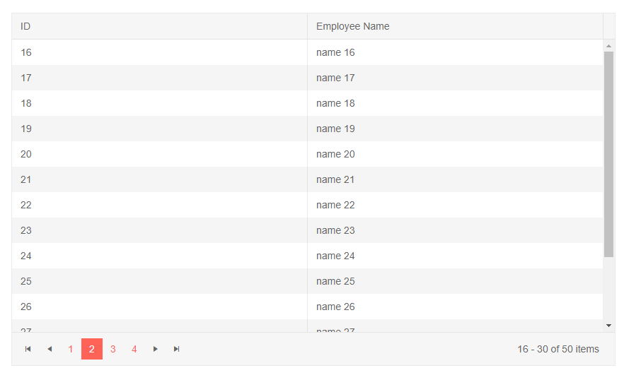

# Grid Paging

The Grid component offers support for paging.

To enable paging, set its `Pageable` property to `true`. 

You can control the number of records per page through the `PageSize` property.

You can set the current page of the grid through its integer `Page` property.

>caption Enable paging in Telerik Grid

````CSHTML
@using Telerik.Blazor.Components.Grid

<TelerikGrid Data="@MyData" Pageable=true PageSize=15 Page=2>
	<TelerikGridColumns>
		<TelerikGridColumn Field="ID"></TelerikGridColumn>
		<TelerikGridColumn Field="TheName" Title="Employee Name"></TelerikGridColumn>
	</TelerikGridColumns>
</TelerikGrid>

@functions {
	public IEnumerable<object> MyData = Enumerable.Range(1, 50).Select(x => new { ID = x, TheName = "name " + x });
}
````

>caption The result from the code snippet above



>tip You can bind the values of those properties to variables in the `@functions {}` section.

Here is one way to implement a page size choice that puts all records on one page.

>caption Bind Page Size to a variable

````CSHTML
@using Telerik.Blazor.Components.Grid

<select onchange=@ChangePageSize>
	@for (int i = 1; i < 4; i++)
	{
		<option value=@(i*10)>@(i * 10)</option>
	}
	<option value="all">all</option>
</select>

<TelerikGrid Data="@MyData" Pageable="true" PageSize="@PageSize">
	<TelerikGridColumns>
		<TelerikGridColumn Field="ID"></TelerikGridColumn>
		<TelerikGridColumn Field="TheName" Title="Employee Name"></TelerikGridColumn>
	</TelerikGridColumns>
</TelerikGrid>

@functions {
	public IEnumerable<object> MyData = Enumerable.Range(1, 50).Select(x => new { ID = x, TheName = "name " + x });

	protected int PageSize { get; set; }

	protected void ChangePageSize(UIChangeEventArgs e)
	{
		if (e.Value.ToString().ToLowerInvariant() == "all")
		{
			PageSize = MyData.Count();
		}
		else
		{
			PageSize = int.Parse(e.Value.ToString());
		}
	}
}
````

## See Also

  * [Live Demo: Grid Paging](https://demos.telerik.com/blazor-ui/grid/paging)