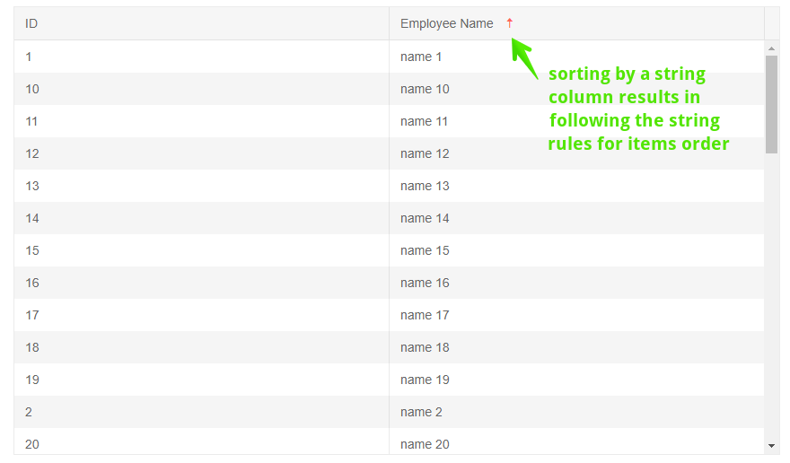

# Grid Sorting

The Grid component offers support for sorting.

In this article:

* [Basics](#basics)
* [Sort From Code](#sort-from-code)
* [More Examples](#more-examples)


## Basics

To enable sorting, set the grid's `Sortable` property to `true`.

When the user clicks the column header, the grid will sort the data according to the column's data type, and an arrow indicator of the sorting direction will be shown next to the column title.

You can prevent the user from sorting a certain field by setting `Sortable="false"` on its column.

>caption Enable Sorting in Telerik Grid

````CSHTML
Click a column header to sort by its data

<TelerikGrid Data="@MyData" Sortable="true" Height="500px">
	<GridColumns>
		<GridColumn Field="ID"></GridColumn>
		<GridColumn Field="TheName" Title="Employee Name"></GridColumn>
	</GridColumns>
</TelerikGrid>

@code {
	public IEnumerable<object> MyData = Enumerable.Range(1, 50).Select(x => new { ID = x, TheName = "name " + x });
}
````

>caption The result from the code snippet above, after the user clicked on the "Employee Name" header to sort



You can sort this grid on the different columns to see the results. The `Name` column is a string, and sorting is done according to the rules for strings, while the `ID` column sorts acording to rules for integers.


### Multi Column Sorting

To allow sorting on more than one column at a time, set the `SortMode` parameter of the grid to `Telerik.Blazor.SortMode.Multiple`.

>caption Enable multi column sorting

````CSHTML
@* Try sorting by Team, then by Name to see how the multiple sorts apply *@

<TelerikGrid Data=@GridData Sortable="true" SortMode="@SortMode.Multiple"
            Pageable="true" Height="400px">
    <GridColumns>
        <GridColumn Field=@nameof(Employee.Name) Groupable="false" />
        <GridColumn Field=@nameof(Employee.Team) Title="Team" />
        <GridColumn Field=@nameof(Employee.IsOnLeave) Title="On Vacation" />
    </GridColumns>
</TelerikGrid>

@code {
    public List<Employee> GridData { get; set; }

    protected override void OnInitialized()
    {
        GridData = new List<Employee>();
        var rand = new Random();
        for (int i = 0; i < 15; i++)
        {
            GridData.Add(new Employee()
            {
                EmployeeId = i,
                Name = "Employee " + i.ToString(),
                Team = "Team " + i % 3,
                IsOnLeave = i % 2 == 0
            });
        }
    }

    public class Employee
    {
        public int EmployeeId { get; set; }
        public string Name { get; set; }
        public string Team { get; set; }
        public bool IsOnLeave { get; set; }
    }
}
````


## Sort From Code

You can sort the grid from your own code through its [state]().

@[template](/_contentTemplates/grid/state.md#initial-state)

>caption Set sorting programmatically

````CSHTML
@[template](/_contentTemplates/grid/state.md#set-sort-from-code)
````

## More Examples

The following articles and sample projects can be helpful when implementing sorting:

* [Capture Sorted event](#get-and-override-user-action-that-changes-the-grid) - the grid state lets you know when it changes so you can capture different aspects of the change

* [Server Sorting]() - this article explains how to implement manual data source operations so you can offload the work to the server. It provides the overview of how to setup the grid for that, and examples - several with local data and links a repository with examples using REST API endpoints.

## See Also

  * [Live Demo: Grid Sorting](https://demos.telerik.com/blazor-ui/grid/sorting)
   
