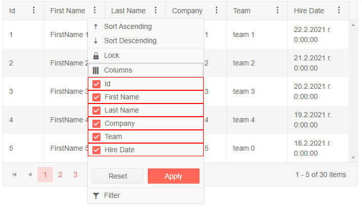

# Column Chooser Template

The `Column Chooser Template` lets you control the rendering of the [ColumnChooser](#column-chooser). It exposes a `context` object that contains a List of all columns in the Grid. When the Template is setup the list of columns, rendered by default, would not be present.

>caption Use the Template to provide custom rendering

````CSHTML
@* Use the Template to render the list of columns and add some custom styles *@ 

<TelerikGrid Data="@MyData"
             Pageable="true"
             PageSize="5"
             Width="700px"
             FilterMode="@GridFilterMode.FilterMenu"
             Sortable="true"
             ShowColumnMenu="true">
    <GridSettings>
        <GridColumnMenuSettings>
            <GridColumnMenuChooser>
                <Template>
                    @{
                        var columns = context.Columns;
                        foreach (var column in columns)
                        {
                            <div style="border: solid 1px red">
                                <GridColumnMenuChooserItem Title="@column.DisplayTitle" ColumnId="@column.Id" />
                            </div>
                        }
                    }

                </Template>
            </GridColumnMenuChooser>
        </GridColumnMenuSettings>
    </GridSettings>
    <GridColumns>
        <GridColumn Field="@(nameof(SampleData.Id))" Width="80px" Title="Id" Id="id-column-id" />
        <GridColumn Field="@(nameof(SampleData.FirstName))" Title="First Name" Id="firstname-column-id" />
        <GridColumn Field="@(nameof(SampleData.LastName))" Title="Last Name" Id="lastname-column-id" />
        <GridColumn Field="@(nameof(SampleData.CompanyName))" Title="Company" Id="companyname-column-id" />
        <GridColumn Field="@(nameof(SampleData.Team))" Title="Team" Id="team-column-id" />
        <GridColumn Field="@(nameof(SampleData.HireDate))" Title="Hire Date" Id="hiredate-column-id" />
    </GridColumns>
</TelerikGrid>

@code {
    public string TextboxValue { get; set; } = string.Empty;

    public IEnumerable<SampleData> MyData = Enumerable.Range(1, 30).Select(x => new SampleData
    {
        Id = x,
        FirstName = $"FirstName {x}",
        LastName = $"LastName {x}",
        CompanyName = $"Company {x}",
        Team = "team " + x % 5,
        HireDate = DateTime.Now.AddDays(-x).Date
    });

    public class SampleData
    {
        public int Id { get; set; }
        public string FirstName { get; set; }
        public string LastName { get; set; }
        public string CompanyName { get; set; }
        public string Team { get; set; }
        public DateTime HireDate { get; set; }
    }
}
````

>caption The result from the code snippet above



## See Also

 * [Live Demo: Grid Templates](https://demos.telerik.com/blazor-ui/grid/templates)
 * [Columns Menu]()

