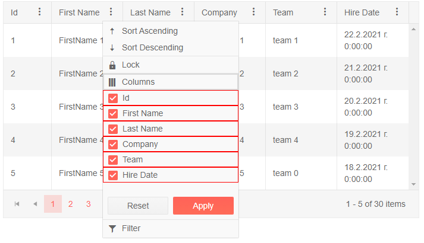

# Column Chooser Template

The `Column Chooser Template` lets you control the rendering of the [ColumnChooser](slug:grid-column-menu#column-chooser). It exposes a `context` object that contains a List of all columns in the Grid. 

When the Template is setup the list of columns, rendered by default, would not be present.

>caption Use the Template to provide custom rendering

<demo metaUrl="client/grid/templates-column-chooser/" height="600"></demo>

>caption The result from the code snippet above

## See Also

* [Live Demo: Grid Templates](https://demos.telerik.com/blazor-ui/grid/templates)
* [Live Demo: Grid Custom Column Menu](https://demos.telerik.com/blazor-ui/grid/custom-column-menu)
* [Columns Menu](slug:grid-column-menu)
* [Blazor Grid](slug:grid-overview)

