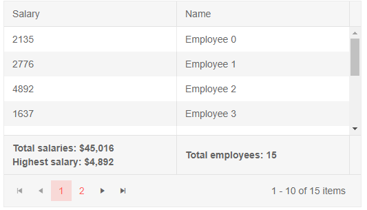

# Column Footer Template

You can display a grand total row at the bottom of the grid through the `FooterTemplate` of each [bound]() column.

You can use [aggregates]() for the current field directly from the `context`, and its `AggregateResults` field lets you get aggregates for other fields that you have defined through their field name and aggregate function.


>caption Footer Template with grand total data

````CSHTML
@* grand total footer that is always visible *@

<TelerikGrid Data=@GridData Pageable="true" Height="300px">
    <GridAggregates>
        <GridAggregate Field=@nameof(Employee.Salary) Aggregate="@GridAggregateType.Max" />
        <GridAggregate Field=@nameof(Employee.Salary) Aggregate="@GridAggregateType.Sum" />
        <GridAggregate Field=@nameof(Employee.EmployeeId) Aggregate="@GridAggregateType.Count" />
    </GridAggregates>
    <GridColumns>
        <GridColumn Field=@nameof(Employee.Salary) Title="Salary">
            <FooterTemplate>
                @{
                    var sum = context.Sum;
                    var max = context.Max;
                    // add some null checks in the rendering for cases
                    // when there is no aggregation (e.g., filtering removes all items)
                }
                Total salaries: @( sum != null ? sum.Value.ToString("C0") : "unknown" )
                <br />
                Highest salary: @( max != null ? max.Value.ToString("C0") : "unknown" )
            </FooterTemplate>
        </GridColumn>
        <GridColumn Field=@nameof(Employee.Name)>
            <FooterTemplate>
                @{
                    // you can use aggregates for other fields/columns by extracting the desired one by its
                    // field name and aggregate function from the AggregateResults collection
                    // The type of its Value is determined by the type of its field
                    // in this example - decimal for the Salary field sum/max or int for employee count
                    var aggregates = context.AggregateResults;
                    int? headCount = null;
                    if (aggregates.Any())
                    {
                        var headCountResult = aggregates
                            .FirstOrDefault(r => r.AggregateMethodName == "Count" && r.Member == nameof(Employee.EmployeeId));
                        if (headCountResult != null) {
                            headCount = (int)headCountResult.Value;
                        }
                    }
                    // there are some null checks in the rendering for cases
                    // when there is no aggregation (e.g., filtering removes all items)
                }
                Total employees: @( headCount != null ? headCount.ToString() : "unknown" )
            </FooterTemplate>
        </GridColumn>
    </GridColumns>
</TelerikGrid>

@code {
    public List<Employee> GridData { get; set; }

    protected override void OnInitialized()
    {
        GridData = new List<Employee>();
        var rand = new Random();
        for (int i = 0; i < 15; i++)
        {
            Random rnd = new Random();
            GridData.Add(new Employee()
            {
                EmployeeId = i,
                Name = "Employee " + i.ToString(),
                Salary = rnd.Next(1000, 5000),
            });
        }
    }

    public class Employee
    {
        public int EmployeeId { get; set; }
        public string Name { get; set; }
        public decimal Salary { get; set; }
    }
}
````

>caption The result from the code snippet above




## Notes

Since the purpose of the footer template is to display aggregates, you need to be aware of their behavior. The following list expands on that and other things to keep in mind.

* Aggregate results are based on all the data across all pages.

* Aggregate results are calculated over filtered data only.

* When using the [`OnRead event`](), the aggregates are based on the available data - for the current page only. If you want to aggregate over the entire data source, you should get the desired information into the view model with the appropriate code in the application, instead of using the built-in grid Aggregates. The `Aggregate` extension method from our `Telerik.DataSource.Extensions` namespace can help you calculate them.

    **Razor**

        @using Telerik.DataSource.Extensions
        @using Telerik.DataSource
    
        The current data aggregates will differ from the aggregates on all the data
    
        <TelerikGrid Data=@GridData TotalCount=@Total OnRead=@ReadItems Pageable="true">
            <GridColumns>
                <GridColumn Field=@nameof(Employee.ID)>
                    <FooterTemplate>
                        Total employees: @totalEmployees
                        <hr />
                        Total employees (from current data): @context.Count
                    </FooterTemplate>
                </GridColumn>
                <GridColumn Field="@nameof(Employee.Salary)">
                    <FooterTemplate>
                        Top salary: @highestSalary
                        <hr />
                        Top salary (from current data): @context.Max
                    </FooterTemplate>
                </GridColumn>
                <GridColumn Field=@nameof(Employee.Name) Title="Name">
                </GridColumn>
            </GridColumns>
            <GridAggregates>
                <GridAggregate Field=@nameof(Employee.Salary) Aggregate="@GridAggregateType.Max" />
                <GridAggregate Field=@nameof(Employee.ID) Aggregate="@GridAggregateType.Count" />
            </GridAggregates>
        </TelerikGrid>
    
        @code {
            public List<Employee> SourceData { get; set; }
            public List<Employee> GridData { get; set; }
            public int Total { get; set; } = 0;
    
            // values for the "real" aggregations
            int totalEmployees { get; set; }
            decimal highestSalary { get; set; }
    
            protected override void OnInitialized()
            {
                SourceData = GenerateData();
            }
    
            protected async Task ReadItems(GridReadEventArgs args)
            {
                var datasourceResult = SourceData.ToDataSourceResult(args.Request);
    
                GridData = (datasourceResult.Data as IEnumerable<Employee>).ToList();
                Total = datasourceResult.Total;
    
                // use Telerik Extension methods to aggregate the entire data source per the aggregates defined in the grid
                // in a real case, this code should be in a controller that can query the database directly. We cast here for simplicity
                IQueryable allDataAsQueriable = SourceData.AsQueryable();
    
                // get the aggregate functions from the grid data source request
                IEnumerable<AggregateFunction> gridAggregates = Enumerable.Empty<AggregateFunction>();
                if (args.Request.Aggregates.Count == 0)
                {
                    // aggregate descriptors - the ones from the markup will not be present in the first call to OnRead
                    // because the framework initializes child components too late and the GridAggregates component is not available yet
                    gridAggregates = new List<AggregateFunction>()
                    {
                        new MaxFunction()
                        {
                            SourceField = nameof(Employee.Salary)
                        },
                        new CountFunction()
                        {
                            SourceField = nameof(Employee.ID)
                        }
                    };
                }
                else
                {
                    gridAggregates = args.Request.Aggregates.SelectMany(a => a.Aggregates);
                }
    
                // use the Telerik Aggregate() extension method to perform aggregation on the IQueryable collection
                AggregateResultCollection aggregatedResults = allDataAsQueriable.Aggregate(gridAggregates);
    
                // extract the aggregate data like you would within the footer template - by the function and field name
                // and put it in the view-model. In a real case that would be extra data returned in the response
                totalEmployees = (int)aggregatedResults.FirstOrDefault(
                    r => r.AggregateMethodName == "Count" && r.Member == nameof(Employee.ID))?.Value;
    
                highestSalary = (decimal)aggregatedResults.FirstOrDefault(
                    r => r.AggregateMethodName == "Max" && r.Member == nameof(Employee.Salary))?.Value;
    
    
                // for the grid data update itself
                StateHasChanged();
            }
    
            private List<Employee> GenerateData()
            {
                var result = new List<Employee>();
                var rand = new Random();
                for (int i = 0; i < 100; i++)
                {
                    result.Add(new Employee()
                    {
                        ID = i,
                        Name = "Name " + i,
                        Salary = rand.Next(1000, 5000),
                    });
                }
    
                return result;
            }
    
            public class Employee
            {
                public int ID { get; set; }
                public string Name { get; set; }
                public decimal Salary { get; set; }
            }
        }

* Footer Templates are not available for the `GridCheckboxColumn` and the `GridCommandColumn`.


## See Also

 * [Live Demo: Grid Footer Template](https://demos.telerik.com/blazor-ui/grid/footer-template)

