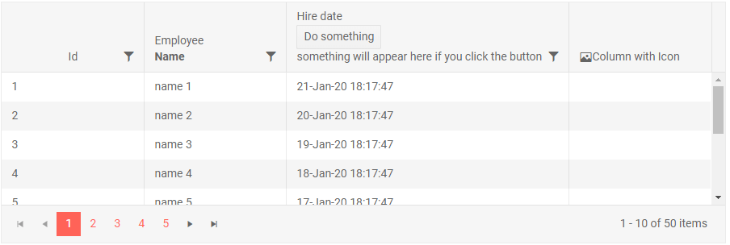

# Column Footer Template

You can display a grand total row at the bottom of the grid through the `FooterTemplate` of each bound column.

You can use [aggregates]() for the current field directly from the `context`, and its `AggregateResults` field lets you get aggregates for other fields that you have defined through their field name and aggregate function.


>caption Footer Template with grand total data

````CSHTML
@* Header templates override the built-in title but leave sorting indicators and filter menu icons *@

<TelerikGrid Data="@MyData" Height="300px" Pageable="true" Sortable="true" FilterMode="@GridFilterMode.FilterMenu">
    <GridColumns>
        <GridColumn Field="@(nameof(SampleData.ID))" Title="This title will not be rendered">
            <HeaderTemplate>
                <div style="text-align:center">Id</div>
                @* this is a block element and it will push the sorting indicator, see the notes below *@
            </HeaderTemplate>
        </GridColumn>
        <GridColumn Field="@(nameof(SampleData.Name))">
            <HeaderTemplate>
                Employee<br /><strong>Name</strong>
            </HeaderTemplate>
        </GridColumn>
        <GridColumn Field="HireDate" Width="350px">
            <HeaderTemplate>
                Hire date<br />
                <TelerikButton OnClick="@DoSomething">Do something</TelerikButton>
                <br />
                @{
                    if (!string.IsNullOrEmpty(result))
                    {
                        <span style="color:red;">@result</span>
                    }
                    else
                    {
                        <div>something will appear here if you click the button</div>
                    }
                }
            </HeaderTemplate>
        </GridColumn>
        <GridColumn>
            <HeaderTemplate>
                <span class="k-display-flex k-align-items-center">
                    <TelerikIcon Icon="@IconName.Image" />
                    Column with Icon
                </span>
            </HeaderTemplate>
        </GridColumn>
    </GridColumns>
</TelerikGrid>

@code {
    string result { get; set; }
    void DoSomething()
    {
        result = $"button in header template clicked on {DateTime.Now}, something happened";
    }

    public class SampleData
    {
        public int ID { get; set; }
        public string Name { get; set; }
        public DateTime HireDate { get; set; }
    }

    public IEnumerable<SampleData> MyData = Enumerable.Range(1, 50).Select(x => new SampleData
    {
        ID = x,
        Name = "name " + x,
        HireDate = DateTime.Now.AddDays(-x)
    });
}
````

>caption The result from the code snippet above



>note Header Templates are not available for the `GridCheckboxColumn` and the `GridCommandColumn`.

>note If you need to use block elements in the header templates, keep in mind that they will push the sort indicator out of its expected position. If you cannot avoid block elements (such as in the `ID` column in the example above), add a CSS rule like the ones below to adjust the sort indicator.

>caption Sort indicator adjustments when block elements are in the header template

````CSS
.k-grid th.k-header .k-icon.k-i-sort-asc-sm,
.k-grid th.k-header .k-icon.k-i-sort-desc-sm {
    position: absolute;
    right: 0;
    top: 8px;
}

/* OR */

.k-grid-header .k-header > .k-link {
    padding-right: 1.5em;
}

    .k-grid-header .k-header > .k-link > .k-icon {
        position: absolute;
        top: 50%;
        right: 0.5em;
        transform: translateY(-50%);
        margin-left: 0;
    }

.k-grid-header .k-sort-order {
    position: absolute;
    right: 0.25em;
}
````

## See Also

 * [Live Demo: Grid Templates](https://demos.telerik.com/blazor-ui/grid/templates)
 * [Live Demo: Grid Custom Editor Template](https://demos.telerik.com/blazor-ui/grid/customeditor)

