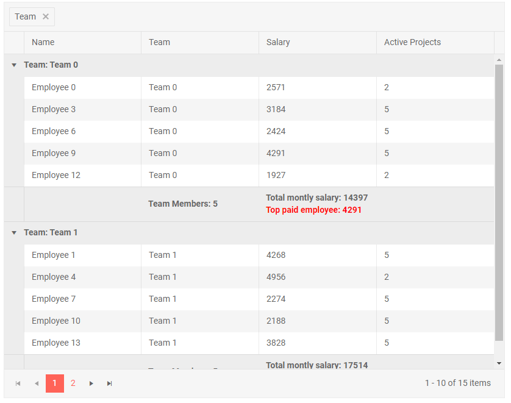

# Column Group Footer

When the grid is grouped, the columns can display a footer with information about the column data [aggregates]() and some custom text/logic. The template is strongly typed and exposes the available aggregates values.

>caption Sample Column Group Footer Template

````CSHTML
@* Group by the Team column to see the results and aggregate data in the footer *@

<TelerikGrid Data=@GridData Groupable="true" Pageable="true" Height="650px">
    <GridAggregates>
        <GridAggregate Field=@nameof(Employee.Team) Aggregate="@GridAggregateType.Count" />
        <GridAggregate Field=@nameof(Employee.Salary) Aggregate="@GridAggregateType.Max" />
        <GridAggregate Field=@nameof(Employee.Salary) Aggregate="@GridAggregateType.Sum" />
    </GridAggregates>
    <GridColumns>
        <GridColumn Field=@nameof(Employee.Name) Groupable="false" />
        <GridColumn Field=@nameof(Employee.Team) Title="Team">
            <GroupFooterTemplate>
                Team Members: <strong>@context.Count</strong>
            </GroupFooterTemplate>
        </GridColumn>
        <GridColumn Field=@nameof(Employee.Salary) Title="Salary" Groupable="false">
            <GroupFooterTemplate>
                @* you can use a group footer for non-groupable columns as well *@
                Total montly salary: @context.Sum
                <br />
                <span style="color: red;">Top paid employee: @context.Max</span>
            </GroupFooterTemplate>
        </GridColumn>
        <GridColumn Field=@nameof(Employee.ActiveProjects) Title="Active Projects">
        </GridColumn>
    </GridColumns>
</TelerikGrid>

@code {
    public List<Employee> GridData { get; set; }

    protected override void OnInitialized()
    {
        GridData = new List<Employee>();
        var rand = new Random();
        for (int i = 0; i < 15; i++)
        {
            Random rnd = new Random();
            GridData.Add(new Employee()
            {
                EmployeeId = i,
                Name = "Employee " + i.ToString(),
                Team = "Team " + i % 3,
                Salary = rnd.Next(1000, 5000),
                ActiveProjects = i % 4 == 0 ? 2 : 5
            });
        }
    }

    public class Employee
    {
        public int EmployeeId { get; set; }
        public string Name { get; set; }
        public string Team { get; set; }
        public decimal Salary { get; set; }
        public int ActiveProjects { get; set; }
    }
}
````

>caption The result from the code snippet above after grouping by the `Team` column




## See Also

 * [Live Demo: Grid Templates](https://demos.telerik.com/blazor-ui/grid/templates)
 * [Live Demo: Grid Custom Editor Template](https://demos.telerik.com/blazor-ui/grid/customeditor)

