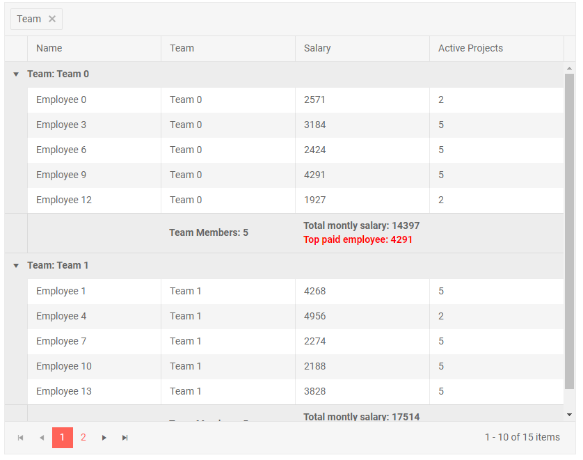

# Column Group Footer

When the grid is grouped, the columns can display a footer with information about the column data [aggregates](slug:grid-aggregates) and some custom text/logic. The template is strongly typed and exposes the available aggregates values.

>caption Sample Column Group Footer Template

<demo metaUrl="client/grid/templates-column-group-footer/" height="700"></demo>

>caption The result from the code snippet above after grouping by the `Team` column

## Using Components in Grid Group Footer Templates

@[template](/_contentTemplates/grid/common-link.md#using-components-in-templates)

## See Also

* [Live Demo: Grid Templates](https://demos.telerik.com/blazor-ui/grid/templates)
* [Live Demo: Grid Custom Editor Template](https://demos.telerik.com/blazor-ui/grid/custom-editor)
* [Blazor Grid](slug:grid-overview)

