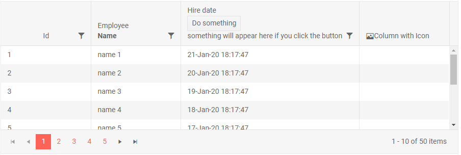

# Column Header Template

Bound columns render the name of the field or their `Title` in their header. Through the `HeaderTemplate`, you can define custom content there instead of the title text.

>tip If you only want to center and wrap the column header text, you can achieve that with some custom CSS as shown in [this knowledge base article]().

>caption Sample Header Template

````CSHTML
@* Header templates override the built-in title but leave sorting indicators and filter menu icons *@

<TelerikGrid Data="@MyData" Height="300px" Pageable="true" Sortable="true" FilterMode="@GridFilterMode.FilterMenu">
    <GridColumns>
        <GridColumn Field="@(nameof(SampleData.Id))" Title="This title will not be rendered">
            <HeaderTemplate>
                <span>Employee ID</span>
            </HeaderTemplate>
        </GridColumn>
        <GridColumn Field="@(nameof(SampleData.Name))">
            <HeaderTemplate>
                Employee<br /><strong>Name</strong>
            </HeaderTemplate>
        </GridColumn>
        <GridColumn Field="HireDate" Width="350px">
            <HeaderTemplate>
                Hire date<br />
                <TelerikButton OnClick="@DoSomething">Do something</TelerikButton>
                <br />
                @{
                    if (!string.IsNullOrEmpty(result))
                    {
                        <span style="color:red;">@result</span>
                    }
                    else
                    {
                        <div>something will appear here if you click the button</div>
                    }
                }
            </HeaderTemplate>
        </GridColumn>
        <GridColumn>
            <HeaderTemplate>
                <span>
                    <TelerikIcon Icon="image" />
                    Column with Icon
                </span>
            </HeaderTemplate>
        </GridColumn>
    </GridColumns>
</TelerikGrid>

@code {
    string result { get; set; }
    void DoSomething()
    {
        result = $"button in header template clicked on {DateTime.Now}, something happened";
    }

    public class SampleData
    {
        public int Id { get; set; }
        public string Name { get; set; }
        public DateTime HireDate { get; set; }
    }

    public IEnumerable<SampleData> MyData = Enumerable.Range(1, 50).Select(x => new SampleData
    {
        Id = x,
        Name = "name " + x,
        HireDate = DateTime.Now.AddDays(-x)
    });
}
````

>caption The result from the code snippet above



>note Header Templates are not available for the `GridCheckboxColumn` and the `GridCommandColumn`.

## See Also

 * [Live Demo: Grid Templates](https://demos.telerik.com/blazor-ui/grid/templates)
 * [Live Demo: Grid Custom Editor Template](https://demos.telerik.com/blazor-ui/grid/customeditor)

