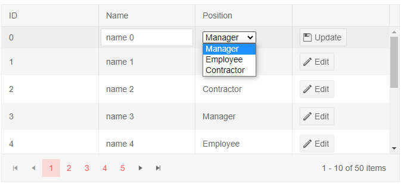
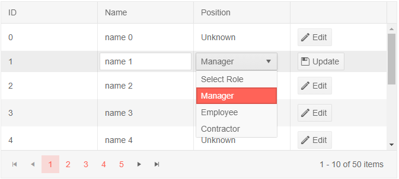

# Editor Template

The column's `EditTemplate` defines the inline template or component that will be rendered when the user is [editing](#editing) the field. It is also used when inserting a new item.

You can data bind components in it to the current context, which is an instance of the model the grid is bound to. You will need a global variable that is also an instance of the model to store those changes. The model the template receives is a copy of the original model, so that changes can be cancelled (the `Cancel` command).

If you need to perform logic more complex than simple data binding, use the change event of the custom editor component to perform it. You can also consider using a [custom edit form](https://demos.telerik.com/blazor-ui/grid/editing-custom-form).

You can find the following examples below:

* [Sample editor template for a field - limit the string input options through a select element](#sample-editor-template-for-a-field---limit-the-string-input-options-through-a-select-element)

* [Sample editor template that uses a foreign key](#sample-editor-template-that-uses-a-foreign-key)


### Sample editor template for a field - limit the string input options through a select element

````CSHTML
@* This example shows how to use a simple <select> to edit strings. You can implement any desired logic instead.
    If you have an enum, the grid can edit and filter it out-of-the-box without the need for an edit template *@

<TelerikGrid Data=@MyData EditMode="@GridEditMode.Inline" Pageable="true" Height="300px" OnUpdate="@UpdateHandler">
    <GridColumns>
        <GridColumn Field=@nameof(SampleData.ID) Editable="false" Title="ID" />
        <GridColumn Field=@nameof(SampleData.Name) Title="Name" />
        <GridColumn Field=@nameof(SampleData.Role) Title="Position">
            <EditorTemplate>
                @{
                    CurrentlyEditedEmployee = context as SampleData;
                    <select @bind="@CurrentlyEditedEmployee.Role">
                        @foreach (var item in Roles)
                        {
                            <option value="@item">@item</option>
                        }
                    </select>
                }
            </EditorTemplate>
        </GridColumn>
        <GridCommandColumn>
            <GridCommandButton Command="Save" Icon="save" ShowInEdit="true">Update</GridCommandButton>
            <GridCommandButton Command="Edit" Icon="edit">Edit</GridCommandButton>
        </GridCommandColumn>
    </GridColumns>
</TelerikGrid>

@code {
    public SampleData CurrentlyEditedEmployee { get; set; }

    public async Task UpdateHandler(GridCommandEventArgs args)
    {
        SampleData item = (SampleData)args.Item;

        // perform actual data source operations here through your service
        SampleData updatedItem = await ServiceMimicUpdate(item);

        // update the local view-model data
        var index = MyData.FindIndex(i => i.ID == updatedItem.ID);
        if (index != -1)
        {
            MyData[index] = updatedItem;
        }
    }

    // the following method mimics an actual data service that handles the actual data source
    // you can see about implement error and exception handling, determining suitable return types as per your needs
    // an example is available here: https://github.com/telerik/blazor-ui/tree/master/grid/remote-validation

    async Task<SampleData> ServiceMimicUpdate(SampleData itemToUpdate)
    {
        // in this example, we just populate the fields, you project may use
        // something else or generate the updated item differently
        SampleData updatedItem = new SampleData()
        {
            ID = itemToUpdate.ID,
            Name = itemToUpdate.Name,
            Role = itemToUpdate.Role
        };
        return await Task.FromResult(updatedItem);
    }

    protected override void OnInitialized()
    {
        MyData = new List<SampleData>();

        for (int i = 0; i < 50; i++)
        {
            MyData.Add(new SampleData()
            {
                ID = i,
                Name = "name " + i,
                Role = Roles[i % Roles.Count]
            });
        }
    }

    //in a real case, keep the models in dedicated locations, this is just an easy to copy and see example
    public class SampleData
    {
        public int ID { get; set; }
        public string Name { get; set; }
        public string Role { get; set; }
    }

    public List<SampleData> MyData { get; set; }

    public static List<string> Roles = new List<string> { "Manager", "Employee", "Contractor" };
}
````

>caption The result from the snippet above after Edit was clicked for the first row and the select was expanded



### Sample editor template that uses a foreign key

````CSHTML
@* This example shows one way to use a dropdownlist to edit values with a foreign key. *@

<TelerikGrid Data=@MyData EditMode="@GridEditMode.Inline" Pageable="true" Height="500px" OnUpdate="@UpdateHandler">
    <GridColumns>
        <GridColumn Field=@nameof(Employee.ID) Editable="false" Title="ID" />
        <GridColumn Field=@nameof(Employee.Name) Title="Name" />
        <GridColumn Field=@nameof(Employee.RoleId) Title="Position">
            <EditorTemplate>
                @{
                    CurrentlyEditedEmployee = context as Employee;
                    <TelerikDropDownList Data="@Roles" DefaultText="Select Role"
                                         @bind-Value="@CurrentlyEditedEmployee.RoleId"
                                         TextField="@nameof(Role.RoleName)" ValueField="@nameof(Role.RoleId)"
                                         Width="100%" PopupHeight="auto">
                    </TelerikDropDownList>
                }
            </EditorTemplate>
            <Template>
                @{
                    // a Template is used to show the foreign key data that is user-friendly
                    int roleId = (context as Employee).RoleId;
                    Role matchingPos = Roles.FirstOrDefault(r => r.RoleId == roleId);
                    string textToRender = matchingPos != null ? matchingPos.RoleName : "Unknown";
                    <text>@textToRender</text>
                }
            </Template>
        </GridColumn>
        <GridCommandColumn>
            <GridCommandButton Command="Save" Icon="save" ShowInEdit="true">Update</GridCommandButton>
            <GridCommandButton Command="Edit" Icon="edit">Edit</GridCommandButton>
        </GridCommandColumn>
    </GridColumns>
</TelerikGrid>

@code {
    List<Employee> MyData { get; set; }
    List<Role> Roles { get; set; }
    Employee CurrentlyEditedEmployee { get; set; }

    async Task UpdateHandler(GridCommandEventArgs args)
    {
        Employee item = (Employee)args.Item;

        // perform actual data source operations here through your service
        Employee updatedItem = await ServiceMimicUpdate(item);

        // update the local view-model data
        var index = MyData.FindIndex(i => i.ID == updatedItem.ID);
        if (index != -1)
        {
            MyData[index] = updatedItem;
        }
    }

    // the following method mimics an actual data service that handles the actual data source
    // you can see about implement error and exception handling, determining suitable return types as per your needs
    // an example is available here: https://github.com/telerik/blazor-ui/tree/master/grid/remote-validation

    async Task<Employee> ServiceMimicUpdate(Employee itemToUpdate)
    {
        // in this example, we just populate the fields, you project may use
        // something else or generate the updated item differently
        Employee updatedItem = new Employee()
        {
            ID = itemToUpdate.ID,
            Name = itemToUpdate.Name,
            RoleId = itemToUpdate.RoleId
        };
        return await Task.FromResult(updatedItem);
    }

    protected override async Task OnInitializedAsync()
    {
        Roles = await GetRoles();
        MyData = await GetGridData();
    }

    async Task<List<Role>> GetRoles()
    {
        var data = new List<Role>
        {
            new Role { RoleId = 1, RoleName = "Manager" },
            new Role { RoleId = 2, RoleName = "Employee" },
            new Role { RoleId = 3, RoleName = "Contractor" },
        };

        return await Task.FromResult(data);
    }

    async Task<List<Employee>> GetGridData()
    {
        var data = new List<Employee>();
        for (int i = 0; i < 50; i++)
        {
            data.Add(new Employee()
            {
                ID = i,
                Name = "name " + i,
                RoleId = i % 4 // every one in four is an unknown one that will not be present in the roles list
                               // and will have an ID of 0 to match the DefaultText of the dropdownlist
                               // you can perform more complicated checks as necessary in your app and/or in the templates
                               // and/or in the view-model data to present it with suitable values and avoid exceptions
            });
        }

        return await Task.FromResult(data);
    }

    public class Employee
    {
        public int ID { get; set; }
        public string Name { get; set; }
        public int RoleId { get; set; }
    }

    public class Role
    {
        public int RoleId { get; set; }
        public string RoleName { get; set; }
    }
}
````

>caption The result from the code snippet above, after Edit was clicked on the second row and the user expanded the dropdown from the editor template



## See Also

 * [Live Demo: Grid Templates](https://demos.telerik.com/blazor-ui/grid/templates)
 * [Live Demo: Grid Custom Editor Template](https://demos.telerik.com/blazor-ui/grid/customeditor)

