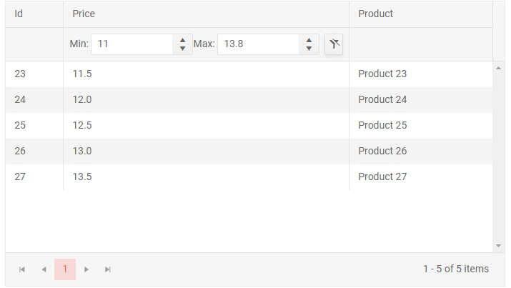
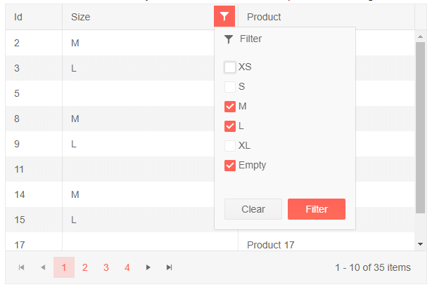

# Filter Template

The Filter Template lets you customize the appearance and logic of the built-in filters. It lets you step on the built-in filtering logic of the grid and implement your own design and logic for setting their values.

There are two different templates you can use depending on the [Filter Mode]() that you chose:

* [Filter Row Template](#filter-row-template)
* [Filter Menu Template](#filter-menu-template)


## Filter Row Template

By default, the filter row puts an appropriate editor (like a numeric textbox for numbers) and its `ValueChanged` handler triggers grid filtering on every keystroke. There is also a button for the user to choose a filter operator, and a clear filter button when there is a value in the editor.

To customize the filter cell, use the `<FilterCellTemplate>` tag of the `<GridColumn>`. It receives a `context` of type `FilterCellTemplateContext` that provides the following members:

* `FilterDescriptor` - the object that describes the column filter. By default it has a first filter with the type and name of the field, and you can add more to its `FilterDescriptors` collection, or change its `LogicalOperator` from the default `AND`.

* `FilterAsync()` - an `async` method that invokes the built-in grid filtering logic (including a handler to [`OnRead`]() if you use one) so you can call upon it easily from your template (e.g., when a value changes or a button is clicked).

* `ClearFilterAsync()` - an `async` method that invokes the built-in grid clear filtering logic (including a handler to [`OnRead`]() if you use one) so you can call upon it easily from your template (e.g., when a value is cleared or a button is clicked).

You can store a reference to each column's context in a field in the view-model, so you can write the handlers in the standard C# code, instead of using lambdas in the markup. You can also pass the context as a Parameter to your own separate filter component to reduce clutter in the main grid markup and code.

### Examples

The example below shows a custom filter that:

* Implements a min-max filter in the filter cell through two numeric textboxes.
* Filters in the `OnChange` event (only when the user presses Enter or blurs the input) to reduce database calls.
* Shows how you can store a reference to the context or use it inline in the template.
* Showcases building a filter descriptor with two filters and sample logic that always filters the data even if one of the inputs is empty.

You can find more examples in the [Live Demo: Custom Filter Row](https://demos.telerik.com/blazor-ui/grid/custom-filter-row) that is available in your local installation under the `demos` folder.


>caption Custom Filter Row Template - Min and Max filters on OnChange

````CSHTML
@using Telerik.DataSource

The custom filter textboxes invoke filtering on Enter or blur through the OnChange event

<TelerikGrid Data=@GridData FilterMode="@GridFilterMode.FilterRow"
             Height="400px" Width="700px" Pageable="true">
    <GridColumns>
        <GridColumn Field="Id" Filterable="false" Width="80px" />

        <GridColumn Field="Price" Width="400px">
            <FilterCellTemplate>
                @{
                    // we store a reference to the filter context to use in the business logic
                    // you can also use it inline in the template, like with the Clear button below
                    theFilterContext = context;
                }

                <label for="min">Min:&nbsp;</label>
                <TelerikNumericTextBox Id="min"
                                       @bind-Value="@MinValue"
                                       OnChange="@SetupFilterRule">
                </TelerikNumericTextBox>
                <label for="min">Max:&nbsp;</label>
                <TelerikNumericTextBox Id="max"
                                       @bind-Value="@MaxValue"
                                       OnChange="@SetupFilterRule">
                </TelerikNumericTextBox>
                <TelerikButton ButtonType="ButtonType.Button"
                               Class="k-clear-button-visible ml-2"
                               Icon="filter-clear"
                               Enabled="@( MinValue != null || MaxValue != null )"
                               OnClick="@(async () =>
                                          {
                                              MinValue = MaxValue = null;

                                              // clear filter through the method the context provides
                                              await context.ClearFilterAsync();
                                          })">
                </TelerikButton>
            </FilterCellTemplate>
        </GridColumn>

        <GridColumn Field="ProductName" Title="Product" Filterable="false" />
    </GridColumns>
</TelerikGrid>

@code {
    FilterCellTemplateContext theFilterContext { get; set; }
    public decimal? MinValue { get; set; }
    public decimal? MaxValue { get; set; }

    async Task SetupFilterRule()
    {
        // set up min value filter - there is one default filter descriptor
        // that alredy has the field set up, so we use that for the MIN filter
        // and set up a value and operator
        var filter1 = theFilterContext.FilterDescriptor.FilterDescriptors[0] as FilterDescriptor;
        filter1.Value = MinValue == null ? int.MinValue : MinValue;
        filter1.Operator = FilterOperator.IsGreaterThan;

        // set up max value filter - we may have to crete a new filter descriptor
        // if there wasn't one already so we prepare it first and check whether we have the second filter
        var filter2Val = MaxValue == null ? int.MaxValue : MaxValue;
        var filter2 = new FilterDescriptor("Price", FilterOperator.IsLessThan, filter2Val);
        filter2.MemberType = typeof(decimal);

        if (theFilterContext.FilterDescriptor.FilterDescriptors.Count > 1)
        {
            theFilterContext.FilterDescriptor.FilterDescriptors[1] = filter2;
        }
        else
        {
            theFilterContext.FilterDescriptor.FilterDescriptors.Add(filter2);
        }

        // ensure logical operator between the two filters is AND (it is the default, but we showcase the option)
        theFilterContext.FilterDescriptor.LogicalOperator = FilterCompositionLogicalOperator.And;

        // invoke filtering through the method the context provides
        await theFilterContext.FilterAsync();
    }


    // sample grid data

    public List<SampleData> GridData { get; set; } = Enumerable.Range(1, 50).Select(x => new SampleData
    {
        Id = x,
        Price = x * 0.5m,
        ProductName = $"Product {x}"
    }).ToList();

    public class SampleData
    {
        public int Id { get; set; }
        public decimal Price { get; set; }
        public string ProductName { get; set; }
    }
}

@* sample CSS rule to align the custom label elements in the filter cell *@
<style>
    .k-filtercell-wrapper {
        align-items: center;
    }
        .k-filtercell-wrapper label {
            margin: unset;
        }
</style>
````

>caption The result from the code snippet above after filtering




## Filter Menu Template

By default, the filter menu contains two filter values that are tied with a logical operator - OR or AND, with filgering being triggered through a dedicated Filter button and a Clear button removes the filter.

To customize the filter menu, use the `<FilterMenuTemplate>` tag of the `<GridColumn>`. The `Filter` and `Clear` buttons are still available below the template.

The template receives a `context` of type `FilterMenuTemplateContext` that provides the following members:

* `FilterDescriptor` - the object that describes the column filter. By default it has two filters with the type and name of the field, and you can add more to its `FilterDescriptors` collection, or change its `LogicalOperator` from the default `AND`.

You can store a reference to each column's context in a field in the view-model, so you can reference it from event handlers in the standard C# code, instead of passing it as a nargument to lambdas in the markup only. You can also pass the context as a Parameter to your own separate filter component to reduce clutter in the main grid markup and code.

### Examples

The example below shows a custom filter that:

* Implements a multi checkbox filter that lets the user choose several values from the data source.
* Shows how you can store a reference to the context or use it inline in the template.
* Showcases building multiple filter descriptors for each value the user chooses.

You can find more examples in the [Live Demo: Custom Filter Menu](https://demos.telerik.com/blazor-ui/grid/custom-filter-menu) that is available in your local installation under the `demos` folder.


>caption Custom Filter Menu Template - Multiple Checkboxes

````CSHTML
@using Telerik.DataSource

This custom filter menu lets you choose more than one option to match against the data source

<TelerikGrid Data=@GridData FilterMode="@GridFilterMode.FilterMenu"
             Height="400px" Width="600px" Pageable="true">
    <GridColumns>
        <GridColumn Field="Id" Filterable="false" Width="80px" />

        <GridColumn Field="Size">
            <FilterMenuTemplate>
                @{
                    // we store a reference to the filter context to use in the business logic to show we can
                    // we could, alternatively pass it as an argument to the event handler in the lambda expression
                    // which can be useful if you want to use the same filter for several columns
                    // you could then pass more arguments to the business logic such as field name and so on
                    theFilterContext = context;
                }

                @foreach (var size in Sizes)
                {
                    <div>
                        <TelerikCheckBox Value="@(IsCheckboxInCurrentFilter(context.FilterDescriptor, size))"
                                         TValue="bool"
                                         ValueChanged="@((value) => UpdateCheckedSizes(value, size))"
                                         Id="@($"size_{size}")">
                        </TelerikCheckBox>
                        <label for="@($"size_{size}")">
                            @size
                        </label>
                    </div>
                }
            </FilterMenuTemplate>
        </GridColumn>

        <GridColumn Field="ProductName" Title="Product" Filterable="false" />
    </GridColumns>
</TelerikGrid>

@code {
    FilterMenuTemplateContext theFilterContext { get; set; }
    public List<string> CheckedSizes { get; set; } = new List<string>();

    public bool IsCheckboxInCurrentFilter(CompositeFilterDescriptor filterDescriptor, string size)
    {
        // get all current filter descriptors and evaluate whether to select the current checkbox
        return filterDescriptor.FilterDescriptors.Select(f => (f as FilterDescriptor).Value?.ToString()).ToList().Contains(size);
    }

    public void UpdateCheckedSizes(bool value, string itemValue)
    {
        // update the list of items we want to filter by
        var isSizeChecked = CheckedSizes.Contains(itemValue);
        if (value && !isSizeChecked)
        {
            CheckedSizes.Add(itemValue);
        }

        if (!value && isSizeChecked)
        {
            CheckedSizes.Remove(itemValue);
        }

        // prepare filter descriptor
        var filterDescriptor = theFilterContext.FilterDescriptor;

        filterDescriptor.FilterDescriptors.Clear();
        // use the OR logical operator so we include all possible values
        filterDescriptor.LogicalOperator = FilterCompositionLogicalOperator.Or;
        CheckedSizes.ForEach(s =>
            // instantiate a filter descriptor for the desired field, and with the desired operator and value
            filterDescriptor.FilterDescriptors.Add(new FilterDescriptor("Size", FilterOperator.IsEqualTo, s))
        );

        //ensure there is at least one blank filter to avoid null reference exceptions
        if (!filterDescriptor.FilterDescriptors.Any())
        {
            filterDescriptor.FilterDescriptors.Add(new FilterDescriptor());
        }
    }

    // sample grid data

    public List<SampleData> GridData { get; set; }

    protected override void OnInitialized()
    {
        GridData = Enumerable.Range(1, 70).Select(x => new SampleData
        {
            Id = x,
            Size = Sizes[x % Sizes.Length],
            ProductName = $"Product {x}"
        }).ToList();
        base.OnInitialized();
    }

    public class SampleData
    {
        public int Id { get; set; }
        public string Size { get; set; }
        public string ProductName { get; set; }
    }

    public string[] Sizes = new string[] { "XS", "S", "M", "L", "XL" };
}
````

>caption The result from the code snippet above, after filtering




## See Also

 * [Live Demo: Grid Custom Filter Row](https://demos.telerik.com/blazor-ui/grid/custom-filter-row)
 * [Live Demo: Grid Custom Filter Menu](https://demos.telerik.com/blazor-ui/grid/custom-filter-menu)

